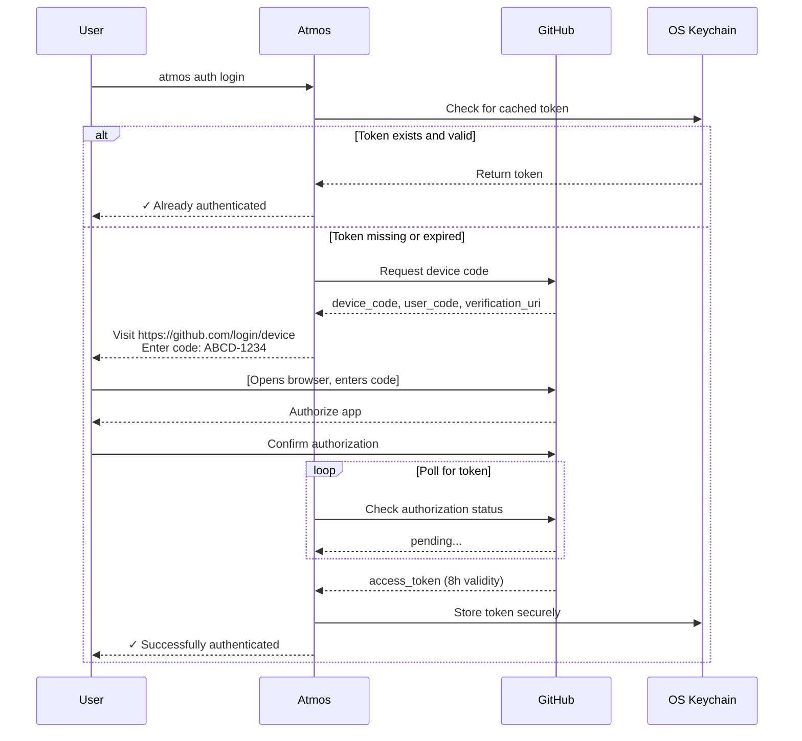
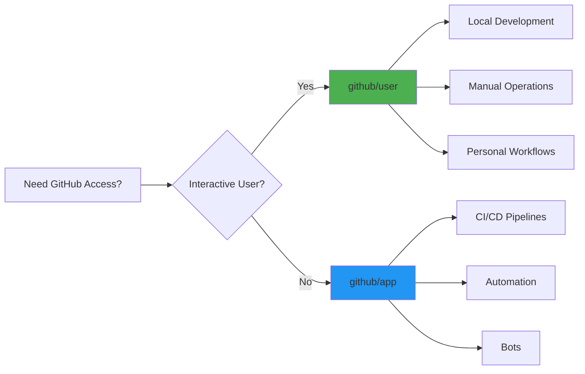
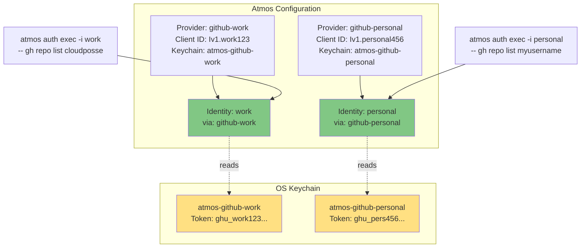
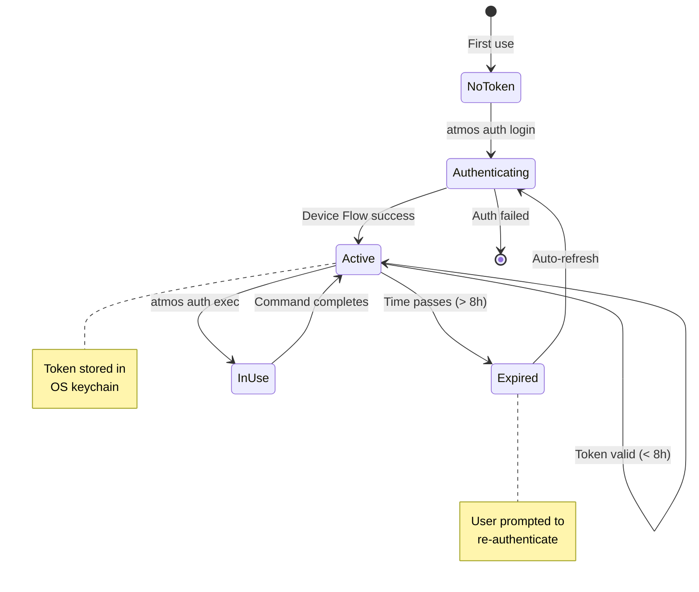

# Auth Documentation Structure Proposal

## Problem

Current documentation structure (`website/docs/cli/commands/auth/usage.mdx`) is a single 601-line file containing:
- All provider types (AWS SSO, AWS SAML, GitHub OIDC)
- All identity types (AWS Permission Set, Assume Role, User)
- Configuration examples
- Use cases
- Troubleshooting

This will become unmanageable as we add:
- GitHub User authentication
- GitHub App authentication
- Azure AD / Entra ID (future)
- Google Cloud Workload Identity (future)
- More identity types

## Proposed Structure

### **Option 1: Provider-Specific Pages** (Recommended)

```
website/docs/cli/commands/auth/
├── usage.mdx                           # Main overview (keep short)
│
├── commands/                           # CLI command reference
│   ├── auth-login.mdx
│   ├── auth-whoami.mdx
│   ├── auth-exec.mdx
│   ├── auth-env.mdx
│   ├── auth-validate.mdx
│   └── auth-user-configure.mdx
│
├── providers/                          # Provider-specific docs
│   ├── aws-iam-identity-center.mdx    # AWS SSO
│   ├── aws-saml.mdx                   # AWS SAML
│   ├── github-oidc.mdx                # GitHub Actions OIDC
│   ├── github-user.mdx                # NEW: GitHub User (Device Flow)
│   ├── github-app.mdx                 # NEW: GitHub App
│   ├── azure-entra-id.mdx             # FUTURE
│   └── gcp-workload-identity.mdx      # FUTURE
│
├── identities/                         # Identity-specific docs
│   ├── aws-permission-set.mdx
│   ├── aws-assume-role.mdx
│   ├── aws-user.mdx
│   └── (future identity types)
│
├── tutorials/                          # End-to-end guides
│   ├── configuring-geodesic.mdx       # EXISTING
│   ├── migrating-from-leapp.mdx       # EXISTING
│   ├── aws-multi-account-setup.mdx    # NEW
│   ├── github-authentication.mdx      # NEW
│   └── azure-integration.mdx          # FUTURE
│
└── concepts/                           # Core concepts
    ├── identity-chaining.mdx
    ├── credential-lifecycle.mdx
    └── security-best-practices.mdx
```

### **Option 2: Cloud-Provider Grouping**

```
website/docs/cli/commands/auth/
├── usage.mdx                           # Main overview
│
├── aws/                                # AWS-specific
│   ├── providers/
│   │   ├── iam-identity-center.mdx
│   │   └── saml.mdx
│   ├── identities/
│   │   ├── permission-set.mdx
│   │   ├── assume-role.mdx
│   │   └── user.mdx
│   └── tutorials/
│       └── multi-account-setup.mdx
│
├── github/                             # GitHub-specific
│   ├── providers/
│   │   ├── oidc.mdx
│   │   ├── user.mdx                   # Device Flow
│   │   └── app.mdx                    # GitHub App
│   └── tutorials/
│       └── ci-cd-authentication.mdx
│
├── azure/                              # FUTURE
│   ├── providers/
│   │   └── entra-id.mdx
│   └── identities/
│       └── managed-identity.mdx
│
└── gcp/                                # FUTURE
    └── providers/
        └── workload-identity.mdx
```

## Recommended: Option 1

**Reasons:**
1. **Flatter structure** - Easier to navigate
2. **Provider independence** - Each provider is self-contained
3. **Scalable** - Easy to add new providers without reorganizing
4. **Search-friendly** - Clear URL structure for SEO
5. **Consistent pattern** - Mirrors how other tools document providers (Terraform, Pulumi)

## Page Template: Provider Documentation

Each provider page follows this structure:

```markdown
---
title: {Provider Name} Authentication
sidebar_label: {Short Name}
sidebar_class_name: provider
description: Authenticate with {Provider} using Atmos Auth
---

import Screengrab from '@site/src/components/Screengrab'
import Intro from '@site/src/components/Intro'

<Intro>
Brief description of what this provider does and when to use it.
</Intro>

## Overview

### Architecture

\`\`\`mermaid
graph LR
    subgraph "Your Configuration"
        Config[atmos.yaml]
    end

    subgraph "Atmos Auth"
        Provider[{Provider Name}<br/>Provider]
        Identity[Identity]
        Manager[Auth Manager]
    end

    subgraph "External Services"
        Service[{External Service}]
        Storage[Credential Storage]
    end

    Config --> Provider
    Config --> Identity
    Provider --> Manager
    Identity --> Manager
    Manager --> Service
    Service --> Storage
    Manager --> Output[Environment Variables]

    style Provider fill:#4CAF50
    style Identity fill:#2196F3
    style Service fill:#FF9800
\`\`\`

- What is this provider?
- When should you use it?
- Prerequisites

## Quick Start

Minimal working example to get started immediately.

```yaml
auth:
  providers:
    {example-name}:
      kind: {provider-kind}
      # minimal required config

  identities:
    {example-identity}:
      kind: {identity-kind}
      via:
        provider: {example-name}
```

```bash
atmos auth login -i {example-identity}
```

## Configuration Reference

### Provider Configuration

<dl>
  <dt>`field_name`</dt>
  <dd>Description, type, required/optional, default value</dd>
</dl>

### Identity Configuration

(If this provider works with specific identity types)

## Examples

### Example 1: {Common Use Case}
### Example 2: {Advanced Use Case}
### Example 3: {Integration with X}

## Identity Chaining

How this provider works with identity chains (if applicable).

## Environment Variables

What environment variables are set when using this provider.

## Troubleshooting

Common issues and solutions.

## Related

- Links to related providers
- Links to identity types
- Links to tutorials
```

## Example: GitHub User Provider Page

```markdown
---
title: GitHub User Authentication
sidebar_label: github/user
sidebar_class_name: provider
description: Authenticate with GitHub using OAuth Device Flow for personal access
---

import Screengrab from '@site/src/components/Screengrab'
import Intro from '@site/src/components/Intro'

<Intro>
Authenticate as a GitHub user using OAuth Device Flow. This provider generates short-lived (8-hour) personal access tokens stored securely in your OS keychain. Perfect for local development workflows requiring GitHub access.

**Inspired by [ghtkn](https://github.com/suzuki-shunsuke/ghtkn)** - a great standalone alternative for GitHub token management.
</Intro>

## Overview

The `github/user` provider uses GitHub's OAuth Device Flow to obtain user access tokens without requiring a client secret. Tokens are:

- **Short-lived**: 8 hours by default (configurable)
- **Secure**: Stored in OS keychain (macOS Keychain, Windows Credential Manager, Linux Secret Service)
- **Scoped**: Request only the permissions you need
- **Automatic**: Refreshed transparently when expired

### Authentication Flow



### When to Use



**Use `github/user` for:**
- ✅ Local development requiring GitHub API access
- ✅ Running Terraform with GitHub provider
- ✅ Using `gh` CLI with Atmos-managed credentials
- ✅ Multi-repository operations as a user

**Use `github/app` instead for:**
- ❌ CI/CD pipelines (use `github/app` instead)
- ❌ Automation without user interaction (use `github/app` instead)

### Prerequisites

1. **GitHub App for Device Flow**
   - Create a GitHub App at https://github.com/settings/apps/new
   - Enable "Device Flow" in app settings
   - Note the Client ID (not the secret)
   - App permissions determine available scopes

2. **OS Keychain Access**
   - macOS: Keychain Access (built-in)
   - Windows: Credential Manager (built-in)
   - Linux: Secret Service (GNOME Keyring, KWallet, etc.)

## Quick Start

```yaml
auth:
  providers:
    github-dev:
      kind: github/user
      client_id: "Iv1.abc123def456"
      scopes:
        - repo
        - workflow

  identities:
    dev:
      kind: github/user
      default: true
      via:
        provider: github-dev
      env:
        - key: GITHUB_TOKEN
          value: "{{ .Token }}"
        - key: GH_TOKEN
          value: "{{ .Token }}"
```

```bash
# First time: interactive authentication
$ atmos auth login
To authenticate with GitHub:
1. Visit: https://github.com/login/device
2. Enter code: ABCD-1234

Waiting for authentication...
✓ Successfully authenticated as erikosterman

# Use with any command
$ atmos auth exec -- gh repo list cloudposse
$ atmos terraform plan vpc -s prod
```

## Configuration Reference

### Provider Configuration

<dl>
  <dt>`kind`</dt>
  <dd>

  **Required.** Must be `github/user`

  </dd>

  <dt>`client_id`</dt>
  <dd>

  **Required.** GitHub App Client ID for Device Flow authentication.

  Get this from your GitHub App settings at https://github.com/settings/apps/{your-app}

  Example: `"Iv1.abc123def456"`

  </dd>

  <dt>`scopes`</dt>
  <dd>

  **Optional.** OAuth scopes to request. Defaults to minimal read access if not specified.

  See [OAuth Scopes Reference](#oauth-scopes-reference) below.

  Example: `[repo, workflow, read:org]`

  </dd>

  <dt>`keychain_service`</dt>
  <dd>

  **Optional.** Name used in OS keychain for storing tokens. Defaults to `"atmos-github"`.

  Use different names for multiple GitHub accounts/orgs.

  Example: `"atmos-github-work"`

  </dd>

  <dt>`token_lifetime`</dt>
  <dd>

  **Optional.** How long tokens remain valid. Defaults to `8h`.

  Valid units: `h` (hours), `m` (minutes). Maximum: `24h`.

  Example: `6h`

  </dd>
</dl>

### Identity Configuration

The `github/user` identity type works with the `github/user` provider.

<dl>
  <dt>`kind`</dt>
  <dd>

  **Required.** Must be `github/user`

  </dd>

  <dt>`via.provider`</dt>
  <dd>

  **Required.** Name of the `github/user` provider to use.

  </dd>

  <dt>`env`</dt>
  <dd>

  **Optional.** Environment variables to set when using this identity.

  Common pattern:
  ```yaml
  env:
    - key: GITHUB_TOKEN
      value: "{{ .Token }}"
    - key: GH_TOKEN
      value: "{{ .Token }}"
  ```

  </dd>
</dl>

## Examples

### Example 1: Personal Development

Simple setup for daily development work:

```yaml
auth:
  providers:
    github-personal:
      kind: github/user
      client_id: "Iv1.abc123def456"
      scopes: [repo, workflow]

  identities:
    me:
      kind: github/user
      default: true
      via:
        provider: github-personal
```

```bash
$ atmos auth login
$ atmos terraform plan infrastructure -s dev
```

### Example 2: Multiple GitHub Accounts

Separate work and personal accounts:



```yaml
auth:
  providers:
    github-work:
      kind: github/user
      client_id: "Iv1.work123"
      scopes: [repo, read:org]
      keychain_service: "atmos-github-work"

    github-personal:
      kind: github/user
      client_id: "Iv1.personal456"
      scopes: [repo, gist]
      keychain_service: "atmos-github-personal"

  identities:
    work:
      kind: github/user
      via:
        provider: github-work

    personal:
      kind: github/user
      via:
        provider: github-personal
```

```bash
$ atmos auth login -i work
$ atmos auth exec -i work -- gh repo list cloudposse

$ atmos auth login -i personal
$ atmos auth exec -i personal -- gh repo list myusername
```

### Example 3: Terraform GitHub Provider

Use GitHub token with Terraform:

```yaml
# atmos.yaml
auth:
  providers:
    github:
      kind: github/user
      client_id: "Iv1.abc123"
      scopes: [repo, admin:org]

  identities:
    terraform:
      kind: github/user
      via:
        provider: github
      env:
        - key: GITHUB_TOKEN
          value: "{{ .Token }}"
        - key: TF_VAR_github_token
          value: "{{ .Token }}"
```

```hcl
# component terraform configuration
variable "github_token" {
  type      = string
  sensitive = true
}

provider "github" {
  token = var.github_token
  owner = "cloudposse"
}

resource "github_repository" "example" {
  name = "my-repo"
}
```

```bash
$ atmos terraform plan github-repos -s prod
```

## OAuth Scopes Reference

### Common Scopes

| Scope | Description | Use Case |
|-------|-------------|----------|
| `repo` | Full control of private repos | Terraform, gh CLI |
| `public_repo` | Public repos only | Open source work |
| `workflow` | Update GitHub Actions | Workflow automation |
| `read:org` | Read org membership | Team visibility |
| `admin:org` | Full org management | Organization admin |
| `gist` | Create gists | Code sharing |

### Repository Scopes

| Scope | Description |
|-------|-------------|
| `repo` | Full access to public/private repos |
| `repo:status` | Commit status access |
| `repo:deployment` | Deployment status access |
| `public_repo` | Public repos only |
| `repo:invite` | Repository invitations |
| `security_events` | Security events access |

### Organization Scopes

| Scope | Description |
|-------|-------------|
| `admin:org` | Full organization control |
| `write:org` | Read/write organization access |
| `read:org` | Read organization membership |

### User Scopes

| Scope | Description |
|-------|-------------|
| `user` | Update all user data |
| `user:email` | Access email addresses |
| `user:follow` | Follow/unfollow users |

### GitHub Actions Scopes

| Scope | Description |
|-------|-------------|
| `workflow` | Update workflow files |

### Package Scopes

| Scope | Description |
|-------|-------------|
| `write:packages` | Upload packages |
| `read:packages` | Download packages |
| `delete:packages` | Delete packages |

### Other Scopes

| Scope | Description |
|-------|-------------|
| `admin:public_key` | Manage SSH keys |
| `admin:gpg_key` | Manage GPG keys |
| `notifications` | Access notifications |
| `delete_repo` | Delete repositories |
| `project` | Manage projects |
| `codespace` | Manage codespaces |

**Security Note:** Request only the scopes you need. Broader scopes increase risk if tokens are leaked.

## Token Lifecycle



## Environment Variables

When using `atmos auth exec` or `atmos auth env`, these variables are set:

| Variable | Value | Purpose |
|----------|-------|---------|
| `GITHUB_TOKEN` | User access token | GitHub API, Terraform |
| `GH_TOKEN` | User access token | gh CLI compatibility |

## Git Credential Helper

**Inspired by [ghtkn](https://github.com/suzuki-shunsuke/ghtkn)**, Atmos can act as a Git credential helper, automatically providing GitHub tokens for git operations.

### Setup

Configure git to use Atmos globally:

```bash
git config --global credential.helper '!atmos auth git-credential'
```

Or for specific GitHub repositories only:

```bash
git config credential.https://github.com.helper '!atmos auth git-credential'
```

### Usage

Once configured, git operations will automatically use your Atmos GitHub authentication:

```bash
# Clone a private repo - no need to enter credentials
git clone https://github.com/cloudposse/private-repo.git

# Push changes - automatically authenticated
git push origin main
```

### How it Works

1. Git requests credentials for github.com
2. Atmos checks for a default GitHub identity
3. Authenticates if needed (Device Flow)
4. Returns token to git
5. Git uses token for the operation

### Specify Identity

Use a specific identity for git operations:

```bash
git config credential.https://github.com.helper '!atmos auth git-credential --identity work'
```

## Logout and Token Management

### Logout from Identity

Remove cached tokens:

```bash
# Logout from default identity
atmos auth logout

# Logout from specific identity
atmos auth logout --identity dev

# Logout from all identities
atmos auth logout --all
```

### Revoke Tokens Completely

Atmos logout removes tokens from your local keychain, but tokens may still be valid on GitHub's side. To fully revoke:

**Option 1: Via GitHub App Settings (Recommended)**
1. Visit https://github.com/settings/apps
2. Find your GitHub App
3. Click "Revoke all user tokens"

**Option 2: Validate Token Status**

Check if a token is still active:

```bash
env GH_TOKEN=$TOKEN gh api /user
```

If successful, the token is still valid on GitHub.

### Security Best Practices

1. **Regular Logout**: Logout when switching contexts or ending work sessions
2. **Revoke on Compromise**: If a token is leaked, revoke immediately via GitHub settings
3. **Short Lifetimes**: Use shorter token lifetimes (default 8h) for better security
4. **Monitor Usage**: Review authorized applications regularly in GitHub settings

## Troubleshooting

### Device Flow Not Working

**Problem:** "Failed to start GitHub Device Flow"

**Solutions:**
- Verify Client ID is correct
- Ensure GitHub App has Device Flow enabled
- Check app is not suspended or deleted
- Try a different browser for authentication

### Token Expired

**Problem:** "Token has expired"

**Solution:** Re-authenticate to get a new token:
```bash
$ atmos auth login -i your-identity
```

### Keychain Access Denied

**Problem:** "Failed to store token in keychain"

**Solutions:**
- **macOS:** Allow Atmos to access Keychain in System Preferences → Security
- **Linux:** Ensure Secret Service daemon is running (`gnome-keyring-daemon` or `kwallet`)
- **Windows:** Check Credential Manager access permissions

### Insufficient Permissions

**Problem:** "403 Forbidden" when accessing repos

**Solutions:**
- Request additional scopes in provider configuration
- Verify GitHub App has required permissions
- Re-authenticate after changing scopes

## Related

- [GitHub App Provider](/cli/commands/auth/providers/github-app) - For CI/CD and automation
- [GitHub OIDC Provider](/cli/commands/auth/providers/github-oidc) - For GitHub Actions workflows
- [GitHub Authentication Tutorial](/cli/commands/auth/tutorials/github-authentication) - Complete setup guide
- [atmos auth exec](/cli/commands/auth/commands/auth-exec) - Execute commands with authentication
- [atmos auth env](/cli/commands/auth/commands/auth-env) - Export credentials as environment variables

## Alternative: ghtkn

If you only need standalone GitHub token management without Atmos, check out **[ghtkn](https://github.com/suzuki-shunsuke/ghtkn)** - a lightweight CLI tool that inspired this provider. It's perfect for developers who want Device Flow authentication without a full infrastructure orchestration tool.
```

## Migration Plan

### Phase 1: Create New Structure (Non-Breaking)
1. Create `providers/` directory with provider-specific pages
2. Create `identities/` directory with identity-specific pages
3. Keep existing `usage.mdx` as-is (redirect to new pages)

### Phase 2: Content Migration
1. Extract provider-specific sections from `usage.mdx`
2. Move to new provider pages
3. Add cross-links between pages
4. Update `usage.mdx` to be a high-level overview with links

### Phase 3: Cleanup
1. Reduce `usage.mdx` to ~150 lines (overview + links)
2. Add deprecation notice for old anchors
3. Set up redirects for old bookmark URLs

## Benefits

1. **Maintainability**: Each provider is self-contained
2. **Discoverability**: Easier to find specific provider docs
3. **Scalability**: Can add 10+ more providers without cluttering
4. **SEO**: Better URL structure for search engines
5. **Versioning**: Can version provider docs independently
6. **Examples**: More room for comprehensive, real-world examples
