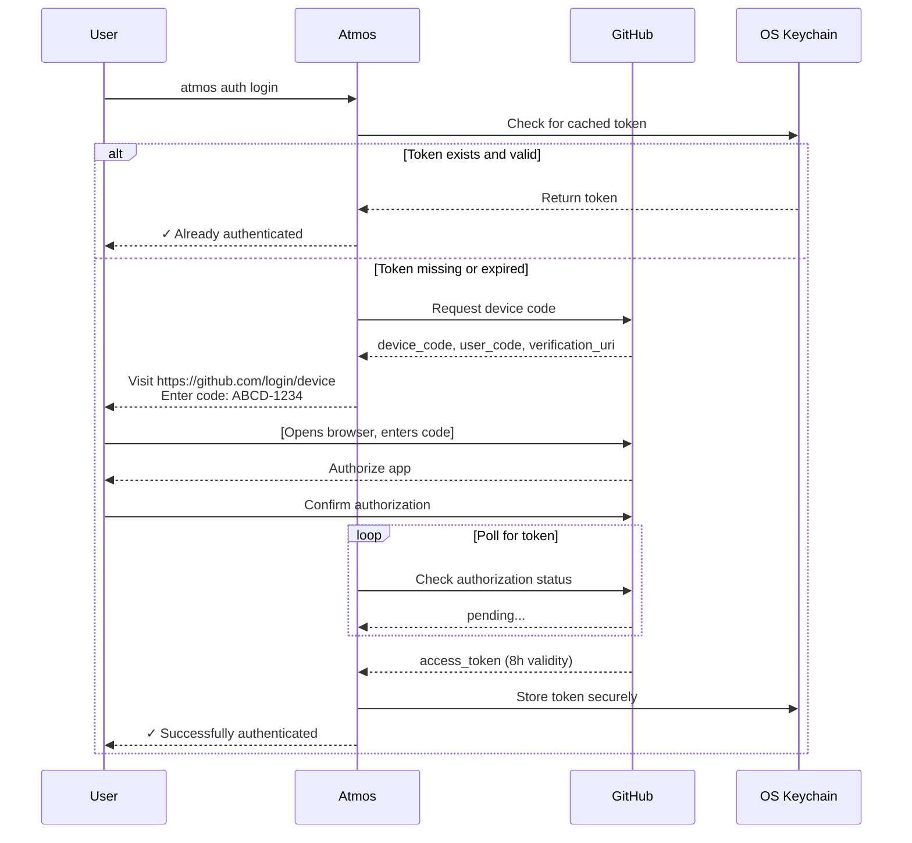
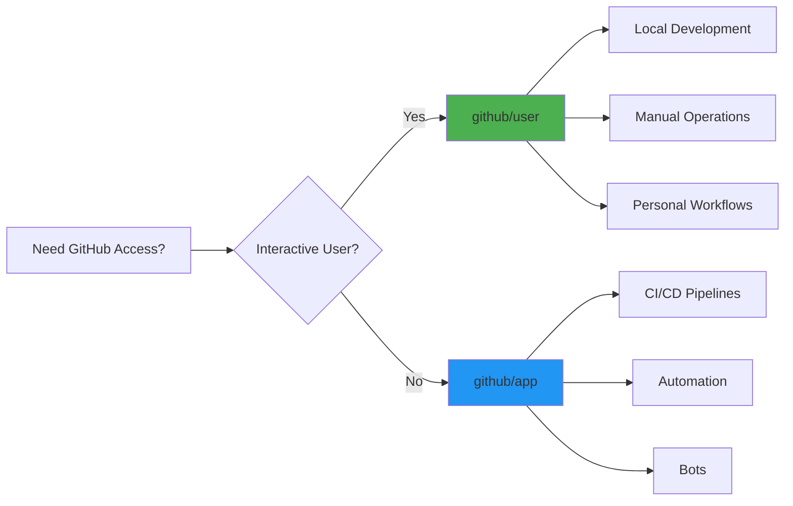
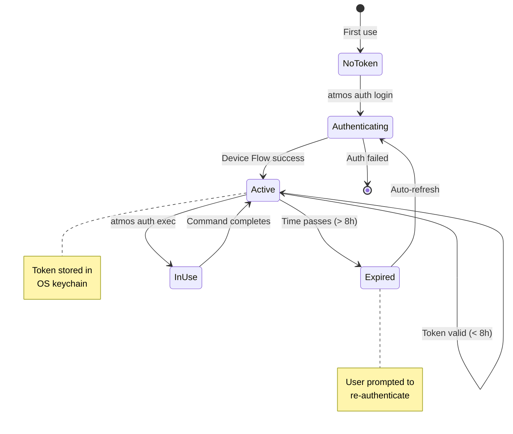
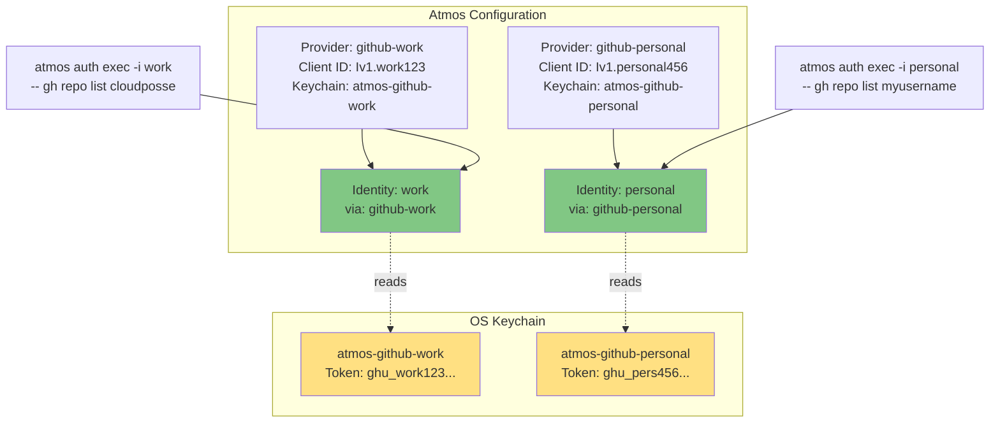
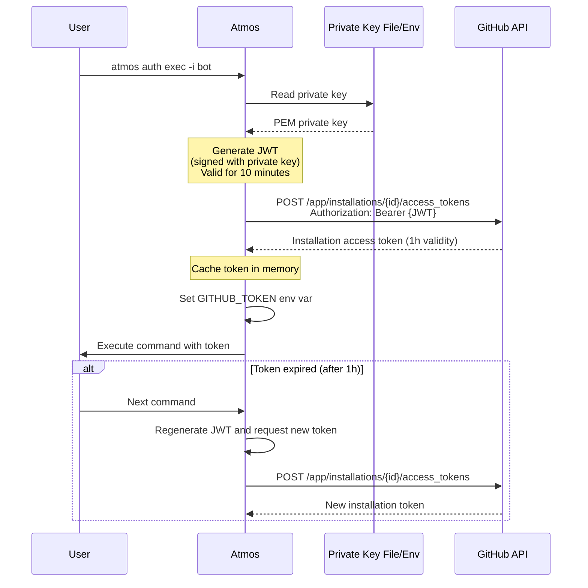

# Mermaid Diagrams for GitHub Authentication

## Overview

5 Mermaid diagrams for GitHub User and GitHub App provider documentation. These visual aids help users understand GitHub-specific authentication flows and architecture.

---

## GitHub User Provider (`github/user`)

### 1. Device Flow Sequence Diagram

**Purpose:** Show the OAuth Device Flow authentication process



**Used in:** GitHub User provider docs, Overview section

---

### 2. Provider Selection Decision Tree

**Purpose:** Help users choose between `github/user` and `github/app`



**Used in:** "When to Use" section for both providers

---

### 3. Token Lifecycle State Diagram

**Purpose:** Show token states and expiration handling



**Used in:** GitHub User provider docs, Token Lifecycle section

---

### 4. Multiple GitHub Accounts Architecture

**Purpose:** Show how to manage separate work and personal accounts



**Used in:** GitHub User provider docs, Example 2 (Multiple Accounts)

---

## GitHub App Provider (`github/app`)

### 5. GitHub App JWT Flow Sequence Diagram

**Purpose:** Show how GitHub App authentication works with JWT signing



**Used in:** GitHub App provider docs, Overview section

---

## Color Conventions

### Component Types
- **Green (#4CAF50)**: User-facing components, manual workflows
- **Blue (#2196F3)**: Automation components, CI/CD
- **Yellow (#FFE082)**: Storage/persistence (keychains)
- **Light Green (#81C784)**: Identities

### States
- **Green**: Active/success states
- **Yellow**: Intermediate states
- **Red**: Error/failed states

---

## Diagram Types Used

### For GitHub Authentication

1. **Sequence Diagrams** (`sequenceDiagram`)
   - Best for: Time-based authentication flows
   - Used in: Device Flow, JWT signing flow

2. **Decision Trees** (`graph LR`)
   - Best for: Choosing between providers
   - Used in: User vs App selection

3. **State Diagrams** (`stateDiagram-v2`)
   - Best for: Token lifecycle management
   - Used in: Token expiration and refresh

4. **Architecture Diagrams** (`graph TB`)
   - Best for: System architecture, multiple accounts
   - Used in: Account isolation, component relationships

---

## Docusaurus Integration

Mermaid diagrams work natively in Docusaurus:

```markdown
\`\`\`mermaid
graph LR
    A --> B
\`\`\`
```

No additional configuration required.

---

## Testing Diagrams

Verify diagrams before committing:

1. **Mermaid Live Editor**: https://mermaid.live - paste and preview
2. **Local Docusaurus**: `cd website && npm run start`
3. **Build check**: `cd website && npm run build`

---

## Usage in Documentation

### GitHub User Provider Page

```markdown
## Overview

[Intro text about Device Flow...]

### Authentication Flow

\`\`\`mermaid
sequenceDiagram
    [Device Flow diagram]
\`\`\`

### When to Use

\`\`\`mermaid
graph LR
    [Decision tree diagram]
\`\`\`

## Token Lifecycle

\`\`\`mermaid
stateDiagram-v2
    [Lifecycle diagram]
\`\`\`

## Examples

### Multiple Accounts

\`\`\`mermaid
graph TB
    [Architecture diagram]
\`\`\`
```

### GitHub App Provider Page

```markdown
## Overview

[Intro text about GitHub Apps...]

### Authentication Flow

\`\`\`mermaid
sequenceDiagram
    [JWT flow diagram]
\`\`\`

### When to Use

\`\`\`mermaid
graph LR
    [Same decision tree as User provider]
\`\`\`
```

---

## Summary

- **5 diagrams total**: 4 for User provider, 1 for App provider (plus shared decision tree)
- **Focused scope**: GitHub authentication only
- **Visual consistency**: Same color scheme and styling
- **Practical value**: Each diagram solves a specific user question
- **Maintainable**: Text-based, version-controlled diagrams

All diagrams are implementation-ready and focused on the GitHub authentication providers being delivered in this PR.
