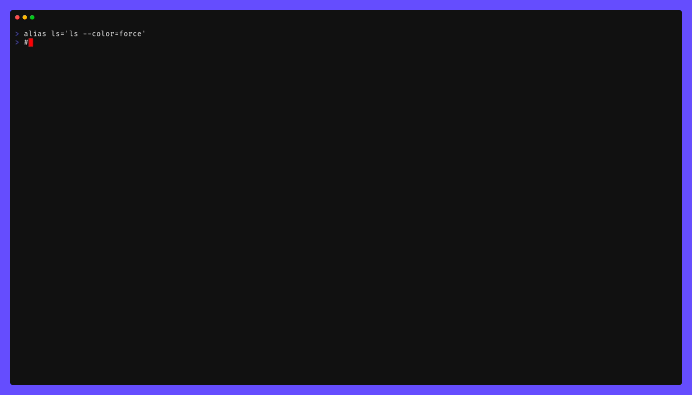

<!-- markdownlint-disable -->
<a href="https://cpco.io/homepage"></a><br/>
    <p align="right">
<a href="https://github.com/cloudposse/atmos/releases/latest"></a><a href="https://github.com/cloudposse/atmos/commits/main/"></a><a href="https://github.com/cloudposse/atmos/actions/workflows/test.yml"></a><a href="https://slack.cloudposse.com"></a></p>
<!-- markdownlint-restore -->

<!--


  ** DO NOT EDIT THIS FILE
  **
  ** This file was automatically generated by the `cloudposse/build-harness`.
  ** 1) Make all changes to `README.yaml`
  ** 2) Run `make init` (you only need to do this once)
  ** 3) Run`make readme` to rebuild this file.
  **
  ** (We maintain HUNDREDS of open source projects. This is how we maintain our sanity.)
  **


-->

**Run your infrastructure anywhere.**

Atmos is the open-source **runtime for infrastructure** — it builds, authenticates, and ships Terraform, OpenTofu, Kubernetes, Helm, and containers the same way on your laptop, in CI, and with AI agents. Auth, secrets, vendoring, caching, the toolchain, workflows, and CI are built in. Point every environment at the same reusable root modules and treat the rest as configuration. Stop stringing together 25 tools.

> **Run it on your laptop. Run it the same in CI. Run it with agents.**

Everything is open source and free.

> [!TIP]
> ### You can try out `atmos` directly in your browser using GitHub Codespaces
>
> [](https://github.com/codespaces/new?hide_repo_select=true&ref=main&repo=cloudposse/atmos&skip_quickstart=true)
>
> <i>Already start one? Find it [here](https://github.com/codespaces).</i>
>

## Screenshots

*<br/>Example of running atmos to describe infrastructure.*


## Introduction


[Atmos](https://atmos.tools) turns sprawling cloud infrastructure into one declarative system you can run consistently — locally, in CI/CD, and through AI agents. Model your platform once as [stacks](https://atmos.tools/stacks) and [components](https://atmos.tools/components), authenticate once, and run the same commands everywhere. The same code deploys to every region, environment, and stage with [DRY configuration](https://atmos.tools/design-patterns/) — no copy-paste, no bespoke wrapper scripts, no glue.

[Cloud Posse](https://cloudposse.com/) builds and operates production infrastructure on AWS, Azure, and GCP with Atmos every day — and so do startups and enterprises managing thousands of components.

## Everything you'd otherwise bolt on

Auth, secrets, vendoring, caching, the toolchain, workflows, CI, and AI are part of the runtime — not a pile of plugins you wire together.

- [**Unified Auth:**](https://atmos.tools/cli/configuration/auth) One identity layer across AWS, Azure, and GCP — SSO, OIDC, and federation. EKS and ECR login happen automatically, and the same identity feeds Terraform, stores, and emulators.
- [**Secrets Management:**](https://atmos.tools/cli/configuration/secrets) Declare secrets per environment, source them from 10+ backends (1Password, SSM, Vault, SOPS, and more), and mask them across every channel.
- [**Vendoring:**](https://atmos.tools/cli/configuration/vendor) Pull every dependency just-in-time with version pinning and retries — no separate vendor step.
- [**Caching & Mirroring:**](https://atmos.tools/cli/configuration/ci/cache) A native build cache plus a transparent Terraform provider and module registry mirror — warm in CI, instant on your laptop.
- [**Toolchain:**](https://atmos.tools/cli/configuration/toolchain) Auto-install the exact Terraform, OpenTofu, and Helmfile versions your stacks need — verified by checksum.
- [**Workflows & Automation:**](https://atmos.tools/workflows) Orchestrate, automate, and chain anything with 25+ step types and custom commands across every component.
- [**GitOps & CI/CD:**](https://atmos.tools/ci) The same commands locally and in CI. Detect affected components, emit matrices, and catch drift.
- [**AI + MCP:**](https://atmos.tools/ai) Chat about your infrastructure, run 20+ skills, expose Atmos as an MCP server, or add `--ai` to any command.

## Run anything, the same way

- **Terraform & OpenTofu like a platform team.** Plan and apply across every component in dependency order with bounded concurrency. Backends and providers are generated for you, and drift is caught automatically.
- **Kubernetes & Helm as first-class workloads.** Model [Helmfile](https://atmos.tools/components/helmfile) and Kubernetes releases beside the rest of your stack, with the same CLI you already use for Terraform.
- **Containers and cloud emulators.** [Containers](https://atmos.tools/components/container) and dev containers are workloads too — and you can spin up [cloud emulators](https://atmos.tools/components/emulator) locally so your whole stack runs on your laptop, with no account required to iterate.
- **Bring your own.** [Packer](https://atmos.tools/components/packer), [Ansible](https://atmos.tools/components/ansible), or your own [component types](https://atmos.tools/components) plug into the same registry the built-ins use.

## Your laptop is the CI. CI is your laptop.

Same command, same auth, same secrets, same toolchain — whether you run it locally or in a pipeline. Atmos is git-aware: it detects what changed and plans or applies only the affected components, so CI does exactly the work that changed — nothing more.

## Built for your agents

Everything is declarative and self-documenting, so AI agents can reason about your infrastructure instead of stringing together 25 tools and praying. Atmos ships a catalog of portable [agent skills](https://atmos.tools/ai/agent-skills) — working across Claude Code, Cursor, Gemini, and Copilot — and an [MCP server](https://atmos.tools/ai/mcp-server) so any agent can install what it needs and drive Atmos directly, as native tools, with no custom integration.

## Extend it without forking it

- [**Custom Commands:**](https://atmos.tools/cli/configuration/commands) Wrap any script as a first-class `atmos` command with flags, args, and identity.
- [**YAML Functions:**](https://atmos.tools/functions/yaml) Resolve state, outputs, secrets, and Git metadata right inside your config.
- [**Hooks:**](https://atmos.tools/stacks/hooks) Run infracost, checkov, trivy, or any command on lifecycle events.
- [**Stores:**](https://atmos.tools/cli/configuration/stores) Plug in SSM, Secrets Manager, Key Vault, Vault, Redis, and more for cross-component data.
- [**Validation:**](https://atmos.tools/validation/validating) Enforce your own guardrails with OPA/Rego policies and JSON Schema.
- [**Templates & Data Sources:**](https://atmos.tools/templates) Pull live data into your config with Go templates and Gomplate datasources.

## Use Cases

Atmos has consistently proven its strength across the cloud infrastructure and DevOps domains:

- **Managing Large Multi-Account Cloud Environments:** Suitable for organizations using multiple cloud accounts to separate different
  projects or stages of development.
- **Cross-Platform Cloud Architectures:** Ideal for businesses that need to manage configuration of services across AWS, GCP, Azure, etc., to
  build a cohesive system.
- **Multi-Tenant Systems for SaaS:** Perfect for SaaS companies looking to host multiple customers within a unified infrastructure.
  Define a baseline tenant configuration once, then onboard new tenants by reusing this baseline through pure configuration — no further code required.
- **Efficient Multi-Region Deployments:** Define baseline configurations with [stacks](https://atmos.tools/stacks) and extend them across regions
  with DRY principles through [imports](https://atmos.tools/stacks/imports) and [inheritance](https://atmos.tools/howto/inheritance).
- **Compliant Infrastructure for Regulated Industries:** Create vetted configurations that comply with SOC2, HIPAA, HITRUST, PCI, and other
  standards, then share and reuse them across the organization via [service catalogs](https://atmos.tools/howto/catalogs),
  [component libraries](https://atmos.tools/components), [vendoring](https://atmos.tools/vendor), and [OPA policies](https://atmos.tools/validation/opa).
- **Empowering Teams with Self-Service Infrastructure:** Let teams manage their infrastructure independently, using predefined templates and policies.

> [!TIP]
> Don't see your use-case listed? Ask us in the [`#atmos`](https://slack.cloudposse.com) Slack channel,
> or [join us for "Office Hours"](https://cloudposse.com/office-hours/) every week.

## Telemetry

Atmos collects **anonymous telemetry** to help improve the product by understanding how it's used.

You can **opt-out** of telemetry collection in either of the following ways:

- Set `settings.telemetry.enabled: false` in your `atmos.yaml`
- Or set the environment variable: `ATMOS_TELEMETRY_ENABLED=false`

> **Note for Atmos Pro users:** If you're using [Atmos Pro](https://atmos-pro.com), your [workspace ID](https://atmos-pro.com/docs/authentication/workspace-id) will be included in telemetry events. This allows our team to provide more effective support and assist with troubleshooting as part of your subscription.

To learn more about what is collected and how it works, see the [Telemetry Documentation](https://atmos.tools/cli/telemetry).

## Documentation

Find all documentation at: [atmos.tools](https://atmos.tools)


## ✨ Contributing

This project is under active development, and we encourage contributions from our community.


Many thanks to our outstanding contributors:

<a href="https://github.com/cloudposse/atmos/graphs/contributors">
  
</a>

For 🐛 bug reports & feature requests, please use the [issue tracker](https://github.com/cloudposse/atmos/issues).

In general, PRs are welcome. We follow the typical "fork-and-pull" Git workflow.
 1. Review our [Code of Conduct](https://github.com/cloudposse/atmos/?tab=coc-ov-file#code-of-conduct) and [Contributor Guidelines](https://github.com/cloudposse/.github/blob/main/CONTRIBUTING.md).
 2. **Fork** the repo on GitHub
 3. **Clone** the project to your own machine
 4. **Commit** changes to your own branch
 5. **Push** your work back up to your fork
 6. Submit a **Pull Request** so that we can review your changes

**NOTE:** Be sure to merge the latest changes from "upstream" before making a pull request!

### 🌎 Slack Community

Join our [Open Source Community](https://cpco.io/slack?utm_source=github&utm_medium=readme&utm_campaign=cloudposse/atmos&utm_content=slack) on Slack. It's **FREE** for everyone! Our "SweetOps" community is where you get to talk with others who share a similar vision for how to rollout and manage infrastructure. This is the best place to talk shop, ask questions, solicit feedback, and work together as a community to build totally *sweet* infrastructure.

### 📰 Newsletter

Sign up for [our newsletter](https://cpco.io/newsletter?utm_source=github&utm_medium=readme&utm_campaign=cloudposse/atmos&utm_content=newsletter) and join 3,000+ DevOps engineers, CTOs, and founders who get insider access to the latest DevOps trends, so you can always stay in the know.
Dropped straight into your Inbox every week — and usually a 5-minute read.

### 📆 Office Hours <a href="https://cloudposse.com/office-hours?utm_source=github&utm_medium=readme&utm_campaign=cloudposse/atmos&utm_content=office_hours"></a>

[Join us every Wednesday via Zoom](https://cloudposse.com/office-hours?utm_source=github&utm_medium=readme&utm_campaign=cloudposse/atmos&utm_content=office_hours) for your weekly dose of insider DevOps trends, AWS news and Terraform insights, all sourced from our SweetOps community, plus a _live Q&A_ that you can’t find anywhere else.
It's **FREE** for everyone!
## License

<a href="https://opensource.org/licenses/Apache-2.0"></a>

<details>
<summary>Preamble to the Apache License, Version 2.0</summary>
<br/>
<br/>

Complete license is available in the [`LICENSE`](LICENSE) file.

```text
Licensed to the Apache Software Foundation (ASF) under one
or more contributor license agreements.  See the NOTICE file
distributed with this work for additional information
regarding copyright ownership.  The ASF licenses this file
to you under the Apache License, Version 2.0 (the
"License"); you may not use this file except in compliance
with the License.  You may obtain a copy of the License at

  https://www.apache.org/licenses/LICENSE-2.0

Unless required by applicable law or agreed to in writing,
software distributed under the License is distributed on an
"AS IS" BASIS, WITHOUT WARRANTIES OR CONDITIONS OF ANY
KIND, either express or implied.  See the License for the
specific language governing permissions and limitations
under the License.
```
</details>

## Trademarks

All other trademarks referenced herein are the property of their respective owners.


---
Copyright © 2017-2026 [Cloud Posse, LLC](https://cpco.io/copyright)


<a href="https://cloudposse.com/readme/footer/link?utm_source=github&utm_medium=readme&utm_campaign=cloudposse/atmos&utm_content=readme_footer_link"></a>


