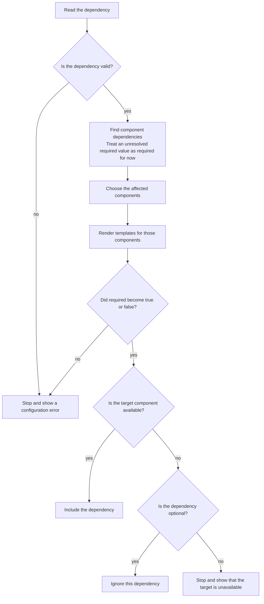

# Fix: `list dependencies` renders templated `required` values

**Date:** 2026-09-09

## Summary

Scoped `list dependencies --process-templates` now defers templated dependency optionality until the selected component is rendered.

## Context

The lightweight closure-discovery pass parsed an unresolved `required` template as a boolean before Phase C rendering, causing valid manifests to fail.

## Changes

- Deferred unresolved `required` values only during structural graph discovery while preserving the conservative required default.
- Kept strict boolean parsing after Phase C rendering.
- Restored the manifest-schema fixture's `required` property and added embedded/fixture parity coverage.
- Documented templated optionality and optional-edge output markers.

## Validation

- `go test ./pkg/list/dependencies -run TestResolveScopedClosureRendersTemplatedRequiredBeforeValidation -count=1`
- `go test ./pkg/datafetcher -run TestManifestSchema_ComponentDependencyRequiredForms -count=1`

## Follow-ups

None.
