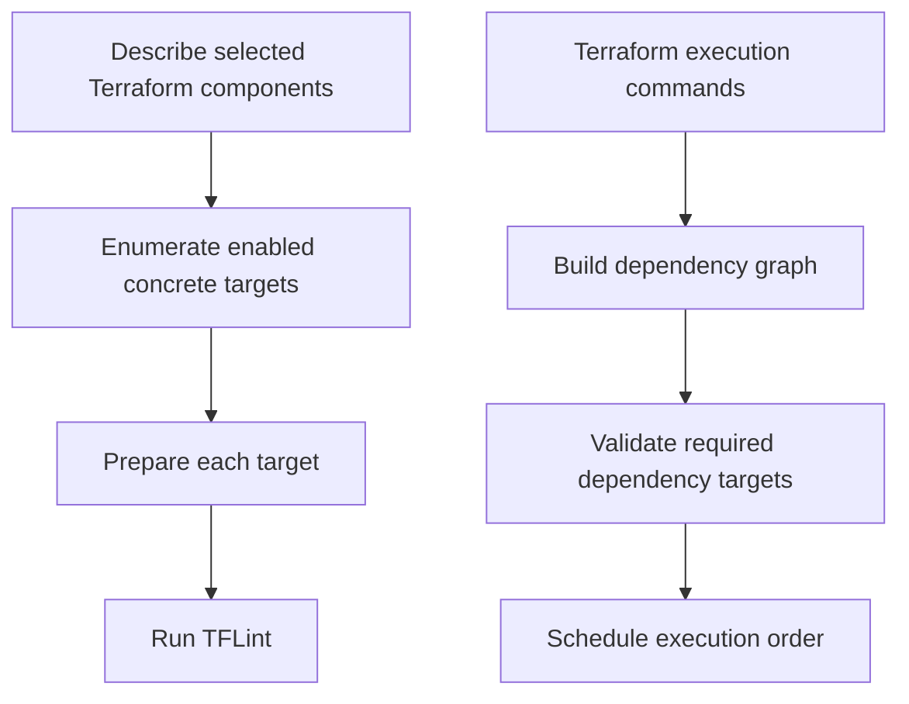

# Fix: `terraform lint` handles filtered dependency targets

**Date:** 2026-09-09

## Summary

`terraform lint <component>` now lints the requested enabled Terraform component without constructing or validating a dependency execution graph.

## Context

TFLint discovers only the requested component. The conditional dependency change made graph construction validate required dependencies strictly, so a dependency omitted by that discovery filter was incorrectly reported as missing before TFLint ran.

## Changes

- Added `scheduleradapters.TerraformTargets` to enumerate enabled, non-abstract Terraform components without resolving dependencies.
- Switched TFLint from dependency-graph construction to target enumeration.
- Added a regression test for a requested component whose required dependency is not part of the discovered stack result.

## Validation

- `go test ./pkg/scanners/tflint ./pkg/scheduler/adapters -count=1`
- `go build ./...`
- `/tmp/opencode/atmos --chdir=examples/quick-start-advanced terraform lint sqs-queue -s plat-ue2-dev --identity=false`
- `atmos test` was blocked by inherited Terraform plugin-cache paths under `/Users/zack.annexstein`; targeted tests passed.

## Follow-ups

None.
