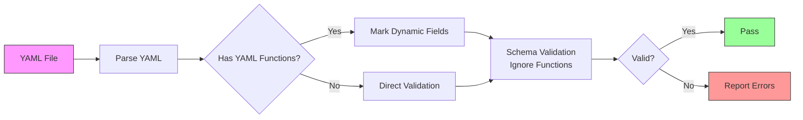

# Product Requirements Document: Atmos Schema System

**Document Version:** 1.0
**Date:** 2025-01-03
**Status:** Implemented
**Authors:** Cloud Posse Engineering Team

## Executive Summary

The Atmos Schema System provides JSON Schema-based validation for all Atmos configuration files, including CLI configurations, stack manifests, vendor configurations, and workflows. This PRD documents the requirements, design decisions, and implementation details for supporting YAML functions and dynamic typing within a schema validation framework.

## Problem Statement

### Current Challenges

1. **Type Polymorphism**: Atmos configurations support YAML functions (e.g., `!env`, `!terraform.output`) that can appear in any field and return any type, making traditional strict schema validation impossible.

2. **Retroactive Schema Creation**: Schemas are being created after hundreds of configuration files already exist in production, requiring backward compatibility.

3. **Mixed Usage Patterns**: Some fields are strictly typed (e.g., `base_path` must be a string), while others are dynamic (e.g., `vars` can contain functions returning any type).

4. **Test File Pollution**: The codebase contains deliberately invalid configurations for testing, which must be excluded from production validation.

5. **No Runtime Type Checking**: Schema validation occurs before YAML function execution, meaning we cannot validate the resolved types.

### Business Impact

- **Developer Experience**: Unclear validation errors lead to confusion and wasted debugging time
- **CI/CD Reliability**: False positives in validation block legitimate deployments
- **Configuration Drift**: Lack of validation allows invalid configurations to propagate
- **Onboarding Friction**: New users struggle to understand what configurations are valid

## Goals and Non-Goals

### Goals

1. **Provide structural validation** for all Atmos configuration types
2. **Support YAML functions** without breaking schema validation
3. **Maintain backward compatibility** with existing configurations
4. **Enable progressive enhancement** of schemas based on usage patterns
5. **Create clear documentation** of what fields support which types
6. **Establish validation infrastructure** for CI/CD integration

### Non-Goals

1. **Type checking after function resolution** - This is a runtime concern, not schema validation
2. **Automatic type inference** from variable names or patterns
3. **Breaking existing valid configurations** to enforce stricter typing
4. **Validating the output of YAML functions** during schema validation
5. **Creating separate schemas for every possible configuration variant**

## Requirements

### Functional Requirements

#### FR1: Schema Types
The system MUST provide schemas for:
- **CLI Configuration** (`atmos.yaml`)
- **Stack Manifests** (stack configuration files)
- **Vendor Configuration** (`vendor.yaml`)
- **Workflow Definitions** (workflow files)

#### FR2: YAML Function Support
The system MUST support the following YAML functions appearing in configuration values:
- `!include` / `!include.raw` - File inclusion
- `!env` - Environment variable resolution
- `!exec` - Command execution
- `!template` - Go template processing
- `!terraform.output` / `!terraform.state` - Terraform integration
- `!store` / `!store.get` - External store access
- `!repo-root` - Repository root path

#### FR3: Field Classification
Fields MUST be classified as either:
- **Static Fields**: Strictly typed, no YAML functions allowed
- **Dynamic Fields**: Accept any type due to potential YAML function usage

#### FR4: Validation Modes
The system MUST support:
- **Structure Validation**: Validate YAML structure and field names
- **Schema Validation**: Validate against JSON Schema (ignoring YAML functions)
- **Exclusion Patterns**: Skip known test files with deliberate failures

#### FR5: Backward Compatibility
- Existing valid configurations MUST continue to pass validation
- Removal of overly strict `required` fields
- Addition of `additionalProperties: true` where appropriate

### Non-Functional Requirements

#### NFR1: Performance
- Schema validation MUST complete in <100ms per file
- Validation script MUST process entire codebase in <30 seconds

#### NFR2: Usability
- Clear, color-coded output for validation results
- Helpful error messages that indicate what's wrong
- Documentation accessible to both developers and operators

#### NFR3: Maintainability
- Schemas stored in version control
- Clear separation between schema definitions
- Documented process for updating schemas

#### NFR4: Extensibility
- Support for adding new YAML functions
- Ability to add custom validation rules
- Progressive schema refinement based on telemetry

## Design Decisions

### Decision 1: Permissive Over Restrictive
**Choice**: Make schemas permissive by default, tighten based on actual usage
**Rationale**:
- Avoids breaking existing configurations
- Allows gradual schema refinement
- Reduces false positives in validation

**Trade-offs**:
- Less type safety initially
- May miss some invalid configurations
- Requires monitoring and iteration

### Decision 2: Any Type for Dynamic Fields
**Choice**: Fields that can contain YAML functions accept any type
**Rationale**:
- YAML functions can return any type
- No reliable way to predict return types
- Simplifies schema maintenance

**Trade-offs**:
- Loss of type checking for these fields
- Potential for runtime errors
- Reduced IDE autocomplete support

### Decision 3: Two-Phase Validation
**Choice**: Separate structure validation from runtime validation
**Rationale**:
- Schema validation cannot execute functions
- Clear separation of concerns
- Enables different validation strategies

**Trade-offs**:
- Some errors only caught at runtime
- Requires additional validation layer
- More complex validation pipeline

### Decision 4: Explicit Test Exclusions
**Choice**: Maintain exclusion list for test files with known issues
**Rationale**:
- Test files intentionally contain invalid configs
- Prevents noise in validation reports
- Focuses validation on production configs

**Trade-offs**:
- Requires maintaining exclusion list
- Risk of accidentally excluding real issues
- Additional complexity in validation script

## Technical Architecture

### Schema Structure

```yaml
# Schema Hierarchy
schemas/
├── atmos/
│   └── 1.0/
│       ├── cli.json          # CLI configuration schema
│       ├── stack.json         # Stack manifest schema
│       ├── vendor.json        # Vendor configuration schema
│       └── workflow.json      # Workflow definition schema
├── validation/
│   ├── validate-all-schemas.sh
│   └── exclusions.yaml
└── docs/
    └── SCHEMA_VALIDATION.md
```

### Field Classification Matrix

| Configuration Type | Static Fields | Dynamic Fields |
|-------------------|---------------|----------------|
| **CLI Config** | `base_path`, `*.command`, `logs.level` | `stores.*`, `templates.*` |
| **Stack Manifest** | Structure fields, `metadata.component` | `vars.*`, `env.*`, `settings.*` |
| **Vendor Config** | `spec.source`, `spec.version` | `spec.targets`, `spec.includes` |
| **Workflow** | `name`, `description` | `steps[].cmd`, `steps[].args` |

### Validation Pipeline



## Implementation Plan

### Phase 1: Schema Definition ✅ COMPLETED
- [x] Create JSON schemas for all configuration types
- [x] Add `additionalProperties: true` where needed
- [x] Remove overly strict required fields
- [x] Document YAML function patterns

### Phase 2: Validation Infrastructure ✅ COMPLETED
- [x] Create validation test script
- [x] Implement exclusion patterns
- [x] Add color-coded output
- [x] Test on existing configurations

### Phase 3: Documentation ✅ COMPLETED
- [x] Create SCHEMA_VALIDATION.md
- [x] Document field classifications
- [x] Provide usage examples
- [x] List common issues and solutions

### Phase 4: Future Enhancements 🔄 PLANNED
- [ ] Add schema validation to CI/CD pipeline
- [ ] Implement telemetry for schema usage
- [ ] Create schema generation from Go structs
- [ ] Build visual schema explorer
- [ ] Add runtime type checking layer

## Success Metrics

### Quantitative Metrics
- **Validation Coverage**: >95% of production configs pass validation
- **False Positive Rate**: <1% of valid configs flagged as invalid
- **Performance**: <100ms validation time per file
- **Adoption**: Schema validation integrated in 100% of CI pipelines

### Qualitative Metrics
- **Developer Satisfaction**: Reduced confusion around configuration requirements
- **Error Clarity**: Validation errors clearly indicate the problem
- **Documentation Quality**: New users can understand schema requirements
- **Maintenance Burden**: Schema updates require <1 hour per change

## Risk Analysis

### Risk 1: Breaking Changes
**Probability**: Medium
**Impact**: High
**Mitigation**:
- Extensive testing before schema changes
- Gradual rollout with feature flags
- Rollback plan for schema updates

### Risk 2: YAML Function Evolution
**Probability**: High
**Impact**: Medium
**Mitigation**:
- Design schemas to be extensible
- Document process for adding new functions
- Regular schema audits

### Risk 3: Performance Degradation
**Probability**: Low
**Impact**: Medium
**Mitigation**:
- Performance benchmarks in CI
- Caching of schema validation results
- Parallel validation for large codebases

### Risk 4: Incomplete Validation
**Probability**: Medium
**Impact**: Low
**Mitigation**:
- Two-phase validation approach
- Runtime validation supplements schema validation
- Regular audits of validation gaps

## Alternatives Considered

### Alternative 1: Strict Type System
**Description**: Enforce strict types, disallow YAML functions in most fields
**Rejected Because**: Would break existing configurations and reduce flexibility

### Alternative 2: Runtime-Only Validation
**Description**: Skip schema validation, only validate after function execution
**Rejected Because**: Loses benefits of early validation and IDE support

### Alternative 3: Multiple Schema Versions
**Description**: Create different schemas for different use cases
**Rejected Because**: Too complex to maintain and document

### Alternative 4: Custom Schema Language
**Description**: Create Atmos-specific schema language supporting functions
**Rejected Because**: High implementation cost, low ecosystem support

## Dependencies

### Technical Dependencies
- JSON Schema Draft 2020-12 specification
- YAML 1.2 specification
- Go template engine (for template functions)
- Terraform/OpenTofu CLI (for terraform functions)

### Organizational Dependencies
- Engineering team for schema maintenance
- DevOps team for CI/CD integration
- Documentation team for user guides
- Support team for troubleshooting

## Timeline

### Completed Milestones
- **Week 1**: Schema analysis and design ✅
- **Week 2**: Schema implementation ✅
- **Week 3**: Validation infrastructure ✅
- **Week 4**: Documentation and rollout ✅

### Future Milestones
- **Q1 2025**: CI/CD integration
- **Q2 2025**: Schema generation automation
- **Q3 2025**: Visual schema explorer
- **Q4 2025**: Runtime type checking

## Open Questions

1. **Q**: Should we version schemas independently from Atmos?
   **A**: Yes, use semantic versioning for schemas (1.0, 1.1, 2.0)

2. **Q**: How do we handle schema migration?
   **A**: Provide migration tools and deprecation warnings

3. **Q**: Should schemas be bundled with Atmos or downloaded?
   **A**: Bundle for offline support, allow override via URL

4. **Q**: How do we collect telemetry on schema usage?
   **A**: Anonymous field usage statistics in Atmos telemetry

## Conclusion

The Atmos Schema System provides a pragmatic approach to validating complex, dynamic configuration files. By accepting the reality of YAML functions and type polymorphism, we've created a validation system that provides value without breaking existing workflows. The two-phase validation approach, combined with clear documentation and tooling, enables teams to gradually improve their configuration quality while maintaining backward compatibility.

The key insight is that perfect type safety is less important than practical validation that catches common errors while allowing the flexibility that makes Atmos powerful. This PRD documents not just what we built, but why we made these choices and how they serve our users.

## Appendices

### Appendix A: YAML Function Reference

| Function | Return Type | Example | Use Case |
|----------|------------|---------|----------|
| `!include` | Any | `!include common.yaml` | Reuse configuration |
| `!env` | String | `!env AWS_REGION` | Environment variables |
| `!exec` | String | `!exec date +%Y` | Dynamic values |
| `!template` | Any | `!template '{{ .vars.name }}'` | Templating |
| `!terraform.output` | Any | `!terraform.output vpc dev id` | Cross-stack references |
| `!terraform.state` | Any | `!terraform.state vpc dev outputs` | State queries |
| `!store` | Any | `!store redis key` | External stores |
| `!store.get` | Any | `!store.get ssm /param` | Parameter stores |
| `!repo-root` | String | `!repo-root` | Repository paths |

### Appendix B: Validation Script Usage

```bash
# Run validation on all schemas
./validate-all-schemas.sh

# Output format
✅ PASS: Valid configuration
❌ FAIL: Invalid configuration
⏭️ SKIP: Test file with known issues

# Exit codes
0 - All validations passed
1 - One or more validations failed
```

### Appendix C: Schema Update Process

1. Identify need for schema change
2. Test change against existing configs
3. Update schema file
4. Run validation script
5. Update documentation
6. Create pull request
7. Deploy after review

### Appendix D: References

- [JSON Schema Specification](https://json-schema.org/specification.html)
- [YAML 1.2 Specification](https://yaml.org/spec/1.2.2/)
- [Atmos Documentation](https://atmos.tools)
- [Go Template Documentation](https://pkg.go.dev/text/template)
