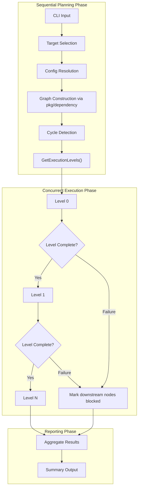

# Proposal: Concurrent Component Provisioning with Dependency-Aware Orchestration

## Summary

Add a concurrent execution mode on top of Atmos' dependency-ordered Terraform execution so that multiple ready component instances can run in parallel from a single `atmos` invocation.

The intent is to keep Atmos' existing dependency semantics and existing dependency graph work, but replace strictly sequential execution of the graph with bounded concurrent scheduling:

- Independent components run concurrently
- Dependent components wait until prerequisites complete
- Cross-stack dependencies are respected
- CI pipelines can execute a full dependency tree from one job instead of coordinating many matrix jobs

This proposal is intentionally design-only. It does not include implementation details beyond the level needed for maintainers to evaluate fit, scope, and risks.

## Problem

Atmos already supports bulk Terraform execution patterns such as:

- `--affected`
- `--all`
- `--components`
- `--query`

It also already models component dependencies through `settings.depends_on`.

PR #1516 answered a large part of the ordering problem by adding reusable dependency graph logic, topological sorting, cross-stack dependency support, filtering, and dependency-ordered execution for bulk Terraform paths. That work is now merged and should be treated as the existing foundation for this proposal.

The remaining gap is that execution of the resolved graph is still sequential. That leaves two concrete problems:

1. Large deployments take longer than necessary because independent components are serialized
2. CI users who want to deploy a dependency tree from one command still need external orchestration, often via a matrix

This is most visible in scenarios such as:

- A platform stack with `vpc`, `dns`, and `iam` as independent roots
- Application stacks that depend on shared network or cluster components
- `--affected --include-dependents` runs where the dependency set is already known, but execution still proceeds one component at a time

## Motivation

The feature matters for both local and CI workflows.

### Local Use

- Faster feedback for large changes
- Simpler "apply the whole slice" workflows
- Better fit for repositories with many component instances

### CI Use

- One `atmos` process can own dependency discovery and execution
- No need to distribute stacks across matrix jobs just to express ordering
- Failures can be reported in graph terms: failed, blocked, skipped, completed

## Current State in the Repository

On current `main`, the repo already contains the main building blocks needed for this feature:

- PR #1516 added a reusable dependency graph package, Kahn-based topological sorting, deterministic ordering, cycle detection, cross-stack support, filtering, and shared execution paths for `--all` and `--affected`
- PR #1876 introduced isolated Terraform component workdirs and positioned them as an enabler for concurrent component execution
- `settings.depends_on` is part of the stack schema
- `describe dependents` can already discover reverse edges
- non-affected multi-component CLI routing (`--all`, `--components`, `--query`) still flows through `ExecuteTerraformQuery`, which walks stacks sequentially
- the graph-backed `ExecuteTerraformAll` executor exists, but is not yet the active CLI path and does not yet match `ExecuteTerraformQuery`'s auth/store bridge behavior for YAML-function-driven config resolution
- current shell execution still binds subprocesses to shared `os.Stdin`, `os.Stdout`, and `os.Stderr`
- Terraform workdirs are explicitly positioned as enabling isolated concurrent execution

At the same time, there are important constraints:

- Config loading is not concurrency-safe today
- Current workflow execution is documented and implemented as sequential
- Some execution structs are mutated in-place and therefore are not safe to share between goroutines

That suggests the right boundary is:

- Build the execution plan sequentially
- Execute the plan concurrently using immutable per-node inputs

## Existing Foundation

This proposal assumes and builds on the following existing foundation:

- the merged PR #1516 graph-backed dependency-ordering foundation for Terraform bulk execution
- the PR #1876 execution-isolation foundation via workdirs

## Potential Additional Foundation from PR #1891

If PR #1891 merges before implementation starts, this proposal should reuse it where it fits:

- `RunCIHooks` and `pkg/ci` provider bindings for Terraform `plan` and `apply`
- `--ci` flags plus CI-related schema/config surface
- planfile upload/download and human-facing CI summary/output integration

If PR #1891 merges first, `plan` and `apply` are no longer hook-free from the concurrency planner's perspective, because concurrent execution would need to preserve those CI-oriented lifecycle actions per node rather than once per command.

However, PR #1891 would not remove the need for:

- stream-injectable subprocess output capture
- CLI routing consolidation onto one graph-backed bulk executor
- node-level hook execution under concurrency
- a stable scheduler result model and JSON summary contract

## What PR #1516 Already Settles

Now that PR #1516 is merged, this proposal should not reopen design questions that it already addresses.

Those decisions include:

- using a reusable dependency graph package instead of keeping graph logic inside one command path
- using topological sorting to derive execution order
- detecting circular dependencies up front with actionable errors
- supporting cross-stack dependencies
- supporting existing bulk selectors and filters
- preserving deterministic ordering for reproducible runs
- handling destroy in reverse dependency order

The proposal in this document is therefore intentionally narrower:

- do not redesign graph construction
- do not redesign filter semantics
- do not redesign ordered `--all` or `--affected`
- add concurrent scheduling on top of the ordered graph that PR #1516 defines

## Goals

- Provision multiple component instances concurrently when they have no unresolved dependencies
- Reuse Atmos' existing dependency model instead of introducing a second ordering system
- Support cross-stack orchestration from one invocation
- Fit naturally into existing multi-component Terraform entry points
- Provide deterministic behavior and summary reporting suitable for CI

## Non-Goals

- Replacing Terraform's internal resource-level parallelism
- Replacing workflows as a general task runner
- Changing the meaning of `settings.depends_on`
- Solving every possible multi-tool orchestration case in the first version
- Implementing distributed execution across multiple machines

## Proposed Direction

Extend the graph-based Terraform executor from PR #1516 with concurrent scheduling of ready nodes.

Because current `main` still routes non-affected bulk CLI execution through `ExecuteTerraformQuery`, the first implementation step should be to converge `--all`, `--components`, and `--query` onto one graph-backed bulk executor with auth/store parity before concurrency is introduced.

Conceptually, the flow is:

1. Select target component instances from one command
2. Build and filter the dependency graph using the existing graph package
3. Derive execution batches or a ready queue from that graph
4. Schedule ready nodes with bounded concurrency
5. Aggregate results and stop or continue based on failure policy

This is best introduced as an extension of the existing multi-component Terraform execution path, not as an extension of current workflows.

### Why Terraform Bulk Execution Is the Best Landing Point

The most natural place for the first version is the existing Terraform bulk executor because it already supports:

- Target selection
- Affected detection
- Dependency-aware ordering
- Graph construction and filtering
- Per-component execution

By contrast, workflows are list-based and sequential by design. They are a poor fit for dynamic graph scheduling unless their model is substantially expanded.

### Architecture Sketch



For simplicity, the diagram shows a linear sequence of levels, but the same blocked-path behavior applies if any execution level fails.

## Execution Model

### 1. Build the Target Set

The orchestrator would accept the same high-level selectors users already understand:

- `--affected`
- `--all`
- `--components`
- `--query`

Recommended target-expansion policy for Phase 1:

- selected roots should be expanded to a prerequisite-closed set by default
- `settings.depends_on` prerequisites should therefore be auto-included before scheduling begins
- `--include-dependents` should remain the explicit opt-in for reverse-edge expansion
- `--require-closure` should be the strict validation flag for users who want the command to fail instead of auto-including omitted prerequisites

The result should be normalized into unique executable nodes keyed by:

- component type
- stack
- component instance name

Using the stack plus component instance is important because the same base component can appear many times across stacks.

Example command shapes:

```shell
atmos terraform plan --components eks --stack tenant1-ue2-dev
# Auto-includes declared prerequisites before scheduling.

atmos terraform plan --components vpc,iam,eks --stack tenant1-ue2-dev --require-closure
# Fails if the explicit target set is not already closed over prerequisites.

atmos terraform apply --affected --include-dependents --max-concurrency 8 -- -auto-approve
# Includes prerequisites by default and adds reverse dependents only when requested.
```

This proposal should reuse the existing graph-building and filtering logic from PR #1516 rather than replace it.

### 2. Build and Filter the Dependency Graph

Each selected node already becomes a vertex in a graph under the PR #1516 design.

Edges come from `settings.depends_on`, and the graph layer already handles the major graph concerns:

- dependencies within a stack
- dependencies across stacks
- transitive prerequisite inclusion
- cycle detection
- deterministic ordering

Closure and validation rules should be explicit:

- if a prerequisite is missing only from the user-selected target set, auto-include it by default
- if `--require-closure` is set, treat omitted prerequisites as a validation error instead of auto-expanding them
- if a `settings.depends_on` edge cannot be resolved to a unique component instance, fail validation
- if graph construction detects a cycle, fail validation

Cycle detection, missing-dependency checks, ambiguous-component resolution, and closure validation should all complete before any node execution begins.

If additional expansion is needed for `--include-dependents`, that should also happen as a graph operation rather than as a separate execution model.

### 3. Derive Execution Levels

PR #1516 already uses topological sorting and introduces `GetExecutionLevels()`. Phase 1 should use level-based scheduling as the default model:

- all nodes in level 0 are eligible to run first
- level 1 only starts after level 0 completes successfully
- level N only starts after level N-1 completes successfully

This is simpler, deterministic, easier to debug, and directly matches the graph API introduced by PR #1516.

The trade-off is utilization: if one node in a level is much slower than its peers, downstream work still waits for the entire level to finish, which can leave workers idle.

A streaming ready-queue remains a valid later-phase optimization for unbalanced graphs, but it should not be the initial scheduler model.

### 4. Concurrent Scheduling

Once execution levels or ready nodes are known, the scheduler should:

- dispatch ready nodes concurrently
- cap concurrency with a worker-pool limit
- mark nodes complete, failed, blocked, or skipped
- unlock downstream nodes only when all prerequisites succeed

At a high level, this is a standard DAG scheduler layered on top of the graph that already exists.

The user-facing concurrency control should be opt-in in Phase 1, with default concurrency of 1 for backward-compatible behavior.

Recommended flag:

- `--max-concurrency N`

This avoids confusion with Terraform's own `-parallelism` flag, which controls resource-level parallelism inside a single component.

If `--max-concurrency > 1` is set and any prerequisite for safe concurrent execution is not met, the CLI should fail fast during validation before any node executes. That includes workdir requirements, non-interactive auth requirements, and command-specific prerequisites such as `-auto-approve` for concurrent `apply` and `destroy`.

### 5. Failure Handling

Failure semantics must be explicit.

Recommended default behavior:

- for `plan`, `apply`, and similar forward-order commands, if a node fails, do not run nodes that depend on it
- for `atmos terraform destroy --all`, if destruction of a dependent node fails, block destruction of that node's prerequisites in the reversed graph
- continue running already-started or otherwise independent nodes where safe
- return a non-zero exit code at the end

Recommended aggregate exit-code rule:

- for `plan`, return `1` if any node failed, `2` if no nodes failed and at least one node returned Terraform's "changes detected" exit code, otherwise `0`
- for other commands, return non-zero if any node failed or execution was interrupted

This gives better CI behavior than either extreme:

- pure fail-fast, which wastes parallel work already available
- pure continue-on-error, which can produce confusing downstream failures

A later extension could add a stricter mode that stops scheduling new work after the first failure.

## CI Shape

One explicit motivation for this feature is to let CI run dependent stacks from a single Atmos command instead of a job matrix.

### Example Shape

Conceptually, a pipeline would be able to run something like:

```shell
atmos terraform apply --affected --include-dependents --max-concurrency 8 -- -auto-approve
```

That single invocation would:

- discover changed roots
- expand dependent component instances
- preserve dependency order
- apply independent branches concurrently
- report one aggregated result to CI

### Why This Is Better Than a Matrix for This Use Case

For dependency-aware infrastructure changes, the matrix model pushes graph logic outside Atmos.

That has several drawbacks:

- ordering is harder to express
- failures are fragmented across jobs
- skipped or blocked dependents are harder to reason about
- duplicated setup work increases CI cost

A single orchestrated invocation keeps dependency discovery, ordering, and execution policy in one place.

## Output and Reporting

Parallel execution introduces a usability problem: raw interleaved stdout becomes difficult to read.

The orchestration layer should therefore produce structured output at the node level.

Recommended reporting model:

- live progress line per component instance or a compact event stream
- per-node result states: `pending`, `running`, `completed`, `failed`, `blocked`, `skipped`
- final summary table or JSON output
- structured per-node log fields such as `component`, `stack`, and execution level or node ID

This is especially important for CI, where users need to understand:

- what ran
- what failed
- what was blocked by upstream failures
- what never became eligible to run

Phase 1 should also define a stable machine-readable CI contract, not just a best-effort JSON dump.

Recommended Phase 1 JSON summary contract:

- transport may be stdout or an explicit output file, but the document shape should remain stable within v1
- top-level fields should include at least `version`, `command`, `started_at`, `finished_at`, `overall_status`, `exit_code`, and `nodes`
- `overall_status` should be constrained to stable values such as `completed`, `failed`, or `interrupted`
- each node entry should include at least `id`, `component`, `stack`, `level`, `status`, `exit_code`, `started_at`, and `finished_at`
- node `status` values should be limited to `pending`, `running`, `completed`, `failed`, `blocked`, and `skipped`
- emitters should sort the top-level `nodes` array by topological `level` first, then by a stable key such as `component` plus `id`, so concurrent completion timing cannot affect output order or diffs
- timestamps should use RFC 3339 format
- v1 compatibility should be additive only: new fields may be added, but existing field names and meanings should not change

If PR #1891 is merged first, its CI summaries, outputs, and planfile actions should layer on top of node-level results and captured output, not replace this stable machine-readable contract.

## Output Isolation

Concurrent execution cannot reuse the current shell execution model unchanged because Atmos subprocess execution still binds each command to shared process stdio.

Phase 1 should therefore require per-node output isolation:

- capture stdout and stderr per component instance
- write per-node logs to a deterministic location such as the component workdir
- keep secret masking behavior consistent with the current `MaskWriter` path
- render live progress separately from raw Terraform output

Recommended Phase 1 model:

- live event stream or compact progress lines in the terminal
- per-component detailed logs on disk
- final summary that links each failed node to its captured output

Per-node structured log context should be injected at the worker boundary so shared logger output remains attributable even when multiple workers are active.

## Interactive Approval

Concurrent `apply` and `destroy` cannot rely on shared `os.Stdin` for interactive approval.

Recommended Phase 1 behavior:

- require non-interactive execution when `--max-concurrency > 1`
- require `-auto-approve` for concurrent `apply` and `destroy`
- document this as an explicit behavioral constraint of concurrent mode

Concurrent `plan` remains safe without approval prompts, but its output still needs per-node capture and aggregation.

## Signal Handling and Cancellation

Signal behavior must be explicit before concurrent execution is introduced.

Recommended default:

- on `SIGINT` or `SIGTERM`, stop scheduling new nodes
- allow running nodes to finish gracefully within a timeout
- if the timeout expires, terminate remaining child processes
- return a non-zero exit code and mark unfinished downstream nodes appropriately

Implementation-wise, this strongly suggests moving the concurrent executor toward context-aware subprocess handling rather than directly calling subprocesses without cancellation semantics.

## Auth and Credential Lifecycle

Authentication should be treated as a shared resource, not as an incidental per-node side effect.

Recommended Phase 1 model:

- perform auth bootstrap during the planning phase
- create or resolve the required `AuthManager` instances before concurrent execution begins
- pass authenticated context into node execution instead of re-prompting per node
- serialize or otherwise guard credential refresh paths that are not safe under concurrent access

Browser- or device-code-based interactive auth flows are especially problematic under concurrency and should be documented as incompatible with high parallelism unless pre-authenticated.

## Execution Context Isolation

Each worker must receive an isolated execution context.

Recommended assumptions:

- deep-copy `ConfigAndStacksInfo` per node before mutation
- avoid shared mutable execution structs across goroutines
- prefer passing pre-resolved configuration and graph results into workers rather than repeating full config resolution in each worker where possible
- treat `AtmosConfiguration` as shared read-only configuration unless a specific subsystem requires cloning

This is necessary both for correctness and for reducing redundant stack/config processing during large runs.

## Node Completion Semantics

For scheduling purposes, a node should not be considered complete merely because the Terraform subprocess exited with code 0.

A node should be considered complete only after:

- the Terraform command finishes successfully
- any required post-command hooks complete successfully
- any required post-apply store updates complete successfully

This matters because downstream components may depend on side effects produced after `apply`, not only on Terraform state changes themselves.

## CI Hook Implications If PR #1891 Lands First

If PR #1891 merges before implementation begins, concurrent execution should treat its CI lifecycle bindings as part of node execution, not as one command-level afterthought.

That means:

- `after.terraform.plan` should run per node using that node's captured output
- `after.terraform.apply` should run per node after that node completes successfully
- `before.terraform.apply` planfile download should be evaluated per node before apply starts
- if concurrent mode cannot preserve those semantics in the first cut, the CLI should fail fast for incompatible combinations such as `--ci` with `--max-concurrency > 1` rather than silently dropping CI behavior

## Rate Limits and Concurrency Defaults

Component-level concurrency multiplies Terraform's own resource-level concurrency and can easily amplify cloud API load.

Recommended Phase 1 defaults:

- keep concurrent mode opt-in
- use conservative examples and defaults
- document the interaction between component-level concurrency and Terraform `-parallelism`

Per-account or per-provider limits are valid future extensions, but a single global concurrency cap is sufficient for Phase 1.

## Remote State and Undeclared Dependencies

Declared dependencies are protected by the graph: prerequisites complete before dependents start, which avoids stale reads for properly-declared remote state relationships.

However, concurrent mode does not protect undeclared dependencies.

The proposal should explicitly document that:

- each component instance is assumed to own separate state
- declared `settings.depends_on` relationships are respected
- components that read remote state or store values without declaring dependencies may still observe unsafe ordering

## Destroy Semantics Under Concurrency

Destroy ordering should remain the reverse of apply ordering.

Under concurrent scheduling, this means:

- nodes with no dependents are eligible to destroy first
- reversed execution levels can run concurrently
- a node can only be destroyed after all of its dependents have completed destruction

This preserves the reverse-topological semantics already defined by PR #1516.

If a destroy node fails, the scheduler should block destruction of its prerequisites while still allowing unrelated or already-running reverse-order branches to complete safely.

## Plan Output Aggregation

Concurrent `plan` is operationally different from concurrent `apply` because users need to review the results.

Phase 1 should include:

- per-component captured plan output
- a summary of nodes with changes, no changes, and errors
- a deterministic output directory or log location for detailed inspection

If machine-readable output is supported, plan summaries should be available there from the start for CI consumption.

## Resumability

Resumability can remain a later phase, but the proposal should define the shape now.

Recommended direction:

- write execution state atomically after each node completes
- persist node status as `completed`, `failed`, `blocked`, `skipped`, or `not-started`
- allow a future `--resume` mode to skip completed nodes and continue from the last known execution state

This is particularly valuable for large CI or operator-driven runs with many long-lived nodes.

## Concurrency and Safety Considerations

This feature should treat planning and execution differently.

### Plan Sequentially

Config loading and stack resolution should stay sequential in the first version.

The repository already documents that config loading is not concurrency-safe, so the safe model is:

- resolve config once
- build the execution graph once
- freeze the plan

### Execute Concurrently

Once the graph is frozen, each executable node should receive an isolated execution context.

That means:

- no shared mutable `ConfigAndStacksInfo` between goroutines
- no shared mutable per-run argument objects
- per-node environment preparation
- per-node logging context

### Workdir Isolation

Terraform workdirs already point in the right direction for this feature:

- isolated directories per component instance
- separation of generated files
- reduced risk of collisions between concurrent executions

This proposal should rely on workdir isolation rather than attempt to share a single component directory across concurrent runs.

## Scope Recommendation

The lowest-risk path is a staged rollout: two foundation PRs followed by three feature phases.

This proposal should be treated as the concurrency layer that builds on top of the dependency graph foundation from PR #1516 and the workdir foundation from PR #1876, and, if it lands first, should reuse the CI/reporting infrastructure from PR #1891 where it fits.

### Foundation PR 1

Introduce stream-injectable subprocess execution and remove output-handling patterns that are unsafe under concurrency.

Suggested scope:

- refactor shell execution so callers can inject stdout/stderr destinations while preserving current defaults
- eliminate global stdout swapping in plan/show paths
- make no CLI surface or scheduling changes yet

This is pure plumbing and should land separately because it affects hot subprocess paths but should not change user-visible behavior.

### Foundation PR 2

Consolidate non-affected bulk Terraform CLI routing onto one graph-backed executor before adding concurrency.

Suggested scope:

- route the non-affected bulk forms of `atmos terraform plan`, `atmos terraform apply`, and `atmos terraform destroy` through a shared graph-backed bulk executor
- ensure that `--all`, `--components`, and `--query` all use that same bulk executor
- preserve auth and store-resolution behavior that currently lives in `ExecuteTerraformQuery`
- ship deterministic dependency ordering for those selectors before concurrency is introduced

This is valuable on its own because it fixes ordering for bulk commands and flushes out graph/auth parity issues before a scheduler is layered on top.

### Phase 1

Add concurrent scheduling for `atmos terraform plan` on the graph-backed non-affected bulk path.

Suggested initial surface:

- `atmos terraform plan --all`
- `atmos terraform plan --components ...`
- `atmos terraform plan --query ...`

Recommended Phase 1 constraints:

- opt-in only, with default concurrency of 1
- level-based scheduling only
- in Phase 1, `--max-concurrency` should be exposed on `atmos terraform plan` only; `apply` and `destroy` should not accept the flag until Phase 2
- workdirs required when `--max-concurrency > 1`
- pre-authenticated, non-interactive auth only when `--max-concurrency > 1`; fail fast if the resolved identity flow would require a browser, device-code flow, or interactive prompt
- global concurrency cap only
- machine-readable summary output available from the start
- if PR #1891 is merged by then, either invoke `after.terraform.plan` / `RunCIHooks` per node using captured output or fail fast on incompatible `--ci` combinations; silent downgrades are not acceptable

If concurrent mode is requested without workdir support, the CLI should fail fast during validation before any node execution begins.

### Phase 2

Extend the same scheduler to mutating commands on the non-affected bulk path.

Suggested surface:

- `atmos terraform apply --all`
- `atmos terraform destroy --all`
- the corresponding `--components` and `--query` forms, which already use the graph-backed path after Foundation PR 2

Recommended Phase 2 additions:

- enforce non-interactive concurrent apply/destroy with `-auto-approve`
- add signal handling and graceful cancellation
- treat hooks/store updates as part of node completion
- add reverse blocked-node semantics for destroy
- if PR #1891 is merged first, execute `before.terraform.apply` and `after.terraform.apply` CI actions per node

### Phase 3

Move `--affected` onto the shared graph-backed scheduler and then add operational refinements.

Suggested scope:

- route `atmos terraform plan --affected` and `atmos terraform apply --affected` through the shared scheduler
- preserve existing `--include-dependents` semantics on the graph-backed path
- add resumability
- consider ready-queue scheduling for better utilization
- add richer progress UX and, later, scoped concurrency limits

The `--affected` selector surface already exists through the dynamic DescribeAffected bridge in `cmd/terraform/utils.go`, so Phase 3 should reuse that path rather than introduce a separate selector model for concurrent execution.

## Alternatives Considered

### 1. Keep Using CI Matrices

This works, but it keeps graph orchestration outside Atmos.

Rejected as the primary answer because it does not solve:

- dependency-aware ordering inside one run
- unified reporting
- reuse of existing Atmos dependency metadata

### 2. Extend Workflows Instead

This would require workflows to move from an ordered list model to a graph model.

Possible in the long term, but not a good first step because:

- current workflow behavior is sequential
- the bulk Terraform path already has dependency information, graph semantics, and execution order

### 3. Run Everything in Parallel Without Dependency Awareness

This is simpler, but incorrect for real infrastructure graphs.

Rejected because it would break one of the main existing guarantees users expect from `settings.depends_on`.

## Open Questions

The maintainers should still decide the following before implementation, but Phase 1 recommendations are included here to reduce ambiguity:

1. Opt-in vs default:
   Recommended Phase 1 position: opt-in, with default concurrency of 1.
2. Execution levels vs streaming ready-queue:
   Recommended Phase 1 position: execution levels only.
3. User-facing flag name:
   Recommended Phase 1 position: `--max-concurrency`.
4. Failure policy:
   Recommended Phase 1 position: continue independent branches by default, with a future `--fail-fast` mode.
5. Workdir requirement:
   Recommended Phase 1 position: require workdirs for concurrent mode.
6. Output format:
   Recommended Phase 1 position: support JSON summary output from the start.
7. Concurrency scoping:
   Recommended Phase 1 position: global concurrency cap only; per-stack or per-account limits later.

## Recommendation

Proceed with a phase-next Terraform concurrency enhancement that builds directly on PR #1516 and PR #1876:

- reuses the dependency graph and ordering semantics from PR #1516
- reuses workdir isolation from PR #1876
- if PR #1891 lands first, reuses its CI hooks, summaries, outputs, and planfile infrastructure as a layer on top of node-level execution
- first converges the non-affected bulk CLI path onto one graph-backed executor with auth/store parity
- keeps graph construction and filtering sequential
- uses level-based scheduling first, with bounded global concurrency
- adds concurrent `plan` before concurrent `apply` and `destroy`
- requires explicit non-interactive execution for concurrent apply and destroy
- isolates per-node output and emits machine-readable summaries
- produces CI-friendly aggregated results

That gives Atmos a practical, high-value improvement without forcing a redesign of workflows, re-litigating graph design that PR #1516 already settled, or introducing a second dependency model.
