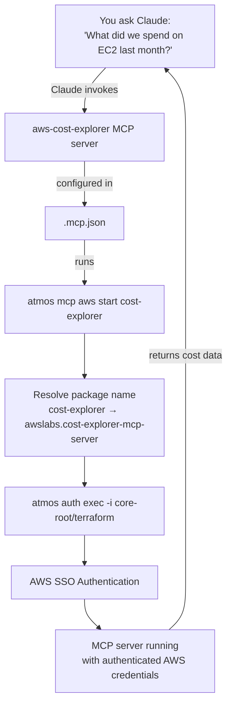

# FinOps with AWS MCP Servers

Give your AI coding assistant direct access to AWS cost data, billing, and pricing information — all authenticated automatically through Atmos. Ask Claude questions like "What did we spend on EC2 last month?" and get real answers from your actual AWS account.

## The Problem

FinOps teams need visibility into AWS costs, but the tools are scattered across consoles and APIs. Meanwhile, AI coding assistants like Claude Code can't access your AWS cost data because they need authenticated credentials — and setting that up for [AWS MCP servers](https://github.com/awslabs/mcp) manually is tedious.

You end up juggling SSO sessions, environment variables, and credential files across 20+ MCP servers. It shouldn't be this hard.

## The Solution

Use Atmos to wire everything together so AI assistants can query your AWS cost data directly:

- **Custom Commands** define `atmos mcp aws install/start/test` subcommands
- **Auth** wraps each MCP server process with `atmos auth exec`, injecting authenticated credentials automatically
- **Toolchain** ensures `uv` (the Python package manager) is available for installing MCP packages
- **`.mcp.json`** tells Claude Code to start each server via `atmos mcp aws start <name>`

The result: Claude Code gets authenticated access to AWS Billing, Cost Explorer, Pricing, and 18 other AWS services — all through a single pattern.

## Features Used

- [Custom Commands](https://atmos.tools/cli/configuration/commands) — nested subcommands for install, start, and test
- [Auth](https://atmos.tools/stacks/auth) — `atmos auth exec` wraps processes with authenticated AWS credentials
- [Toolchain](https://atmos.tools/cli/configuration/toolchain) — ensures `uv` is available via toolchain aliases
- [AI/MCP](https://atmos.tools/ai/mcp-server) — enables MCP server support

## How It Works



1. You ask Claude a question about AWS costs, infrastructure, or pricing
2. Claude invokes the relevant MCP server (e.g., `aws-cost-explorer`, `aws-pricing`)
3. The `.mcp.json` config runs `atmos mcp aws start <server-name>`
4. The custom command resolves the short name to the full Python package name
5. `atmos auth exec -i core-root/terraform` handles AWS SSO authentication
6. The MCP server process inherits the authenticated credentials and returns real data

## Getting Started

### Prerequisites

- [Atmos](https://atmos.tools/quick-start/install-atmos) installed
- AWS account with SSO configured
- Python 3.13 (for MCP server packages)

### Setup

1. Copy the configuration files from this gist into your project
2. Adjust the identity (`-i core-root/terraform`) and profile (`ATMOS_PROFILE=managers`) to match your environment
3. Install all MCP server packages:

```bash
atmos mcp aws install all
```

4. Test that authentication works:

```bash
atmos mcp aws test all
```

5. Start using MCP servers with Claude Code — the `.mcp.json` file handles the rest.

## Configuration Files

| File | Purpose |
|------|---------|
| `atmos.yaml` | Imports configuration from `.atmos.d/` |
| `.atmos.d/mcp.yaml` | Custom commands for `atmos mcp aws install/start/test` |
| `.atmos.d/toolchain.yaml` | Toolchain alias for `uv` package manager |
| `.atmos.d/ai.yaml` | Enables AI/MCP support in Atmos |
| `.mcp.json` | Claude Code MCP server configuration |

## Usage

```bash
# Install a specific MCP server package
atmos mcp aws install pricing

# Install all 21 AWS MCP server packages
atmos mcp aws install all

# Start a specific server with automatic AWS auth
atmos mcp aws start pricing

# Test that authentication is working
atmos mcp aws test all
```

## Available Servers

This gist includes 21 AWS MCP servers. The FinOps-relevant ones are highlighted:

### FinOps & Cost Management

| Server | Package | What You Can Ask |
|--------|---------|-----------------|
| billing-cost-management | awslabs.billing-cost-management-mcp-server | Billing summaries, payment history |
| cost-explorer | awslabs.cost-explorer-mcp-server | Spend breakdowns, cost trends, forecasts |
| pricing | awslabs.aws-pricing-mcp-server | On-demand vs reserved pricing, cost comparisons |

### Infrastructure & Operations

| Server | Package |
|--------|---------|
| terraform | awslabs.terraform-mcp-server |
| cfn | awslabs.cfn-mcp-server |
| cdk | awslabs.cdk-mcp-server |
| iac | awslabs.aws-iac-mcp-server |
| ecs | awslabs.ecs-mcp-server |
| eks | awslabs.eks-mcp-server |
| serverless | awslabs.aws-serverless-mcp-server |
| lambda-tool | awslabs.lambda-tool-mcp-server |
| stepfunctions-tool | awslabs.stepfunctions-tool-mcp-server |

### Observability & Security

| Server | Package |
|--------|---------|
| cloudwatch | awslabs.cloudwatch-mcp-server |
| cloudtrail | awslabs.cloudtrail-mcp-server |
| iam | awslabs.iam-mcp-server |
| well-architected-security | awslabs.well-architected-security-mcp-server |
| network | awslabs.aws-network-mcp-server |

### Data & Support

| Server | Package |
|--------|---------|
| dynamodb | awslabs.dynamodb-mcp-server |
| s3-tables | awslabs.s3-tables-mcp-server |
| documentation | awslabs.aws-documentation-mcp-server |
| support | awslabs.aws-support-mcp-server |

## Customization

### Different AWS Account/Identity

Change the identity flag in `.atmos.d/mcp.yaml`:

```yaml
# Before
exec env ATMOS_PROFILE=managers atmos auth exec -i core-root/terraform -- \

# After (your identity)
exec env ATMOS_PROFILE=your-profile atmos auth exec -i your-stack/terraform -- \
```

### Different AWS Region

Update `AWS_REGION` in `.mcp.json` for each server entry:

```json
"env": { "AWS_REGION": "us-west-2" }
```

### Adding New Servers

1. Add the server name to the `ALL_SERVERS` array in the `install` command
2. Add the package name resolution logic if it follows a non-standard naming pattern
3. Add a new entry to `.mcp.json`

## The Key Insight

`atmos auth exec` is the glue that makes this work. It wraps any command with authenticated credentials using `exec`, which replaces the current process — so the MCP server inherits the credentials directly. No temp files, no environment variable juggling, no credential expiration headaches.

Combined with Custom Commands for the install/start/test workflow and Toolchain for dependency management, you get a complete, self-contained solution for AI-powered FinOps. Your team can ask natural language questions about AWS costs and get answers from real account data — without leaving their editor.
