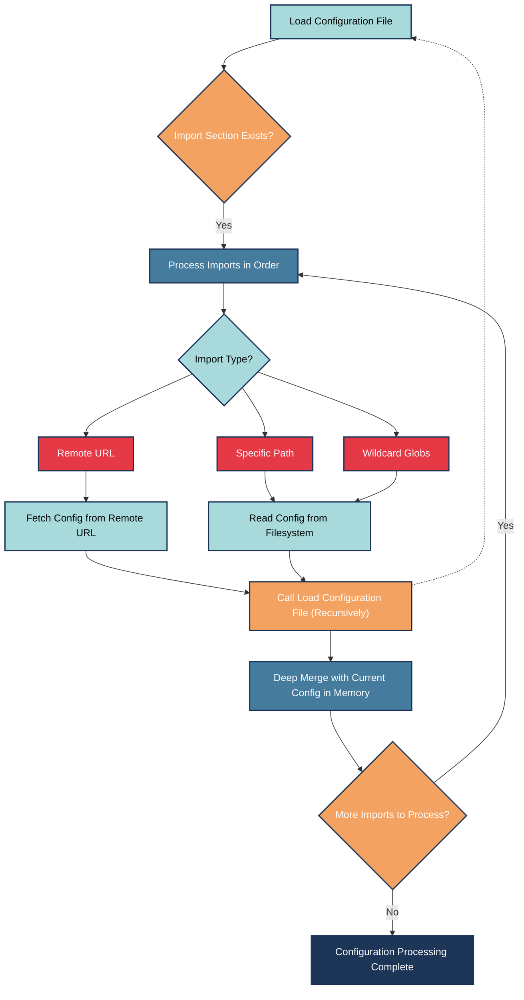

### Import Config

```mermaid
flowchart TD
    A["Load Configuration File"] --> B{"Import Section Exists?"}
    
    B -- Yes --> C["Process Imports in Order"]
    C --> D{"Import Type?"}
    D --> E["Remote URL"]
    D --> F["Specific Path"]
    D --> G["Wildcard Globs"]
    
    E --> H["Fetch Config from Remote URL"]
    F --> I["Read Config from Filesystem"]
    G --> I["Read Config from Filesystem"]
    
    H --> J["Call Load Configuration File (Recursively)"]
    I --> J["Call Load Configuration File (Recursively)"]
    
    J --> L["Deep Merge with Current Config in Memory"]
    L --> K{"More Imports to Process?"}
    K -- Yes --> C
    K -- No --> M["Configuration Processing Complete"]
    
    %% Loopback for recursion
    J -.-> A

    %% Styling for clarity
    style A fill:#A8DADC,stroke:#1D3557,stroke-width:2px,color:#000000
    style B fill:#F4A261,stroke:#1D3557,stroke-width:2px,color:#FFFFFF
    style C fill:#457B9D,stroke:#1D3557,stroke-width:2px,color:#FFFFFF
    style D fill:#A8DADC,stroke:#1D3557,stroke-width:2px,color:#000000
    style E fill:#E63946,stroke:#1D3557,stroke-width:2px,color:#FFFFFF
    style F fill:#E63946,stroke:#1D3557,stroke-width:2px,color:#FFFFFF
    style G fill:#E63946,stroke:#1D3557,stroke-width:2px,color:#FFFFFF
    style H fill:#A8DADC,stroke:#1D3557,stroke-width:2px,color:#000000
    style I fill:#A8DADC,stroke:#1D3557,stroke-width:2px,color:#000000
    style J fill:#F4A261,stroke:#1D3557,stroke-width:2px,color:#FFFFFF
    style L fill:#457B9D,stroke:#1D3557,stroke-width:2px,color:#FFFFFF
    style K fill:#F4A261,stroke:#1D3557,stroke-width:2px,color:#FFFFFF
    style M fill:#1D3557,stroke:#1D3557,stroke-width:2px,color:#FFFFFF
    
    classDef recursion stroke-dasharray: 5 5;
```
