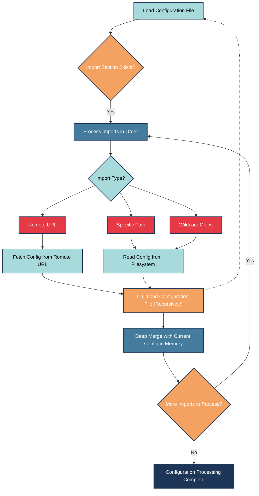
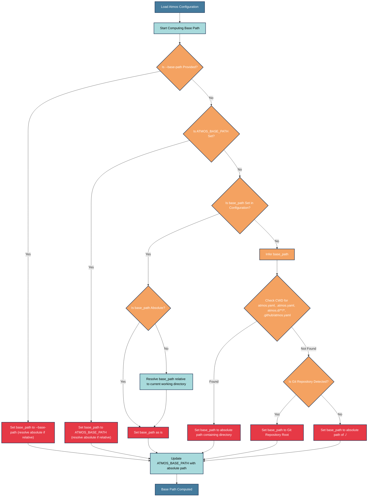

```mermaid
flowchart TD
    A["Load Configuration File"] --> B{"Import Section Exists?"}
    
    B -- Yes --> C["Process Imports in Order"]
    C --> D{"Import Type?"}
    D --> E["Remote URL"]
    D --> F["Specific Path"]
    D --> G["Wildcard Globs"]
    
    E --> H["Fetch Config from Remote URL"]
    F --> I["Read Config from Filesystem"]
    G --> I["Read Config from Filesystem"]
    
    H --> J["Call Load Configuration File (Recursively)"]
    I --> J["Call Load Configuration File (Recursively)"]
    
    J --> L["Deep Merge with Current Config in Memory"]
    L --> K{"More Imports to Process?"}
    K -- Yes --> C
    K -- No --> M["Configuration Processing Complete"]
    
    %% Loopback for recursion
    J -.-> A

    %% Styling for clarity
    style A fill:#A8DADC,stroke:#1D3557,stroke-width:2px,color:#000000
    style B fill:#F4A261,stroke:#1D3557,stroke-width:2px,color:#FFFFFF
    style C fill:#457B9D,stroke:#1D3557,stroke-width:2px,color:#FFFFFF
    style D fill:#A8DADC,stroke:#1D3557,stroke-width:2px,color:#000000
    style E fill:#E63946,stroke:#1D3557,stroke-width:2px,color:#FFFFFF
    style F fill:#E63946,stroke:#1D3557,stroke-width:2px,color:#FFFFFF
    style G fill:#E63946,stroke:#1D3557,stroke-width:2px,color:#FFFFFF
    style H fill:#A8DADC,stroke:#1D3557,stroke-width:2px,color:#000000
    style I fill:#A8DADC,stroke:#1D3557,stroke-width:2px,color:#000000
    style J fill:#F4A261,stroke:#1D3557,stroke-width:2px,color:#FFFFFF
    style L fill:#457B9D,stroke:#1D3557,stroke-width:2px,color:#FFFFFF
    style K fill:#F4A261,stroke:#1D3557,stroke-width:2px,color:#FFFFFF
    style M fill:#1D3557,stroke:#1D3557,stroke-width:2px,color:#FFFFFF
    
    classDef recursion stroke-dasharray: 5 5;
```

```mermaid

---
config:
  layout: fixed
---
flowchart TD
    A["Start Configuration Process"] --> Z1["Load Atmos Schema Defaults"]
    Z1 --> Z2["Load // go:embed cloudposse/atmos/config/atmos.yaml"]
    Z2 --> Z3["Deep Merge Schema Defaults and Embedded Config"]
    Z3 --> B{"Is --config Provided?"}
    
    %% If --config is provided
    B -- Yes --> C["Stage 1: Load Explicit Configurations via --config"]
    C --> C1{"Load each --config path in order ."}
    C1 --> C2{"if path is dir search (/**/*yaml , /**/*yml ) in order . on same directory extension .yaml has priority over yml"}
    C2 --> C3["Update ATMOS_CLI_CONFIG_PATH with loaded config absolute paths (separated by delimiter)"]
    C3 --> D["Process Imports and Deep Merge"]
    D --> E["Final Merged Config"]
    E --> F["Output Final Configuration"]
    
    %% If --config is not provided
    B -- No --> G["Stage 1: Load System Configurations"]
    G --> G1{"Check System Paths"}
    G1 -- Found --> G2["Load First Found Config: %PROGRAMDATA%/atmos.yaml (Windows), /usr/local/etc/atmos.yaml, or /etc/atmos.yaml"]
    G2 --> G3["Update ATMOS_CLI_CONFIG_PATH"]
    G3 --> H["Process Imports and Deep Merge"]
    G1 -- Not Found --> H["Process Imports and Deep Merge"]
    
    H --> I["Stage 2: Discover Additional Configurations"]
    I --> I1{"Check ATMOS_CLI_CONFIG_PATH"}
    I1 -- Found --> I2["Load First Found Config: atmos.yaml or atmos.d/**/* from ATMOS_CLI_CONFIG_PATH"]
    I2 --> I4["Update ATMOS_CLI_CONFIG_PATH with loaded absolute paths"]
    I4 --> J["Process Imports and Deep Merge"]
    I1 -- Not Found --> I12{"Check Current Working Directory"}
     %% New branch for Current Working Directory (note it's not identical to repo root)
    I12 -- Found --> I13["Load First Found Config: atmos.yaml, .atmos.yaml, atmos.d/**/*, .atmos.d/**/* from CWD"]
    I13 --> I4
    I12 -- Not Found --> I5{"Check Git Repository Root"}
    I5 -- Found --> I6["Load First Found Config: atmos.yaml, .atmos.yaml, atmos.d/**/*, .atmos.d/**/*, or .github/atmos.yaml from Git Repo Root"]
    I6 --> I4    
   
    I5 -- Not Found --> I18["No configuration found in Stage 2"]
    I18 --> K["Stage 3: Apply User Preferences"]
    
    J --> K["Stage 3: Apply User Preferences"]
    K --> K1{"Check $XDG_CONFIG_HOME/atmos.yaml"}
    K1 -- Found --> K2["Load First Found Config: $XDG_CONFIG_HOME/atmos.yaml"]
    K2 --> K3["Update ATMOS_CLI_CONFIG_PATH with $XDG_CONFIG_HOME/atmos.yaml"]
    K3 --> L["Process Imports and Deep Merge"]
    K1 -- Not Found --> K4{"Check User's Home Directory"}
    K4 -- Found --> K5["Load First Found Config: %LOCALAPPDATA%/atmos/atmos.yaml (Windows), ~/.config/atmos/atmos.yaml, or ~/.atmos/atmos.yaml (Linux/macOS)"]
    K5 --> K3
    K4 -- Not Found --> K7["No configuration found in Stage 3"]
    K7 --> M["Final Merged Config"]
    
    L --> M["Final Merged Config"]
    M --> F["Output Final Configuration"]
    
    %% Styling for clarity
    style A fill:#457B9D,stroke:#1D3557,stroke-width:2px,color:#FFFFFF
    style Z1 fill:#A8DADC,stroke:#1D3557,stroke-width:2px,color:#000000
    style Z2 fill:#A8DADC,stroke:#1D3557,stroke-width:2px,color:#000000
    style Z3 fill:#E63946,stroke:#1D3557,stroke-width:2px,color:#FFFFFF
    style B fill:#F4A261,stroke:#1D3557,stroke-width:2px,color:#FFFFFF
    style C fill:#A8DADC,stroke:#1D3557,stroke-width:2px,color:#000000
    style C1 fill:#A8DADC,stroke:#1D3557,stroke-width:2px,color:#000000
    style C2 fill:#A8DADC,stroke:#1D3557,stroke-width:2px,color:#000000
    style D fill:#E63946,stroke:#1D3557,stroke-width:2px,color:#FFFFFF
    style E fill:#457B9D,stroke:#1D3557,stroke-width:2px,color:#FFFFFF
    style F fill:#1D3557,stroke:#1D3557,stroke-width:2px,color:#FFFFFF
    style G fill:#A8DADC,stroke:#1D3557,stroke-width:2px,color:#000000
    style G1 fill:#F4A261,stroke:#1D3557,stroke-width:2px,color:#FFFFFF
    style G2 fill:#E63946,stroke:#1D3557,stroke-width:2px,color:#FFFFFF
    style G3 fill:#A8DADC,stroke:#1D3557,stroke-width:2px,color:#000000
    style H fill:#E63946,stroke:#1D3557,stroke-width:2px,color:#FFFFFF
    style I fill:#F4A261,stroke:#1D3557,stroke-width:2px,color:#FFFFFF
    style I1 fill:#F4A261,stroke:#1D3557,stroke-width:2px,color:#FFFFFF
    style I2 fill:#E63946,stroke:#1D3557,stroke-width:2px,color:#FFFFFF
    style I4 fill:#A8DADC,stroke:#1D3557,stroke-width:2px,color:#000000
    style J fill:#E63946,stroke:#1D3557,stroke-width:2px,color:#FFFFFF
    style I5 fill:#F4A261,stroke:#1D3557,stroke-width:2px,color:#FFFFFF
    style I6 fill:#E63946,stroke:#1D3557,stroke-width:2px,color:#FFFFFF
    style I12 fill:#F4A261,stroke:#1D3557,stroke-width:2px,color:#FFFFFF
    style I13 fill:#E63946,stroke:#1D3557,stroke-width:2px,color:#FFFFFF
    style I18 fill:#A8DADC,stroke:#1D3557,stroke-width:2px,color:#000000
    style K fill:#F4A261,stroke:#1D3557,stroke-width:2px,color:#FFFFFF
    style K1 fill:#F4A261,stroke:#1D3557,stroke-width:2px,color:#FFFFFF
    style K2 fill:#E63946,stroke:#1D3557,stroke-width:2px,color:#FFFFFF
    style K3 fill:#A8DADC,stroke:#1D3557,stroke-width:2px,color:#000000
    style K4 fill:#F4A261,stroke:#1D3557,stroke-width:2px,color:#FFFFFF
    style K5 fill:#E63946,stroke:#1D3557,stroke-width:2px,color:#FFFFFF
    style K7 fill:#A8DADC,stroke:#1D3557,stroke-width:2px,color:#000000
    style L fill:#E63946,stroke:#1D3557,stroke-width:2px,color:#FFFFFF
    style M fill:#457B9D,stroke:#1D3557,stroke-width:2px,color:#FFFFFF
```

```mermaid

flowchart TD
    A["Load Atmos Configuration"] --> B["Start Computing Base Path"]
    B --> C{"Is --base-path Provided?"}
    
    %% If --base-path is provided
    C -- Yes --> D["Set base_path to --base-path (resolve absolute if relative)"]
    D --> E["Update ATMOS_BASE_PATH with absolute path"]
    
    %% If --base-path is not provided
    C -- No --> G{"Is ATMOS_BASE_PATH Set?"}
    G -- Yes --> H["Set base_path to ATMOS_BASE_PATH (resolve absolute if relative)"]
    H --> E
    G -- No --> I{"Is base_path Set in Configuration?"}
    I -- Yes --> J{"Is base_path Absolute?"}
    J -- Yes --> K["Set base_path as is"]
    K --> E
    J -- No --> L["Resolve base_path relative to current working directory"]
    L --> K
    I -- No --> M["Infer base_path"]
    M --> M1{"Check CWD for atmos.yaml, .atmos.yaml, atmos.d/**/*, .github/atmos.yaml"}
    M1 -- Found --> M2["Set base_path to absolute path containing directory"]
    M1 -- Not Found --> M3{"Is Git Repository Detected?"}
    M3 -- Yes --> M4["Set base_path to Git Repository Root"]
    M3 -- No --> M5["Set base_path to absolute path of ./"]
    M2 --> E
    M4 --> E
    M5 --> E
    
    E --> F["Base Path Computed"]
    
    %% Styling for clarity
    style A fill:#457B9D,stroke:#1D3557,stroke-width:2px,color:#FFFFFF
    style B fill:#A8DADC,stroke:#1D3557,stroke-width:2px,color:#000000
    style C fill:#F4A261,stroke:#1D3557,stroke-width:2px,color:#FFFFFF
    style D fill:#E63946,stroke:#1D3557,stroke-width:2px,color:#FFFFFF
    style E fill:#A8DADC,stroke:#1D3557,stroke-width:2px,color:#000000
    style F fill:#457B9D,stroke:#1D3557,stroke-width:2px,color:#FFFFFF
    style G fill:#F4A261,stroke:#1D3557,stroke-width:2px,color:#FFFFFF
    style H fill:#E63946,stroke:#1D3557,stroke-width:2px,color:#FFFFFF
    style I fill:#F4A261,stroke:#1D3557,stroke-width:2px,color:#FFFFFF
    style J fill:#F4A261,stroke:#1D3557,stroke-width:2px,color:#FFFFFF
    style K fill:#E63946,stroke:#1D3557,stroke-width:2px,color:#FFFFFF
    style L fill:#A8DADC,stroke:#1D3557,stroke-width:2px,color:#000000
    style M fill:#F4A261,stroke:#1D3557,stroke-width:2px,color:#FFFFFF
    style M1 fill:#F4A261,stroke:#1D3557,stroke-width:2px,color:#FFFFFF
    style M2 fill:#E63946,stroke:#1D3557,stroke-width:2px,color:#FFFFFF
    style M3 fill:#F4A261,stroke:#1D3557,stroke-width:2px,color:#FFFFFF
    style M4 fill:#E63946,stroke:#1D3557,stroke-width:2px,color:#FFFFFF
    style M5 fill:#E63946,stroke:#1D3557,stroke-width:2px,color:#FFFFFF
```
