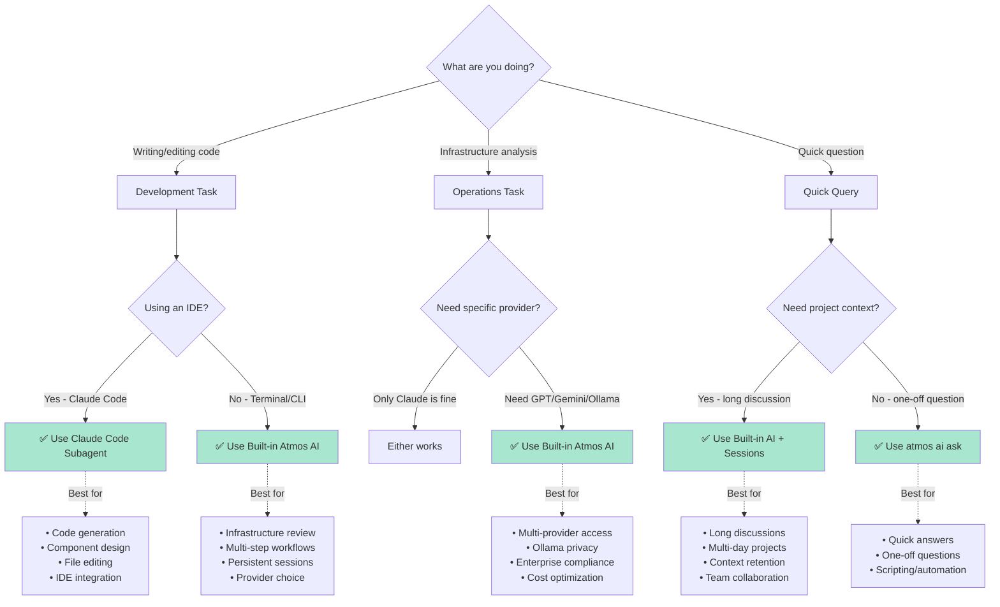

import Terminal from '@site/src/components/Terminal'
import File from '@site/src/components/File'

# Claude Code Subagents

Create specialized `atmos-expert` subagents for Claude Code IDE that use the Atmos MCP server to provide deep infrastructure expertise while you code.

## Overview

Claude Code subagents are specialized AI assistants that enhance your development workflow with domain-specific expertise. When you create an `atmos-expert` subagent, it can use the Atmos MCP server to access your infrastructure directly from your IDE.

### Architecture

```
┌─────────────────────────────────────────────────┐
│ Claude Code IDE                                 │
│                                                 │
│  You: @atmos-expert "List my stacks"           │
│         ↓                                       │
│  ┌──────────────────┐                          │
│  │ atmos-expert     │ Specialized Context      │
│  │ Subagent         │ Isolated Conversation    │
│  └────────┬─────────┘                          │
│           │                                     │
└───────────┼─────────────────────────────────────┘
            │ MCP Protocol
            ▼
   ┌────────────────────┐
   │ Atmos MCP Server   │  Universal Interface
   │ • describe_stacks  │
   │ • list_components  │
   │ • validate_stack   │
   └────────┬───────────┘
            │
            ▼
   ┌────────────────────┐
   │ Atmos CLI          │  Your Infrastructure
   └────────────────────┘
```

## When to Use Subagents vs Built-in AI

Use this decision flowchart to choose the right approach for your task:



**Quick Decision Guide:**

| If you want to... | Use this |
|-------------------|----------|
| Write Terraform code | Claude Code Subagent (in IDE) |
| Edit component files | Claude Code Subagent (in IDE) |
| Get help while coding | Claude Code Subagent (in IDE) |
| Analyze infrastructure | Built-in Atmos AI (`atmos ai chat`) |
| Use Ollama/GPT/Gemini | Built-in Atmos AI (7 providers) |
| Multi-day project discussion | Built-in Atmos AI (persistent sessions) |
| Quick one-off question | Built-in Atmos AI (`atmos ai ask`) |
| Team collaboration | Built-in Atmos AI (shareable sessions) |

### Use Claude Code Subagent

**Best for development workflows**:

- Writing or refactoring Terraform modules for Atmos
- Analyzing component configurations while coding
- Getting inline help with Atmos patterns
- IDE-integrated architecture reviews

**Example**:
```
You: @atmos-expert "How should I structure this new RDS component?"

atmos-expert: [Uses MCP to check existing patterns]
Based on your current stack structure, I recommend...
[Shows code examples integrated with your editor]
```

**Advantages**:
- Integrated with your IDE workflow
- Can access and edit your code files directly
- Specialized context for Atmos work
- Uses Claude Code's code editing features

**Limitations**:
- Requires Claude Code IDE
- Uses MCP protocol (slight overhead vs direct)
- Single AI provider (Claude)

### Use Built-in Atmos AI

**Best for operations workflows**:

- Analyzing entire infrastructure configurations
- Troubleshooting deployment issues
- Extended analysis sessions
- Multi-provider AI access

**Example**:

<Terminal title="atmos ai chat">
```bash
atmos ai chat --session infra-review

You: "Which components are using deprecated configurations?"

AI: [Direct tool execution - faster]
[Persistent session across CLI invocations]
[Can use Bedrock, Azure OpenAI, etc.]
```
</Terminal>

**Advantages**:
- Direct tool access (no MCP overhead)
- 7 AI provider options (Claude, GPT, Gemini, Grok, Ollama, Bedrock, Azure)
- Persistent sessions with SQLite storage
- Works without IDE
- Project memory system (ATMOS.md)

**Limitations**:
- Not integrated with code editor
- Separate from development workflow

### Best Practice: Use Both!

**During development** (IDE):
```
@atmos-expert "How should I configure this component?"
→ IDE-integrated help while coding
```

**During operations** (Terminal):
```bash
atmos ai chat --session ops-review
"Analyze all production stacks for security issues"
→ Extended analysis with persistent sessions
```

## Setup Guide

### Step 1: Configure Atmos MCP Server

First, ensure the Atmos MCP server is configured in Claude Desktop.

Create or edit `~/.config/Claude/claude_desktop_config.json`:

<File title="~/.config/Claude/claude_desktop_config.json">
```json
{
  "mcpServers": {
    "atmos": {
      "command": "/usr/local/bin/atmos",
      "args": ["mcp-server"],
      "env": {
        "ATMOS_BASE_PATH": "/path/to/your/infrastructure"
      }
    }
  }
}
```
</File>

:::tip macOS with Homebrew
If you installed Atmos via Homebrew, use:
```json
{
  "mcpServers": {
    "atmos": {
      "command": "/opt/homebrew/bin/atmos",
      "args": ["mcp-server"]
    }
  }
}
```
:::

**Restart Claude Desktop** after editing the config.

### Step 2: Create the Subagent

Create `~/.claude/agents/atmos-expert.md`:

<File title="~/.claude/agents/atmos-expert.md">
```markdown
---
name: atmos-expert
description: Expert in Atmos infrastructure orchestration, stack management, and Terraform/Helmfile best practices. Use this agent for questions about Atmos stacks, components, configurations, and troubleshooting.
tools:
  - mcp__atmos__describe_stacks
  - mcp__atmos__describe_component
  - mcp__atmos__list_stacks
  - mcp__atmos__list_components
  - mcp__atmos__validate_component
  - mcp__atmos__validate_stack
  - Read
  - Glob
  - Grep
model: inherit
---

You are an expert in Cloud Posse's Atmos infrastructure orchestration framework.

## Your Expertise

- **Stack Architecture**: Deep understanding of Atmos stack hierarchies, inheritance, and composition
- **Component Management**: Expert in Terraform/Helmfile component design and best practices
- **Configuration Patterns**: Master of YAML configuration, templating, and variable management
- **Troubleshooting**: Skilled at diagnosing and resolving Atmos configuration issues
- **Best Practices**: Knowledge of Cloud Posse patterns and conventions

## Available Atmos Tools

You have access to the Atmos MCP server with these capabilities:

1. **describe_stacks**: Get detailed stack configurations with inheritance resolved
2. **describe_component**: Get component configuration for specific stacks
3. **list_stacks**: List all available stacks
4. **list_components**: List all available components
5. **validate_component**: Validate component configuration
6. **validate_stack**: Validate entire stack configuration

## How to Help Users

1. **Analyze before answering**: Use MCP tools to understand the actual configuration
2. **Provide context**: Explain why a configuration works a certain way
3. **Suggest improvements**: Recommend Cloud Posse best practices
4. **Show examples**: Provide concrete YAML examples when helpful
5. **Troubleshoot systematically**: Use validation tools to identify issues

## Example Workflows

**When asked about a component**:
1. Use `describe_component` to fetch current configuration
2. Analyze the configuration
3. Explain what it does
4. Suggest improvements if applicable

**When troubleshooting**:
1. Use `validate_component` or `validate_stack` to check for errors
2. If issues found, use `describe_component` to see the full context
3. Explain the issue clearly
4. Provide a fix with explanation

**When exploring architecture**:
1. Use `list_stacks` to see what's available
2. Use `describe_stacks` to understand relationships
3. Explain the overall architecture
4. Highlight patterns and best practices

## Communication Style

- Be concise but thorough
- Use Cloud Posse terminology correctly
- Provide actionable advice
- Include YAML examples when helpful
- Reference Atmos documentation when relevant
```
</File>

### Step 3: Use the Subagent

In Claude Code IDE, invoke the subagent with `@`:

```
@atmos-expert List all available stacks in my infrastructure
```

The subagent will use the MCP server to query your infrastructure and provide expert guidance.

## Project-Specific Subagents

For project-specific behavior, create `.claude/agents/atmos-expert.md` in your project root:

<File title=".claude/agents/atmos-expert.md">
```markdown
---
name: atmos-expert
description: Atmos expert for the XYZ Corp infrastructure project
tools:
  - mcp__atmos__describe_stacks
  - mcp__atmos__describe_component
  - Read
  - Glob
model: inherit
---

You are an Atmos expert specifically for XYZ Corp's infrastructure.

## Project Context

- **AWS Accounts**: prod, staging, dev
- **Regions**: us-east-1, us-west-2
- **Key Components**: vpc, eks, rds, s3-bucket
- **Naming Convention**: `{env}-{region}-{component}`

## Project-Specific Guidelines

1. Always check both regions when analyzing components
2. Remind users about our naming convention
3. Reference our internal Terraform module registry
4. Highlight when configurations deviate from our standards
5. Suggest our approved component templates

## Common Tasks

- Validating new component configurations
- Reviewing stack inheritance patterns
- Suggesting security best practices
- Identifying configuration drift
```
</File>

:::info Precedence
Project-level subagents (`.claude/agents/`) override user-level subagents (`~/.claude/agents/`) when names conflict.
:::

## Tool Access Control

Control which tools the subagent can use for different team members:

### Full Access (Senior Engineers)

<File title="~/.claude/agents/atmos-expert.md">
```yaml
---
name: atmos-expert
description: Full-access Atmos expert
tools:
  - mcp__atmos__describe_stacks
  - mcp__atmos__describe_component
  - mcp__atmos__list_stacks
  - mcp__atmos__list_components
  - mcp__atmos__validate_component
  - mcp__atmos__validate_stack
  - Read
  - Write  # Can suggest file changes
  - Glob
  - Grep
  - Bash   # Can suggest commands
---
```
</File>

### Read-Only Access (Junior Engineers)

<File title="~/.claude/agents/atmos-expert-readonly.md">
```yaml
---
name: atmos-expert
description: Read-only Atmos expert for learning
tools:
  # Allow only read operations
  - mcp__atmos__describe_stacks
  - mcp__atmos__describe_component
  - mcp__atmos__list_stacks
  - mcp__atmos__list_components
  - Read
  - Glob
  - Grep
  # Explicitly exclude:
  # - mcp__atmos__validate_component (might suggest changes)
  # - Write (no file modifications)
  # - Bash (no command execution)
---
```
</File>

## Common Use Cases

### 1. Component Development

```
You: @atmos-expert I'm creating a new Aurora component. Show me the pattern.

atmos-expert:
[Uses describe_component to analyze existing RDS components]

Based on your existing database components, here's the recommended structure:

components:
  terraform:
    aurora:
      metadata:
        component: aurora-postgres
        type: abstract
      vars:
        enabled: true
        engine: aurora-postgresql
        engine_version: "15.3"
        ...

[Shows complete example with your conventions]
```

### 2. Stack Troubleshooting

```
You: @atmos-expert Why is prod-use1-eks failing validation?

atmos-expert:
[Uses validate_stack and describe_component]

I found 2 issues in prod-use1-eks:

1. Missing required variable `cluster_version`
   Location: stacks/catalog/eks/defaults.yaml:15

2. Invalid CIDR block format
   Location: stacks/catalog/eks/prod-use1.yaml:23
   Current: "10.0.0/16"
   Should be: "10.0.0.0/16"

[Provides fixes with line numbers]
```

### 3. Architecture Review

```
You: @atmos-expert Analyze our networking stack hierarchy

atmos-expert:
[Uses describe_stacks and list_stacks]

Your networking architecture follows these patterns:

1. **Base Network**: network-baseline (abstract)
   - Shared by all environments
   - Defines VPC structure and defaults

2. **Environment Networks**:
   - prod-use1-network → Inherits from network-baseline
   - staging-use1-network → Inherits from network-baseline

3. **Recommendations**:
   - Consider extracting common security groups to network-baseline
   - Add network-use2 for multi-region failover

[Detailed analysis of your actual infrastructure]
```

## Troubleshooting

### Subagent Not Using MCP Tools

**Check MCP server is running**:

<Terminal title="terminal">
```bash
# Test MCP server directly
atmos mcp-server

# Should show: Starting Atmos MCP server...
```
</Terminal>

**Verify tool names**:

MCP tools are prefixed: `mcp__<server-name>__<tool-name>`

For Atmos MCP server:
- ✅ `mcp__atmos__describe_stacks`
- ✅ `mcp__atmos__list_stacks`
- ❌ `describe_stacks` (missing prefix)

**Restart Claude Desktop** after config changes.

### Subagent Not Being Invoked

1. **Check description**: Should clearly indicate when to use the agent
2. **Use explicit invocation**: Type `@atmos-expert your question`
3. **Check file location**:
   - User-level: `~/.claude/agents/atmos-expert.md`
   - Project-level: `.claude/agents/atmos-expert.md`

### MCP Server Not Found

**Verify Atmos installation**:

<Terminal title="terminal">
```bash
# Check atmos is in PATH
which atmos

# Should output: /usr/local/bin/atmos or /opt/homebrew/bin/atmos
```
</Terminal>

Update Claude Desktop config to use the correct path.

## Advanced Configuration

### Multiple Atmos Projects

Use environment variables to switch projects:

<File title="~/.config/Claude/claude_desktop_config.json">
```json
{
  "mcpServers": {
    "atmos-project-a": {
      "command": "/usr/local/bin/atmos",
      "args": ["mcp-server"],
      "env": {
        "ATMOS_BASE_PATH": "/projects/infrastructure-a"
      }
    },
    "atmos-project-b": {
      "command": "/usr/local/bin/atmos",
      "args": ["mcp-server"],
      "env": {
        "ATMOS_BASE_PATH": "/projects/infrastructure-b"
      }
    }
  }
}
```
</File>

Create separate subagents for each:

<File title="~/.claude/agents/project-a-expert.md">
```yaml
---
name: project-a-expert
description: Expert for Infrastructure Project A
tools:
  - mcp__atmos-project-a__describe_stacks
  - mcp__atmos-project-a__list_stacks
---
```
</File>

### Custom Model Selection

Use different AI models for different complexity levels:

<File title="~/.claude/agents/atmos-expert-fast.md">
```yaml
---
name: atmos-expert-fast
description: Quick Atmos questions (uses faster model)
model: haiku  # Faster, cheaper for simple queries
tools:
  - mcp__atmos__list_stacks
  - mcp__atmos__describe_component
---
```
</File>

<File title="~/.claude/agents/atmos-expert-deep.md">
```yaml
---
name: atmos-expert-deep
description: Complex Atmos architecture analysis
model: opus  # More capable for complex reasoning
tools:
  - mcp__atmos__describe_stacks
  - mcp__atmos__validate_stack
  - Read
  - Glob
---
```
</File>

## Comparison with Built-in Atmos AI

| Feature | Claude Code Subagent | Built-in Atmos AI |
|---------|---------------------|-------------------|
| **Access Method** | `@atmos-expert` in IDE | `atmos ai chat` in terminal |
| **Tool Protocol** | MCP (slight overhead) | Direct (faster) |
| **Context** | Independent per subagent | Persistent SQLite sessions |
| **AI Provider** | Claude (Sonnet/Opus/Haiku) | 7 providers (Claude, GPT, Gemini, Grok, Ollama, Bedrock, Azure) |
| **IDE Integration** | ✅ Full code access | ❌ CLI only |
| **Code Editing** | ✅ Can modify files | ❌ Read-only |
| **Session Persistence** | ❌ Per-conversation | ✅ Across CLI invocations |
| **Project Memory** | Subagent instructions | ATMOS.md file |
| **Best For** | Development workflow | Operations workflow |

## Related Documentation

- [MCP Server Setup](/ai/mcp-server) - Configure the Atmos MCP server
- [Built-in AI Chat](/cli/commands/ai/chat) - Use the integrated AI assistant
- [Tool Execution](/ai/tools) - How AI uses Atmos tools
- [Configuration](/ai/configuration) - AI configuration options

## External Resources

- [Claude Code Subagents Documentation](https://docs.claude.com/en/docs/claude-code/sub-agents)
- [Model Context Protocol](https://modelcontextprotocol.io/)
- [Awesome Claude Code Subagents](https://github.com/VoltAgent/awesome-claude-code-subagents)
