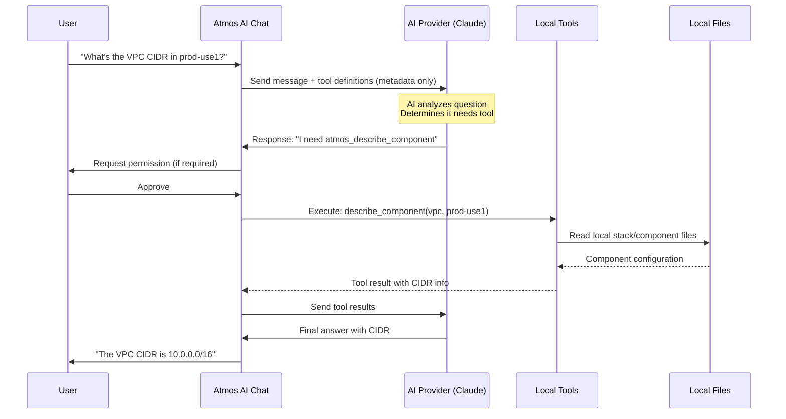

import Terminal from '@site/src/components/Terminal'
import File from '@site/src/components/File'

# AI Tool Execution

Atmos AI can execute tools to query your infrastructure configuration. Tools allow the AI to automatically inspect stacks, components, and validate configurations without requiring manual intervention.

## Overview

Tool execution provides:
- **Automated Queries**: AI can inspect your infrastructure on demand
- **Read-only Operations**: Safe execution of describe, list, and validate commands
- **Permission System**: Granular control over what the AI can execute
- **User Confirmations**: Smart prompts for sensitive operations
- **Timeout Protection**: Automatic cancellation of long-running operations

## How Tool Calling Works

### The Tool Calling Process

When you chat with Atmos AI, here's what happens behind the scenes:



### What Gets Sent to AI Servers

It's important to understand **when and what** data is sent to the AI provider:

#### Initial Message (Always Sent)
When you start a conversation, Atmos sends:
1. **Your question** - The message you type
2. **Tool definitions** - Metadata describing available tools (names, parameters, descriptions)
3. **Context** - Session history and memory context (if enabled)

**Example tool definition sent to AI:**
```json
{
  "name": "atmos_describe_component",
  "description": "Describe an Atmos component configuration in a specific stack",
  "parameters": {
    "component": {"type": "string", "description": "Component name", "required": true},
    "stack": {"type": "string", "description": "Stack name", "required": true}
  }
}
```

**Note:** At this stage, **no actual component or stack data** is sent - only the tool definitions (metadata).

#### When AI Decides to Use a Tool

If the AI determines it needs information from your local environment:

1. **AI sends back a tool call request** - Specifies which tool and parameters
2. **Tool executes locally** - Reads your local files/runs Atmos commands
3. **Only the tool results are sent** - Specific data the AI requested

**Example flow:**
```
You: "What's the VPC configuration in prod-use1?"

→ Sent to AI: Your question + tool definitions (no actual data yet)
← AI responds: "I need to call atmos_describe_component(vpc, prod-use1)"
→ Tool executes locally, reads your stack files
→ Sent to AI: Only the VPC component configuration for prod-use1
← AI responds: "The VPC in prod-use1 has CIDR 10.0.0.0/16 with..."
```

### Multi-Turn Conversations with Tools

When you ask the AI to perform complex tasks with tools, it automatically follows through to completion. Instead of just showing you raw tool output, the AI analyzes the results and provides complete, formatted answers.

**Example - Complete Response:**

<Terminal title="atmos ai chat">
```bash
You: "Execute 'atmos describe stacks' and create a table of all stacks"

AI: I'll execute the describe stacks command and create a formatted table for you.

🔧 Executing tool: execute_atmos_command
Parameters: { command: "describe stacks" }

✅ Tool executed successfully

Here's a formatted table of your Atmos stacks:

| Stack Name      | Stage   | Region    | Components         |
|-----------------|---------|-----------|-------------------|
| prod-use1       | prod    | us-east-1 | vpc, rds, eks     |
| prod-use2       | prod    | us-east-2 | vpc, rds          |
| staging-use1    | staging | us-east-1 | vpc, rds          |
| dev-use1        | dev     | us-east-1 | vpc               |

You have 4 stacks across 3 stages (prod, staging, dev) in 2 regions.
```
</Terminal>

**What Happens Behind the Scenes:**

1. **You make a request** - Ask the AI to execute a command and format results
2. **AI plans the task** - "I need to execute the command, then format the output as a table"
3. **Tool executes** - Command runs locally and returns raw data
4. **AI receives results** - Raw output is sent back to the AI
5. **AI formats and explains** - Creates the table and provides insights

**Benefits:**

- **Complete Answers** - Get formatted, analyzed results instead of raw output
- **Natural Flow** - The AI completes what it promises to do
- **Smart Analysis** - AI can interpret data, create visualizations, and provide insights
- **Multi-Step Tasks** - Handle requests like "compare these components and create a table"

**More Examples:**

<Terminal title="atmos ai chat">
```bash
# Example 1: Analysis after tool execution
You: "Check if my VPC configurations are consistent across all prod stacks"

AI: I'll check the VPC configurations and analyze consistency.

[Executes: atmos_describe_component vpc -s prod-use1]
[Executes: atmos_describe_component vpc -s prod-use2]

Analysis of VPC configurations across prod stacks:

✅ CIDR blocks follow consistent pattern:
   - prod-use1: 10.0.0.0/16
   - prod-use2: 10.1.0.0/16

✅ All use 3 availability zones
✅ All have VPN gateway enabled
⚠️  prod-use2 has different NAT gateway configuration

Your VPCs are mostly consistent, but you may want to review the NAT gateway settings.

# Example 2: Multiple tool executions with summary
You: "Find all components that use the VPC module and list them"

AI: I'll search for VPC module usage and summarize findings.

[Executes: search_files pattern="module \"vpc\""]

Found 5 components using the VPC module:

1. components/terraform/eks/main.tf (line 12)
2. components/terraform/rds/main.tf (line 8)
3. components/terraform/networking/main.tf (lines 5, 23)

The VPC module is primarily used for networking infrastructure across your
EKS, RDS, and dedicated networking components.
```
</Terminal>

This intelligent behavior ensures you always get complete, useful answers rather than just raw command output.

---

### When Tools Are Called

The AI automatically decides to call tools when:

1. **Specific Information Needed**: You ask about a specific component, stack, or configuration
   - "What's the CIDR block for VPC in prod?"
   - "Show me the RDS configuration"

2. **Listing/Discovery**: You want to see what's available
   - "What stacks do I have?"
   - "List all components"

3. **Validation**: You ask about configuration correctness
   - "Is my stack configuration valid?"
   - "Check for errors in my stacks"

4. **File Operations**: You request file content or modifications
   - "Show me the vpc/main.tf file"
   - "Read the catalog/vpc.yaml file"

5. **Analysis**: You ask the AI to analyze or compare configurations
   - "Compare VPC configs across all prod stacks"
   - "Find differences between dev and prod"

**The AI will NOT call tools when:**
- Answering general questions about Atmos ("What is a stack?")
- Explaining concepts ("How do components work?")
- Providing documentation ("How do I configure Atmos?")
- You explicitly ask it not to ("Don't look at my files, just explain...")

### How Tool Descriptions Determine Triggering

**The Critical Role of Tool Descriptions:**

Tool descriptions are the **instruction manual** for the AI - they tell the AI exactly WHEN and WHY to call each tool. Without proper descriptions, the AI has no way to know that a tool exists or what it does.

**Technical Implementation:**

When Atmos sends tool definitions to the AI provider (Claude, GPT, Gemini, etc.), each tool includes:

1. **Name** - The tool identifier (e.g., `atmos_describe_component`)
2. **Description** - **Critical!** Explains WHAT the tool does and WHEN to use it
3. **Parameters** - The inputs the tool accepts

The AI analyzes your question, reads all tool descriptions, and decides which tool (if any) can help answer your question.

**Example - How Descriptions Enable Tool Selection:**

<File title="Tool Definition Sent to AI Provider">
```json
{
  "name": "web_search",
  "description": "Search the web for information using DuckDuckGo or Google Custom Search. Returns titles, URLs, and descriptions of search results. Use this to find current information, documentation, examples, or answers to questions that require up-to-date knowledge.",
  "parameters": {
    "query": {
      "type": "string",
      "description": "The search query to execute",
      "required": true
    },
    "max_results": {
      "type": "integer",
      "description": "Maximum number of search results to return (1-50, default: 10)",
      "required": false
    }
  }
}
```
</File>

**When you ask:** "Search for the latest Terraform AWS VPC module documentation"

**The AI thinks:**
1. Reads the question: needs to "search for" something
2. Scans tool descriptions
3. Finds `web_search` description mentions "Search the web for information"
4. Determines this tool can help
5. Calls `web_search` with query="Terraform AWS VPC module documentation"

**Writing Effective Tool Descriptions:**

Good descriptions should include:
- **Action** - What the tool does (e.g., "Search the web", "Validate files", "List stacks")
- **Purpose** - What problem it solves
- **Use Cases** - When to use it (e.g., "Use this to find current information")
- **Scope** - What it covers (e.g., "Returns titles, URLs, and descriptions")

**Anti-pattern (Bad Description):**
```json
{
  "name": "web_search",
  "description": "Searches the web"  // ❌ Too vague, AI won't know when to use it
}
```

**Best Practice (Good Description):**
```json
{
  "name": "web_search",
  "description": "Search the web for information using DuckDuckGo or Google Custom Search. Returns titles, URLs, and descriptions of search results. Use this to find current information, documentation, examples, or answers to questions that require up-to-date knowledge."  // ✅ Clear, specific, explains when to use it
}
```

**Key Takeaway:** Tool descriptions are not optional metadata - they are the **mechanism** by which the AI knows tools exist and when to use them. Every tool in Atmos includes a detailed description specifically designed to help the AI make the right decision about when to call it.

### Data Privacy and Security

**Key Points:**

✅ **Tool definitions are always sent** - These contain no sensitive data, just metadata about what tools exist

✅ **Your questions are always sent** - This is how the AI understands what you're asking

✅ **Actual data is only sent when tools are called** - Component configs, stack files, validation results are ONLY sent when the AI specifically requests them by calling a tool

✅ **You control tool execution** - Permission system lets you approve/deny each tool call

✅ **Local execution** - Tools run on your machine, reading your local files

✅ **Results only** - Only the tool's output is sent, not your entire codebase

**Example - What gets sent:**

```
Question: "Explain how Atmos stacks work"
→ Sent to AI: Your question + tool definitions
→ Tools called: NONE
→ Data sent: NONE (just your question)

Question: "What's the VPC CIDR in prod-use1?"
→ Sent to AI: Your question + tool definitions
→ Tools called: atmos_describe_component(vpc, prod-use1)
→ Data sent: VPC component configuration from prod-use1 stack ONLY
```

### Tool Execution Security

When a tool is executed:

1. **Permission Check**: Verifies tool is allowed (not blocked, respects permissions)
2. **User Prompt**: Shows tool name, description, and parameters (if confirmation required)
3. **Local Execution**: Tool runs on your machine with your Atmos configuration
4. **Path Validation**: File operations validate paths to prevent directory traversal
5. **Timeout Protection**: Operations automatically cancelled after 30 seconds
6. **Result Transmission**: Only the tool's specific output is sent back to the AI

**Security Features:**
- Path traversal protection for file operations
- Sandboxed execution within configured directories
- File permissions (0600 for sensitive files)
- Permission system prevents unauthorized operations
- All execution happens locally on your machine

## Configuration

Enable tool execution in your `atmos.yaml`:

<File title="atmos.yaml">
```yaml
settings:
  ai:
    enabled: true
    default_provider: "anthropic"
    providers:
      anthropic:
        model: "claude-sonnet-4-20250514"
        api_key_env: "ANTHROPIC_API_KEY"

    tools:
      enabled: true                        # Enable tool execution
      require_confirmation: true           # Prompt before executing tools

      # Tools that can execute without user confirmation
      allowed_tools:
        - atmos_describe_component
        - atmos_list_stacks
        - atmos_validate_stacks
        - atmos_describe_*                 # Wildcard patterns supported

      # Tools that always require confirmation
      restricted_tools:
        - write_component_file
        - write_stack_file
        - atmos_terraform_plan

      # Tools that are completely blocked
      blocked_tools:
        - atmos_terraform_destroy
        - atmos_terraform_apply

      yolo_mode: false                     # Skip all confirmations (DANGEROUS!)
```
</File>

### Configuration Options

<dl>
  <dt>`tools.enabled`</dt>
  <dd>Enable or disable AI tool execution capabilities (default: `false`)</dd>

  <dt>`tools.require_confirmation`</dt>
  <dd>Prompt user before executing any tool not in the `allowed_tools` list (default: `true`)</dd>

  <dt>`tools.allowed_tools`</dt>
  <dd>List of tools that can execute without user confirmation. Supports wildcard patterns like `atmos_*` (default: `[]`)</dd>

  <dt>`tools.restricted_tools`</dt>
  <dd>List of tools that always require user confirmation, even if `require_confirmation` is `false` (default: `[]`)</dd>

  <dt>`tools.blocked_tools`</dt>
  <dd>List of tools that are completely blocked from execution (default: `[]`)</dd>

  <dt>`tools.yolo_mode`</dt>
  <dd>Skip all permission checks and execute all tools automatically. **DANGEROUS!** Only use in trusted CI/CD environments (default: `false`)</dd>
</dl>

## Available Tools

### Atmos Tools

These tools interact with your Atmos configuration:

#### `atmos_describe_component`

Describes an Atmos component configuration in a specific stack.

**Parameters:**
- `component` (string, required) - Component name (e.g., 'vpc', 'rds')
- `stack` (string, required) - Stack name (e.g., 'prod-use1')

**Example Usage:**

<Terminal title="atmos ai chat">
```bash
You: "What's the CIDR block for the VPC in prod-use1?"

AI: Let me check that for you.

🔧 Tool Execution Request
Tool: atmos_describe_component
Description: Describe an Atmos component configuration in a specific stack

Parameters:
  component: vpc
  stack: prod-use1

Allow execution? (y/N): y

✅ Executing tool...

The VPC in prod-use1 uses CIDR block 10.0.0.0/16 with the following configuration:
...
```
</Terminal>

**Permissions:** Read-only, no confirmation required by default

---

#### `atmos_list_stacks`

Lists all available Atmos stacks.

**Parameters:**
- `format` (string, optional) - Output format: `yaml` or `json` (default: `yaml`)

**Example Usage:**

<Terminal title="atmos ai chat">
```bash
You: "What stacks are available?"

AI: Let me list the available stacks.

🔧 Tool Execution Request
Tool: atmos_list_stacks
Description: List all available Atmos stacks

Parameters:
  format: yaml

Allow execution? (y/N): y

✅ Executing tool...

You have the following stacks:
- prod-use1
- prod-use2
- staging-use1
- dev-use1
```
</Terminal>

**Permissions:** Read-only, no confirmation required by default

---

#### `atmos_validate_stacks`

Validates Atmos stack configurations for correctness.

**Parameters:**
- `schema_type` (string, optional) - Schema validation type: `jsonschema` or `opa` (default: `jsonschema`)

**Example Usage:**

<Terminal title="atmos ai chat">
```bash
You: "Are my stack configurations valid?"

AI: Let me validate your stack configurations.

🔧 Tool Execution Request
Tool: atmos_validate_stacks
Description: Validate Atmos stack configurations for correctness

Parameters:
  schema_type: jsonschema

Allow execution? (y/N): y

✅ Executing tool...

✅ All stacks validated successfully using jsonschema.
```
</Terminal>

**Permissions:** Read-only, no confirmation required by default

---

#### `validate_file_lsp`

Validates a YAML, Terraform, or HCL file using Language Server Protocol for real-time diagnostics and error detection.

:::info Prerequisites
This tool requires [LSP to be configured](/lsp/lsp-client) in your `atmos.yaml` and `ai.use_lsp: true`.
:::

**Parameters:**
- `file_path` (string, required) - Absolute or relative path to the file to validate (e.g., 'stacks/prod/vpc.yaml', 'components/terraform/vpc/main.tf')

**Example Usage:**

<Terminal title="atmos ai chat">
```bash
You: "Validate stacks/prod/vpc.yaml"

AI: I'll validate that file using LSP.

🔧 Tool Execution Request
Tool: validate_file_lsp
Description: Validate a YAML, Terraform, or HCL file using Language Server Protocol

Parameters:
  file_path: stacks/prod/vpc.yaml

Allow execution? (y/N): y

✅ Executing tool...

Found 2 issue(s) in /project/stacks/prod/vpc.yaml:

ERRORS (1):
1. Line 15: Unknown property 'vpc_ciddr' (did you mean 'vpc_cidr'?)

WARNINGS (1):
1. Line 23: Property 'availability_zones' is deprecated, use 'azs' instead

The file has 1 error and 1 warning. The error on line 15 is a typo in the property name - it should be 'vpc_cidr' not 'vpc_ciddr'. Would you like me to help fix these issues?
```
</Terminal>

**Permissions:** Read-only, no confirmation required by default

**Benefits:**
- **Precise error locations** with line and column numbers
- **Real-time validation** before running Terraform/Atmos commands
- **Syntax and schema checks** for YAML, Terraform, and HCL
- **Early error detection** catches issues during development

**Learn more:** [LSP Integration](/lsp/lsp-client)

---

#### `read_component_file`

Reads a file from the components directory (Terraform, Helmfile, or Packer).

**Parameters:**
- `component_type` (string, required) - Component type: `terraform`, `helmfile`, or `packer`
- `file_path` (string, required) - Relative file path within the component type directory (e.g., `vpc/main.tf`)

**Example Usage:**

<Terminal title="atmos ai chat">
```bash
You: "Show me the VPC Terraform configuration"

AI: Let me read that file for you.

🔧 Tool Execution Request
Tool: read_component_file
Description: Read a file from the components directory

Parameters:
  component_type: terraform
  file_path: vpc/main.tf

✅ Executing tool...

Here's the VPC configuration from components/terraform/vpc/main.tf:
[file contents displayed]
```
</Terminal>

**Permissions:** Read-only, no confirmation required by default

**Security:** Path traversal protection ensures files can only be read from the configured components directory.

---

#### `read_stack_file`

Reads a file from the stacks directory.

**Parameters:**
- `file_path` (string, required) - Relative file path within the stacks directory (e.g., `catalog/vpc.yaml`)

**Example Usage:**

<Terminal title="atmos ai chat">
```bash
You: "Show me the VPC stack configuration"

AI: Let me read that stack file.

🔧 Tool Execution Request
Tool: read_stack_file
Description: Read a file from the stacks directory

Parameters:
  file_path: catalog/vpc.yaml

✅ Executing tool...

Here's the stack configuration from stacks/catalog/vpc.yaml:
[file contents displayed]
```
</Terminal>

**Permissions:** Read-only, no confirmation required by default

**Security:** Path traversal protection ensures files can only be read from the configured stacks directory.

---

#### `write_component_file`

Writes or modifies a file in the components directory.

**Parameters:**
- `component_type` (string, required) - Component type: `terraform`, `helmfile`, or `packer`
- `file_path` (string, required) - Relative file path within the component type directory
- `content` (string, required) - File content to write

**Example Usage:**

<Terminal title="atmos ai chat">
```bash
You: "Create a new Terraform variables file for the VPC component"

AI: I'll create that file for you.

🔧 Tool Execution Request
Tool: write_component_file
Description: Write or modify a file in the components directory

Parameters:
  component_type: terraform
  file_path: vpc/variables.tf
  content: |
    variable "cidr_block" {
      type        = string
      description = "CIDR block for VPC"
    }

⚠️  This tool requires confirmation (writes files)
Allow execution? (y/N): y

✅ Executing tool...

Successfully created components/terraform/vpc/variables.tf
```
</Terminal>

**Permissions:** Requires user confirmation (modifies files)

**Security:**
- Path traversal protection
- File permissions set to 0600 (owner read/write only)
- Parent directories created with 0755 permissions

---

#### `write_stack_file`

Writes or modifies a file in the stacks directory.

**Parameters:**
- `file_path` (string, required) - Relative file path within the stacks directory
- `content` (string, required) - File content to write

**Example Usage:**

<Terminal title="atmos ai chat">
```bash
You: "Create a new stack configuration for the VPC"

AI: I'll create that stack file.

🔧 Tool Execution Request
Tool: write_stack_file
Description: Write or modify a file in the stacks directory

Parameters:
  file_path: catalog/vpc-new.yaml
  content: |
    components:
      terraform:
        vpc:
          vars:
            cidr_block: 10.1.0.0/16

⚠️  This tool requires confirmation (writes files)
Allow execution? (y/N): y

✅ Executing tool...

Successfully created stacks/catalog/vpc-new.yaml
```
</Terminal>

**Permissions:** Requires user confirmation (modifies files)

**Security:**
- Path traversal protection
- File permissions set to 0600 (owner read/write only)
- Parent directories created with 0755 permissions

---

### File and Command Tools

These tools provide powerful file operations and command execution capabilities.

#### `read_file`

Read any file from the Atmos repository (atmos.yaml, workflows, vendor manifests, documentation, etc.).

**Parameters:**
- `file_path` (string, required) - Path to the file to read. Can be relative to Atmos base path (e.g., 'atmos.yaml', 'workflows/deploy.yaml') or absolute.

**Example Usage:**

<Terminal title="atmos ai chat">
```bash
You: "Show me the atmos.yaml configuration"

AI: Let me read that file for you.

🔧 Tool Execution Request
Tool: read_file
Description: Read any file from the Atmos repository

Parameters:
  file_path: atmos.yaml

✅ Executing tool...

Here's your atmos.yaml configuration:
[file contents displayed]
```
</Terminal>

**Permissions:** Read-only, no confirmation required by default

**Security:** Path traversal protection ensures files can only be read from within the Atmos base path.

---

#### `execute_atmos_command`

Execute any Atmos CLI command and return the output.

**Parameters:**
- `command` (string, required) - The Atmos command to execute (without the 'atmos' prefix). Examples: 'terraform plan vpc -s prod-us-east-1', 'describe component vpc -s prod-us-east-1', 'list stacks', 'validate stacks', 'describe affected'.

**Example Usage:**

<Terminal title="atmos ai chat">
```bash
You: "Run terraform plan for the VPC in prod-us-east-1"

AI: I'll run that Terraform plan for you.

🔧 Tool Execution Request
Tool: execute_atmos_command
Description: Execute any Atmos CLI command and return the output

Parameters:
  command: terraform plan vpc -s prod-us-east-1

⚠️  This tool requires confirmation (executes commands)
Allow execution? (y/N): y

✅ Executing tool...

Here's the Terraform plan output:
[plan output displayed]

The plan shows 3 resources will be added for the VPC infrastructure.
```
</Terminal>

**Permissions:** Requires user confirmation (executes commands)

**Security:**
- Command executed in Atmos base path
- Combined output (stdout + stderr) captured
- Timeout protection (operations cancelled after timeout)

**Use Cases:**
- Run Terraform operations: `terraform plan`, `terraform apply`
- Execute workflows: `workflow deploy`
- Describe affected components: `describe affected`
- Any other Atmos CLI command

---

#### `search_files`

Search for text patterns or regex across files in the Atmos repository.

**Parameters:**
- `pattern` (string, required) - The text pattern or regular expression to search for (e.g., 'module "vpc"', 'terraform_version', 'backend_type').
- `path` (string, optional) - The path to search in, relative to Atmos base path. Use '.' for entire repository, 'components/terraform' for components, 'stacks' for stacks. Default is '.' (entire repository).
- `file_pattern` (string, optional) - File pattern to filter (e.g., '*.yaml', '*.tf', '*.hcl'). Default is '*' (all files).
- `case_sensitive` (boolean, optional) - Whether the search should be case-sensitive. Default is false.

**Example Usage:**

<Terminal title="atmos ai chat">
```bash
You: "Find all components that use the VPC module"

AI: Let me search for that pattern.

🔧 Tool Execution Request
Tool: search_files
Description: Search for a text pattern or regex across files

Parameters:
  pattern: module "vpc"
  path: components/terraform
  file_pattern: *.tf

✅ Executing tool...

Found 5 matches in 3 files for pattern 'module "vpc"':

components/terraform/eks/main.tf:
  Line 12: module "vpc" {

components/terraform/rds/main.tf:
  Line 8: module "vpc" {

components/terraform/networking/main.tf:
  Line 5: module "vpc" {
  Line 23: module "vpc_endpoints" {
```
</Terminal>

**Permissions:** Read-only, no confirmation required by default

**Use Cases:**
- Find components using specific modules
- Locate stacks with particular configurations
- Search for variable usage across configurations
- Find all references to a resource

---

#### `list_component_files`

List all files in a component directory to discover component structure.

**Parameters:**
- `component_type` (string, required) - Type of component: 'terraform', 'helmfile', or 'packer'
- `component_path` (string, optional) - Path to the component within the component type directory (e.g., 'vpc', 'eks', 'networking/vpc'). Use '.' to list all components. Default is '.'.
- `file_pattern` (string, optional) - File pattern to filter (e.g., '*.tf', '*.yaml', '*.hcl'). Default is '*' (all files).

**Example Usage:**

<Terminal title="atmos ai chat">
```bash
You: "What files are in the VPC component?"

AI: Let me list those files.

🔧 Tool Execution Request
Tool: list_component_files
Description: List all files in a component directory

Parameters:
  component_type: terraform
  component_path: vpc
  file_pattern: *.tf

✅ Executing tool...

Files in terraform/vpc (pattern: *.tf):
(4 files, 1 directories)

main.tf
variables.tf
outputs.tf
versions.tf
modules/
```
</Terminal>

**Permissions:** Read-only, no confirmation required by default

**Use Cases:**
- Discover component structure
- Find configuration files
- Understand component organization
- Locate specific files before reading them

---

#### `get_template_context`

Get the template context (variables and functions) available for a component in a stack. Use this to debug Go template failures.

**Parameters:**
- `component` (string, required) - The component name (e.g., 'vpc', 'eks', 'rds')
- `stack` (string, required) - The stack name (e.g., 'prod-us-east-1', 'staging-eu-west-1')

**Example Usage:**

<Terminal title="atmos ai chat">
```bash
You: "Why is the Go template failing in the VPC component for prod-us-east-1?"

AI: Let me check the template context.

🔧 Tool Execution Request
Tool: get_template_context
Description: Get template context for debugging Go template failures

Parameters:
  component: vpc
  stack: prod-us-east-1

✅ Executing tool...

Template context for component 'vpc' in stack 'prod-us-east-1':

{
  "vars": {
    "cidr_block": "10.0.0.0/16",
    "availability_zones": ["us-east-1a", "us-east-1b", "us-east-1c"],
    ...
  },
  "settings": {...},
  ...
}

Available template functions:
- atmos.Component(component, stack) - Get component configuration
- atmos.Stack(stack) - Get stack configuration
- atmos.Setting(key) - Get Atmos setting
- terraform.output(component, stack, output_name) - Get Terraform output
- terraform.state(component, stack) - Get Terraform state
- store.get(key) - Get value from configured store (SSM, Azure Key Vault, etc.)
- exec(command) - Execute shell command
- env(var_name) - Get environment variable
Plus all Gomplate functions: https://docs.gomplate.ca/functions/

I can see that the context includes all the variables and functions you need.
The template should have access to `atmos.Component("vpc", "prod-us-east-1")` which returns the configuration shown above.
```
</Terminal>

**Permissions:** Read-only, no confirmation required by default

**Use Cases:**
- Debug Go template failures
- Understand available template variables
- See what `atmos.Component()` returns
- Verify template function availability
- Troubleshoot template rendering issues

---

#### `describe_affected`

Show components affected by git changes for change impact analysis.

**Parameters:**
- `ref` (string, optional) - Git reference to compare against (e.g., 'main', 'HEAD~1', 'origin/main'). Default is 'main'.
- `verbose` (boolean, optional) - Include detailed information about affected files. Default is false.

**Example Usage:**

<Terminal title="atmos ai chat">
```bash
You: "What components will be affected by my changes?"

AI: Let me check what's affected.

🔧 Tool Execution Request
Tool: describe_affected
Description: Show components affected by git changes

Parameters:
  ref: main
  verbose: false

✅ Executing tool...

Affected components (compared to main):

Total: 3 components

- vpc in stack prod-us-east-1
- vpc in stack staging-us-east-1
- rds in stack prod-us-east-1

These components will be affected by your changes since diverging from main branch.
```
</Terminal>

**Permissions:** Read-only, no confirmation required by default

**Use Cases:**
- Change impact analysis
- Understand deployment scope
- Plan deployments
- Review PR impact
- Identify affected infrastructure

---

#### `web_search`

Search the web for current information, documentation, and examples using DuckDuckGo or Google Custom Search.

:::info Configuration Required
This tool requires web search to be enabled in your `atmos.yaml` configuration. See [Configuration](#web-search-configuration) below.
:::

**Parameters:**
- `query` (string, required) - The search query to execute (e.g., 'Terraform AWS VPC module', 'latest Kubernetes version')
- `max_results` (integer, optional) - Maximum number of search results to return (1-50, default: 10)

**Example Usage:**

<Terminal title="atmos ai chat">
```bash
You: "Search for the latest Terraform AWS VPC module documentation"

AI: I'll search the web for that information.

🔧 Tool Execution Request
Tool: web_search
Description: Search the web for information using DuckDuckGo

Parameters:
  query: Terraform AWS VPC module documentation
  max_results: 5

Allow execution? (y/N): y

✅ Executing tool...

Web search results for 'Terraform AWS VPC module documentation' (5 results):

1. Terraform AWS VPC Module - Official Documentation
   URL: https://registry.terraform.io/modules/terraform-aws-modules/vpc/aws
   Terraform module to create AWS VPC resources with best practices...

2. AWS VPC Terraform Module Examples
   URL: https://github.com/terraform-aws-modules/terraform-aws-vpc
   Complete examples for using the terraform-aws-vpc module...

3. How to Create a VPC Using Terraform
   URL: https://spacelift.io/blog/terraform-aws-vpc
   Step-by-step guide to creating AWS VPCs with Terraform...

Based on the search results, the official Terraform AWS VPC module documentation
is available at https://registry.terraform.io/modules/terraform-aws-modules/vpc/aws.
```
</Terminal>

**Permissions:** Requires user confirmation (makes external HTTP requests)

**Use Cases:**
- Find current documentation and examples
- Research best practices and solutions
- Look up latest versions and features
- Discover community resources and tutorials
- Get up-to-date information beyond AI's knowledge cutoff

#### Web Search Configuration

Enable web search in your `atmos.yaml`:

<File title="atmos.yaml">
```yaml
settings:
  ai:
    enabled: true

    # Enable web search
    web_search:
      enabled: true
      max_results: 10          # Optional: limit results (default: 10)
      engine: "duckduckgo"     # Optional: duckduckgo or google (default: duckduckgo)

      # Optional: Google Custom Search API (requires API key)
      # google_api_key: "your-api-key"
      # google_cse_id: "your-cse-id"
```
</File>

**Search Engines:**

- **DuckDuckGo** (default): No API key required, privacy-focused, works out of the box
- **Google Custom Search**: Requires API key and CSE ID, provides more comprehensive results

**Privacy & Security:**
- Web searches make external HTTP requests to search engines
- No search queries are logged or stored by Atmos
- DuckDuckGo does not track searches
- Google Custom Search respects your Google account privacy settings
- Tool requires user confirmation before making requests

---

## Permission System

The permission system provides granular control over what tools the AI can execute.

### Permission Modes

#### Prompt Mode (Default)

User is prompted for each tool execution:

<File title="atmos.yaml">
```yaml
tools:
  enabled: true
  require_confirmation: true  # Default mode
```
</File>

#### Allow Mode

All tools execute without prompts (except restricted tools):

<File title="atmos.yaml">
```yaml
tools:
  enabled: true
  require_confirmation: false
  # Still prompt for restricted_tools
  restricted_tools:
    - atmos_terraform_plan
```
</File>

#### YOLO Mode (⚠️ Dangerous)

All tools execute automatically without any prompts:

<File title="atmos.yaml">
```yaml
tools:
  enabled: true
  yolo_mode: true  # ⚠️ DANGEROUS! No safety checks!
```
</File>

**Warning:** Only use YOLO mode in isolated CI/CD environments with strict access controls.

### Permission Flow

When the AI requests tool execution:

```
1. YOLO Mode Enabled?
   └─ Yes → Execute immediately (skip all checks)
   └─ No  → Continue to step 2

2. Tool in Blocked List?
   └─ Yes → Deny execution
   └─ No  → Continue to step 3

3. Tool in Allowed List?
   └─ Yes → Execute without prompt
   └─ No  → Continue to step 4

4. Tool in Restricted List?
   └─ Yes → Always prompt user
   └─ No  → Continue to step 5

5. require_confirmation = true?
   └─ Yes → Prompt user
   └─ No  → Execute without prompt
```

### Wildcard Patterns

Use wildcards to match multiple tools:

<File title="atmos.yaml">
```yaml
tools:
  allowed_tools:
    - atmos_describe_*      # Match: atmos_describe_component, atmos_describe_stacks
    - atmos_list_*          # Match: atmos_list_stacks, atmos_list_components
    - file_read*            # Match: file_read, file_read_lines
    - *_validate            # Match: atmos_validate, stack_validate
```
</File>

**Pattern Rules:**
- `*` matches any characters
- Patterns are matched against the full tool name
- First match wins (check order matters)

### Permission Lists

#### Allowed Tools

Tools that execute without confirmation:

<File title="atmos.yaml">
```yaml
tools:
  allowed_tools:
    - atmos_describe_component   # Specific tool
    - atmos_list_stacks
    - atmos_validate_stacks
    - atmos_describe_*           # All describe commands
    - read_component_file        # Read component files
    - read_stack_file            # Read stack files
```
</File>

Use for:
- ✅ Read-only operations
- ✅ Safe query commands
- ✅ Frequently used tools

#### Restricted Tools

Tools that always require confirmation:

<File title="atmos.yaml">
```yaml
tools:
  restricted_tools:
    - write_component_file       # Modifies component files
    - write_stack_file           # Modifies stack files
    - atmos_terraform_plan       # Generates plans
    - atmos_terraform_*          # All terraform operations
```
</File>

Use for:
- ⚠️ Operations that modify state
- ⚠️ Commands that generate plans
- ⚠️ Potentially expensive operations

#### Blocked Tools

Tools that are completely prohibited:

<File title="atmos.yaml">
```yaml
tools:
  blocked_tools:
    - atmos_terraform_destroy    # Destructive operation
    - atmos_terraform_apply      # Applies changes
    - *_delete                   # Block all delete operations
```
</File>

Use for:
- 🚫 Destructive operations
- 🚫 Commands that apply changes
- 🚫 Tools that should never run automatically

## Permission Prompts

When a tool requires confirmation, you'll see a detailed prompt:

<Terminal title="atmos ai chat">
```bash
🔧 Tool Execution Request
Tool: atmos_describe_component
Description: Describe an Atmos component configuration in a specific stack

Parameters:
  component: vpc
  stack: prod-use1

Allow execution? (y/N):
```
</Terminal>

**Responses:**
- `y` or `yes` - Allow this execution
- `n`, `no`, or Enter - Deny this execution

### Prompt Information

Each prompt shows:
- **Tool Name** - The specific tool being executed
- **Description** - What the tool does
- **Parameters** - All parameters being passed to the tool

This allows you to make informed decisions about tool execution.

## Security Best Practices

### Start Conservative

Begin with strict permissions and relax over time:

<File title="atmos.yaml">
```yaml
# Day 1: Prompt for everything
tools:
  enabled: true
  require_confirmation: true
  allowed_tools: []

# After trust is established: Allow read-only tools
tools:
  enabled: true
  require_confirmation: true
  allowed_tools:
    - atmos_describe_*
    - atmos_list_*
    - atmos_validate_*
```
</File>

### Block Destructive Operations

Always block tools that modify infrastructure:

<File title="atmos.yaml">
```yaml
tools:
  blocked_tools:
    - atmos_terraform_destroy
    - atmos_terraform_apply
    - write_component_file        # Prevent AI from modifying components
    - write_stack_file            # Prevent AI from modifying stacks
    - *_delete
    - *_destroy
```
</File>

### Use Restricted List Wisely

Force confirmation for state-modifying operations:

<File title="atmos.yaml">
```yaml
tools:
  restricted_tools:
    - atmos_terraform_plan      # Always confirm plans
    - write_component_file      # Always confirm component edits
    - write_stack_file          # Always confirm stack edits
    - atmos_workflow_*          # Always confirm workflows
```
</File>

### Avoid YOLO Mode

Never use YOLO mode in:
- ❌ Production environments
- ❌ Shared development environments
- ❌ Workstations with access to production
- ❌ Any environment with sensitive data

Only use YOLO mode in:
- ✅ Isolated CI/CD runners
- ✅ Read-only analysis environments
- ✅ Sandboxed testing environments

### Review Permissions Regularly

Audit your tool configuration as new tools are added:

<Terminal title="shell">
```bash
# Review current configuration
grep -A 20 "tools:" atmos.yaml

# Test permission system
atmos ai chat
> "List all stacks"  # Should trigger permission prompt or execute based on config
```
</Terminal>

### Environment-Specific Configuration

Use different configurations for different environments:

<File title="atmos.yaml (production)">
```yaml
# Production: Very restrictive
tools:
  enabled: true
  require_confirmation: true
  allowed_tools: []              # Nothing auto-allowed
  blocked_tools:
    - atmos_terraform_*          # Block all Terraform operations
    - write_*                    # Block all write operations
```
</File>

<File title="atmos.yaml (development)">
```yaml
# Development: More permissive
tools:
  enabled: true
  require_confirmation: true
  allowed_tools:
    - atmos_describe_*           # Allow describe operations
    - atmos_list_*               # Allow list operations
    - atmos_validate_*           # Allow validation
    - read_component_file        # Allow reading component files
    - read_stack_file            # Allow reading stack files
  blocked_tools:
    - atmos_terraform_destroy    # Still block destroy
    - write_component_file       # Block file modifications
    - write_stack_file           # Block file modifications
```
</File>

## Tool Execution Behavior

### Timeouts

Tools have a default timeout of 30 seconds:

- Long-running operations are automatically cancelled
- Prevents hanging on unresponsive operations
- Error returned to AI if timeout occurs

### Error Handling

When a tool fails:

<Terminal title="atmos ai chat">
```bash
You: "Describe the vpc component in nonexistent-stack"

AI: Let me check that.

🔧 Tool Execution Request
Tool: atmos_describe_component
Parameters:
  component: vpc
  stack: nonexistent-stack

Allow execution? (y/N): y

❌ Tool execution failed: stack 'nonexistent-stack' not found

I apologize, but the stack 'nonexistent-stack' doesn't exist in your configuration.
Would you like me to list the available stacks instead?
```
</Terminal>

The AI receives error information and can adjust its response accordingly.

### Tool Results

Tools return structured results:

```go
type Result struct {
    Success bool                      // Did the tool succeed?
    Output  string                    // Human-readable output
    Data    map[string]interface{}    // Structured data
    Error   error                     // Error if failed
}
```

The AI uses this information to:
- Provide accurate answers
- Handle errors gracefully
- Make follow-up queries

## Use Cases

### Automated Infrastructure Analysis

<Terminal title="atmos ai chat">
```bash
You: "Analyze the VPC configuration across all production stacks"

AI: Let me analyze the VPC configurations.

# AI automatically executes:
# 1. atmos_list_stacks to find all prod stacks
# 2. atmos_describe_component vpc prod-use1
# 3. atmos_describe_component vpc prod-use2
# ... (with appropriate permissions)

Based on my analysis of your production VPCs:
- prod-use1: CIDR 10.0.0.0/16, 3 availability zones
- prod-use2: CIDR 10.1.0.0/16, 3 availability zones
- Both use consistent subnet layouts
- All have VPN gateway enabled
```
</Terminal>

### Configuration Validation

<Terminal title="atmos ai chat">
```bash
You: "Are all my stack configurations valid?"

AI: Let me validate your configurations.

# AI executes: atmos_validate_stacks

All stack configurations are valid! I found:
- 15 stacks validated
- No schema violations
- No missing required fields

Your configurations look good.
```
</Terminal>

### Troubleshooting

<Terminal title="atmos ai chat">
```bash
You: "Why is the prod-use1 stack failing validation?"

AI: Let me check the configuration.

# AI executes:
# 1. atmos_describe_component * prod-use1
# 2. atmos_validate_stacks

I found the issue. The `vpc` component in prod-use1 is missing the required
`enable_dns_hostnames` field. This is required by your JSON schema.

Would you like me to suggest the correct configuration?
```
</Terminal>

## Troubleshooting

### Tool Execution Denied

If you see "tool execution denied" errors:

<Terminal title="shell">
```bash
# Check if tools are enabled
grep -A 5 "tools:" atmos.yaml

# Verify tool isn't blocked
grep -A 10 "blocked_tools:" atmos.yaml
```
</Terminal>

### Permission Prompts Not Appearing

If prompts don't appear when expected:

<File title="atmos.yaml">
```yaml
# Ensure require_confirmation is true
tools:
  require_confirmation: true

# Check if tool is in allowed_tools
allowed_tools:
  - atmos_describe_*  # This would skip prompts!
```
</File>

### Timeouts

If tools are timing out:

- Tools have a 30-second timeout
- Long-running operations will be cancelled
- Consider running the operation manually: `atmos describe component <component> <stack>`

### YOLO Mode Not Working

YOLO mode requires explicit configuration:

<File title="atmos.yaml">
```yaml
tools:
  enabled: true
  yolo_mode: true  # Must be explicitly set
```
</File>

**Warning:** Only use YOLO mode in controlled environments.

## Complete Tool Catalog

Atmos AI now includes a comprehensive set of tools for infrastructure management:

**Component & Stack Tools:**
- ✅ `atmos_describe_component` - Describe component configuration in a stack
- ✅ `atmos_list_stacks` - List all available stacks
- ✅ `describe_affected` - Show affected components from git changes
- ✅ `get_template_context` - Debug Go template failures

**Validation Tools:**
- ✅ `atmos_validate_stacks` - Validate all stack configurations
- ✅ `validate_file_lsp` - Validate files with Language Server Protocol

**File Operation Tools:**
- ✅ `read_component_file` - Read files from components directory
- ✅ `write_component_file` - Write files to components directory
- ✅ `read_stack_file` - Read files from stacks directory
- ✅ `write_stack_file` - Write files to stacks directory
- ✅ `read_file` - Read any file from repository
- ✅ `search_files` - Search for patterns across files
- ✅ `list_component_files` - List files in a component

**Command Execution Tools:**
- ✅ `execute_atmos_command` - Execute any Atmos CLI command

**Web & Research Tools:**
- ✅ `web_search` - Search the web for current information and documentation

**Total Tools Available:** 15 tools across all categories

With these tools, Atmos AI has full Claude Code-like capabilities for infrastructure management!

## Related Documentation

- [AI Configuration](/ai/configuration) - Configure AI providers and settings
- [AI Sessions](/ai/sessions) - Learn about persistent conversation sessions
- [AI Commands](/cli/commands/ai/usage) - Complete command reference
