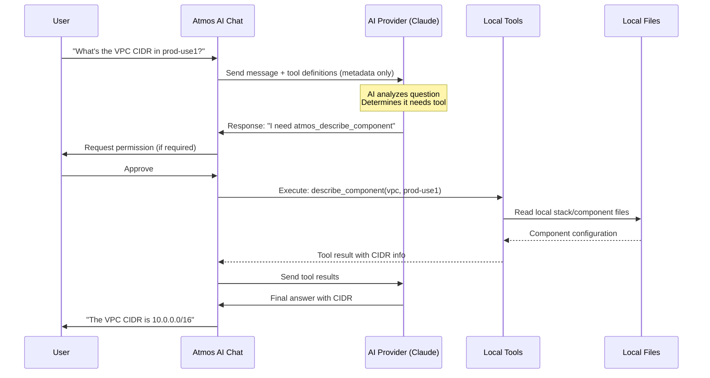

import Terminal from '@site/src/components/Terminal'
import File from '@site/src/components/File'
import Experimental from '@site/src/components/Experimental'

# AI Tool Execution

<Experimental />

Atmos AI can execute tools to query your infrastructure configuration, read and write files, validate stacks, and run commands — all locally on your machine.

## How Tool Calling Works

When you ask a question that requires infrastructure data, the AI decides which tool to call, requests permission (if configured), executes the tool locally, and uses the result to answer your question.


```mermaid
sequenceDiagram
    participant User
    participant AtmosAI as Atmos AI Chat
    participant LLM as AI Provider (Claude)
    participant Tools as Local Tools
    participant Files as Local Files

    User->>AtmosAI: "What's the VPC CIDR in prod-use1?"
    AtmosAI->>LLM: Send message + tool definitions (metadata only)
    Note over LLM: AI analyzes question<br/>Determines it needs tool
    LLM->>AtmosAI: Response: "I need atmos_describe_component"
    AtmosAI->>User: Request permission (if required)
    User->>AtmosAI: Approve
    AtmosAI->>Tools: Execute: describe_component(vpc, prod-use1)
    Tools->>Files: Read local stack/component files
    Files-->>Tools: Component configuration
    Tools-->>AtmosAI: Tool result with CIDR info
    AtmosAI->>LLM: Send tool results
    LLM->>AtmosAI: Final answer with CIDR
    AtmosAI->>User: "The VPC CIDR is 10.0.0.0/16"
```

### What Gets Sent to the AI Provider

Only **metadata** is sent initially — tool definitions (names, parameters, descriptions) and your question. No actual infrastructure data leaves your machine until the AI specifically requests it by calling a tool.

When the AI calls a tool, it runs **locally** and only the tool's output is sent back. You control this through the [permission system](#permission-system).

### When Tools Are Called

The AI calls tools when you ask about specific components, stacks, or configurations. It does **not** call tools for general questions like "What is a stack?" or "How do components work?"

## Configuration

<File title="atmos.yaml">
```yaml
settings:
  ai:
    enabled: true
    default_provider: "anthropic"
    providers:
      anthropic:
        model: "claude-sonnet-4-5-20250929"
        api_key_env: "ANTHROPIC_API_KEY"

    tools:
      enabled: true                        # Enable tool execution
      # require_confirmation: true         # Default: true (secure by default)
                                            # Set to false to opt-out of prompts

      # Tools that can execute without user confirmation
      allowed_tools:
        - atmos_describe_component
        - atmos_list_stacks
        - atmos_validate_stacks
        - atmos_describe_*                 # Wildcard patterns supported

      # Tools that always require confirmation
      restricted_tools:
        - write_component_file
        - write_stack_file
        - atmos_terraform_plan

      # Tools that are completely blocked
      blocked_tools:
        - atmos_terraform_destroy
        - atmos_terraform_apply

      yolo_mode: false                     # Skip all confirmations (DANGEROUS!)
```
</File>

<dl>
  <dt>`tools.enabled`</dt>
  <dd>Enable or disable AI tool execution (default: `false`)</dd>

  <dt>`tools.require_confirmation`</dt>
  <dd>Prompt user before executing tools (default: `true`). Set to `false` to allow all tools except `restricted_tools` to execute automatically.</dd>

  <dt>`tools.allowed_tools`</dt>
  <dd>Tools that execute without confirmation. Supports wildcards like `atmos_*` (default: `[]`)</dd>

  <dt>`tools.restricted_tools`</dt>
  <dd>Tools that always require confirmation, even when `require_confirmation: false` (default: `[]`)</dd>

  <dt>`tools.blocked_tools`</dt>
  <dd>Tools completely blocked from execution (default: `[]`)</dd>

  <dt>`tools.yolo_mode`</dt>
  <dd>Skip all permission checks. Only use in trusted CI/CD environments (default: `false`)</dd>
</dl>

## Available Tools

### Atmos Commands

| Tool | Description | Permissions |
|------|-------------|-------------|
| `atmos_describe_component` | Describe a component's configuration in a stack | Read-only |
| `atmos_list_stacks` | List all available stacks | Read-only |
| `atmos_list_components` | List all available components | Read-only |
| `atmos_validate_stacks` | Validate stack configurations | Read-only |
| `atmos_describe_affected` | Show components affected by git changes | Read-only |
| `atmos_describe_config` | Show Atmos configuration | Read-only |
| `atmos_get_template_context` | Debug Go template variable context | Read-only |
| `execute_atmos_command` | Execute any Atmos CLI command | Varies |

### File Operations

| Tool | Description | Permissions |
|------|-------------|-------------|
| `read_file` | Read any file from the repository | Read-only |
| `read_component_file` | Read a file from the components directory | Read-only |
| `read_stack_file` | Read a file from the stacks directory | Read-only |
| `list_component_files` | List files in a component directory | Read-only |
| `search_files` | Search for patterns across files | Read-only |
| `write_component_file` | Write or modify a component file | Requires confirmation |
| `write_stack_file` | Write or modify a stack file | Requires confirmation |

### Validation and Web

| Tool | Description | Permissions |
|------|-------------|-------------|
| `validate_file_lsp` | Validate files using LSP diagnostics ([requires LSP](/lsp/lsp-client)) | Read-only |
| `web_search` | Search the web via DuckDuckGo or Google | Requires confirmation |

All file operations include **path traversal protection** — files can only be accessed within configured directories.

### Web Search Configuration

<File title="atmos.yaml">
```yaml
settings:
  ai:
    web_search:
      enabled: true
      max_results: 10
      engine: "duckduckgo"     # or "google" (requires API key)
```
</File>

## Permission System

The permission system controls what tools the AI can execute.

### Permission Modes

| Mode | Config | Behavior |
|------|--------|----------|
| **Prompt** (default) | `require_confirmation: true` | Ask before each tool execution |
| **Allow** | `require_confirmation: false` | Auto-execute all except `restricted_tools` |
| **YOLO** | `yolo_mode: true` | Skip all checks — only use in isolated CI/CD |

### Permission Flow

```
1. YOLO Mode?     → Yes → Execute immediately
2. Blocked?       → Yes → Deny
3. Allowed list?  → Yes → Execute without prompt
4. Restricted?    → Yes → Always prompt
5. Default        → Prompt if require_confirmation is true
```

### Wildcard Patterns

```yaml
allowed_tools:
  - atmos_describe_*      # Match all describe commands
  - atmos_list_*          # Match all list commands
  - *_validate            # Match anything ending in _validate
```

### Permission Prompts

When a tool requires confirmation:

```
Tool Execution Request
━━━━━━━━━━━━━━━━━━━━━━━━━━━━━━━━━━━━━━━━
Tool: atmos_describe_component
Description: Describe an Atmos component configuration in a specific stack

Parameters:
  component: vpc
  stack: prod-use1

Options:
  [a] Always allow (save to .atmos/ai.settings.local.json)
  [y] Allow once
  [n] Deny once
  [d] Always deny (save to .atmos/ai.settings.local.json)

Choice (a/y/n/d):
```

### Persistent Permission Cache

"Always allow" and "always deny" decisions are saved to `.atmos/ai.settings.local.json`:

<File title=".atmos/ai.settings.local.json">
```json
{
  "permissions": {
    "allow": [
      "atmos_describe_component",
      "atmos_list_stacks"
    ],
    "deny": [
      "atmos_terraform_apply"
    ]
  }
}
```
</File>

This file is user-specific, gitignored by default, and editable manually. Decisions persist across all AI sessions.

**Priority order:** Blocked tools (config) > Cached denials > Allowed tools (config) > Cached allowances > Restricted tools > Default behavior.

## Skill-Specific Tool Access

Each [AI skill](/ai/skills) defines which tools it can use, creating a safety layer where specialized skills only perform actions relevant to their purpose.

| Skill | Can Read | Can Write | Can Execute | Notes |
|-------|----------|-----------|-------------|-------|
| **General** | All | All | All | Full access (respects global config) |
| **atmos-stacks** | Stacks, components, files | No | No | Analysis only |
| **atmos-components** | Components, files | Yes (with confirmation) | Yes (with confirmation) | Code-focused |
| **atmos-terraform** | Stacks, components, files | No | Yes (with confirmation) | Plan/review only |
| **atmos-validation** | Stacks, files, LSP | No | No | Validation only |

**Workflow tip:** Use different skills for different phases — analyze with `atmos-stacks`, refactor with `atmos-components`, validate with `atmos-validation`. Switch skills with **Ctrl+A** in the chat TUI.

Custom skills can define their own tool access in `atmos.yaml`. See [AI Skills](/ai/skills) for details.

## Security Best Practices

**Start conservative.** The default (prompt for everything) is the most secure. Relax permissions over time as you build trust:

<File title="atmos.yaml">
```yaml
# Production: very restrictive
tools:
  enabled: true
  allowed_tools: []              # Prompt for everything
  blocked_tools:
    - atmos_terraform_*          # Block all Terraform operations
    - write_*                    # Block all write operations

# Development: more permissive
tools:
  enabled: true
  allowed_tools:
    - atmos_describe_*           # Auto-approve read-only
    - atmos_list_*
    - atmos_validate_*
  blocked_tools:
    - atmos_terraform_destroy    # Still block destroy
```
</File>

:::warning YOLO Mode
Never use `yolo_mode` in production, shared environments, or workstations with production access. Reserve it for isolated CI/CD runners and sandboxed testing.
:::

## Troubleshooting

**Tools not executing:** Check `tools.enabled: true` in your config and verify the tool isn't in `blocked_tools`.

**No permission prompts:** The tool may be in `allowed_tools` or you may have previously chosen "always allow" in `.atmos/ai.settings.local.json`. Delete the cache file to reset.

**Timeouts:** Tools have a 30-second timeout. Long-running operations are automatically cancelled. Run them manually if needed.

## Related Documentation

- [AI Configuration](/ai/configuration) - Configure AI providers and settings
- [AI Skills](/ai/skills) - Skill system and custom skill creation
- [AI Sessions](/ai/sessions) - Persistent conversation sessions
