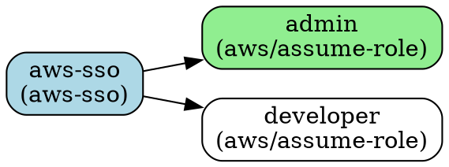
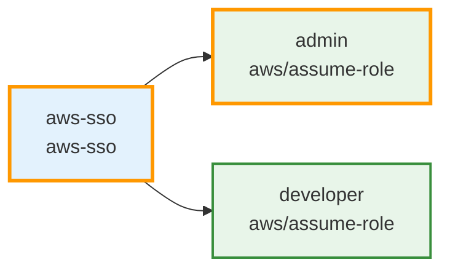
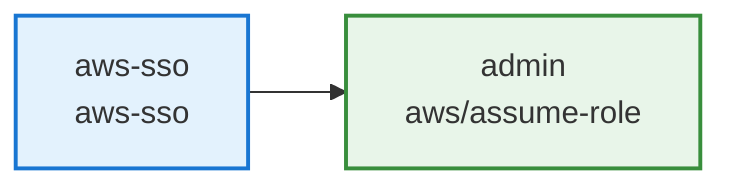

import Screengrab from '@site/src/components/Screengrab'
import Intro from '@site/src/components/Intro'

<Intro>
Display all authentication providers and identities configured in your Atmos project. View authentication chains showing how identities assume roles through providers or other identities. Supports multiple output formats including interactive tables, hierarchical trees, JSON, and YAML for integration with other tools.
</Intro>

<Screengrab title="atmos auth list --help" slug="atmos-auth-list--help" />

## Usage

```shell
atmos auth list [--format <format>] [--providers [names]] [--identities [names]]
```

## Examples

```shell
# List all providers and identities in table format (default)
atmos auth list

# Show only providers
atmos auth list --providers

# Show only specific providers
atmos auth list --providers=aws-sso,okta

# Show only identities
atmos auth list --identities

# Show specific identities
atmos auth list --identities=admin,developer

# Display as hierarchical tree
atmos auth list --format tree

# Export as JSON for programmatic access
atmos auth list --format json

# Export as YAML
atmos auth list --format yaml

# Generate Graphviz diagram
brew install graphviz
atmos auth list --format graphviz > auth.dot
dot -Tpng auth.dot -o auth.png

# Generate Mermaid diagram
atmos auth list --format mermaid

# Generate Markdown with embedded Mermaid
atmos auth list --format markdown > auth.md
```

## Output Formats

<dl>
  <dt>`table` (default)</dt>
  <dd>
    Displays providers and identities in formatted tables with columns for key attributes. Shows authentication chains inline for identities.
  </dd>

  <dt>`tree`</dt>
  <dd>
    Hierarchical tree view showing providers and identities with nested attributes. Visualizes authentication chains clearly with parent-child relationships.
  </dd>

  <dt>`json`</dt>
  <dd>
    Machine-readable JSON output containing the complete provider and identity configurations. Useful for programmatic access and integration with other tools.
  </dd>

  <dt>`yaml`</dt>
  <dd>
    Human-readable YAML output of provider and identity configurations. Good for reviewing configuration or generating documentation.
  </dd>

  <dt>`graphviz` / `dot`</dt>
  <dd>
    Graphviz DOT format for creating visual diagrams. Use with `dot` command to generate PNG, SVG, or PDF diagrams. Requires `brew install graphviz` on macOS.
  </dd>

  <dt>`mermaid`</dt>
  <dd>
    Mermaid diagram syntax for rendering in GitHub, GitLab, Confluence, and other Mermaid-compatible platforms. Shows providers and identities as a flowchart with styled nodes.
  </dd>

  <dt>`markdown` / `md`</dt>
  <dd>
    Markdown document with embedded Mermaid diagram in a code fence. Ready to commit to your repository documentation.
  </dd>
</dl>

## Flags

<dl>
  <dt>`--format` / `-f`</dt>
  <dd>
    Output format: `table`, `tree`, `json`, `yaml`, `graphviz`, `mermaid`, or `markdown`. Default: `table`.
  </dd>

  <dt>`--providers [names]`</dt>
  <dd>
    Show only providers. Optionally filter by comma-separated provider names (e.g., `--providers=aws-sso,okta`). Cannot be used with `--identities`.
  </dd>

  <dt>`--identities [names]`</dt>
  <dd>
    Show only identities. Optionally filter by comma-separated identity names (e.g., `--identities=admin,dev`). Cannot be used with `--providers`.
  </dd>
</dl>

## Understanding Authentication Chains

Authentication chains show how identities authenticate through providers or other identities. Chains are displayed in the format:

```
provider → identity1 → identity2 → target
```

For example:
- `aws-sso → admin` - Direct authentication through AWS SSO
- `aws-sso → base-role → admin-role` - Multi-step authentication with role assumption
- `okta → aws-dev → developer` - Authentication through Okta SSO, then assuming an AWS role

Chains can be arbitrarily long when using multiple role assumptions or identity federation.

## Table Format Details

### Providers Table

- **NAME** - Provider configuration name
- **KIND** - Provider type (e.g., `aws-sso`, `okta`)
- **REGION** - Cloud region (if applicable)
- **START URL / URL** - Authentication endpoint
- **DEFAULT** - Marked with ✓ if this is the default provider

### Identities Table

- **NAME** - Identity configuration name
- **KIND** - Identity type (e.g., `aws/assume-role`, `aws/user`)
- **VIA PROVIDER** - Provider used for authentication
- **VIA IDENTITY** - Parent identity for multi-step authentication
- **DEFAULT** - Marked with ✓ if this is the default identity
- **ALIAS** - Short alias for the identity

## Tree Format Details

The tree format shows hierarchical relationships with providers as roots and their identities as children:

```
Authentication Configuration
├─ aws-sso (aws-sso) [DEFAULT]
│  ├─ Region: us-east-1
│  ├─ Start URL: https://example.awsapps.com/start
│  ├─ Session
│  │  └─ Duration: 12h
│  └─ Identities
│     ├─ admin (aws/assume-role) [DEFAULT]
│     │  ├─ Principal
│     │  │  └─ arn: arn:aws:iam::123456789012:role/AdminRole
│     │  └─ ops (aws/assume-role)
│     │     └─ Principal
│     │        └─ arn: arn:aws:iam::987654321098:role/OpsRole
│     └─ developer (aws/assume-role)
│        └─ Principal
│           └─ arn: arn:aws:iam::123456789012:role/DeveloperRole
```

## Graphviz Format Example

The Graphviz format generates DOT language for creating professional diagrams:



Generate visualizations with:

```shell
# PNG image
atmos auth list --format graphviz | dot -Tpng > auth.png

# SVG (scalable)
atmos auth list --format graphviz | dot -Tsvg > auth.svg

# PDF document
atmos auth list --format graphviz | dot -Tpdf > auth.pdf
```

## Mermaid Format Example

The Mermaid format works in GitHub, GitLab, and many documentation platforms:



Use in documentation by adding to Markdown:

````markdown

````

Or use the `--format markdown` to generate the complete document automatically.

## Related Commands

- [`atmos auth whoami`](/cli/commands/auth/whoami) - Display current authentication status
- [`atmos auth login`](/cli/commands/auth/login) - Authenticate with a provider
- [`atmos auth validate`](/cli/commands/auth/validate) - Validate authentication configuration
- [`atmos auth env`](/cli/commands/auth/env) - Export credentials as environment variables

## Version Support

`atmos auth list` is available in Atmos `v1.195.0` and later. To get started:

```shell
# Install latest version
brew upgrade atmos

# Verify version
atmos version
```

## What's Next

This is just the beginning. We're continuing to improve authentication management in Atmos with:

- Enhanced visualization options for better understanding of authentication flows
- Interactive TUI mode for browsing configurations
- Better integration with Dev Containers for seamless development environments
- Support for additional cloud providers and identity providers (PRs welcome!)

Want to contribute? Check out our [GitHub repository](https://github.com/cloudposse/atmos) to submit feature requests or pull requests for new authentication providers.
