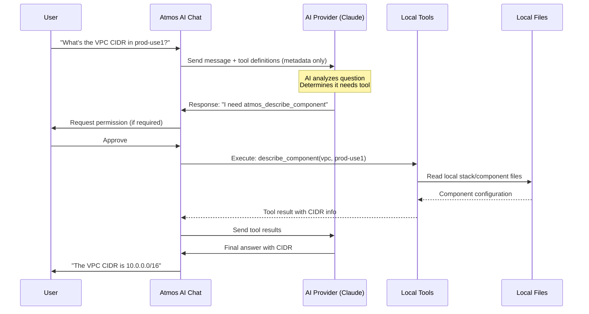

import File from '@site/src/components/File'
import Intro from '@site/src/components/Intro'
import Experimental from '@site/src/components/Experimental'

<Intro>
The `ai.tools` section controls which Atmos commands the AI assistant can execute and whether user
confirmation is required.
</Intro>

<Experimental />

:::note Renamed in a recent release
`tools.allowed_tools`, `tools.restricted_tools`, and `tools.blocked_tools` were renamed to
`tools.allowed`, `tools.restricted`, and `tools.blocked` — the `tools:` block already establishes
what these are lists of. The old names are no longer read; update `atmos.yaml` to the new names.
`tools.allowed` also picked up a second responsibility: see [Tool Settings](#tool-settings) below.
:::

## How Tool Calling Works

When you ask a question that requires infrastructure data, the AI decides which tool to call, requests permission (if configured), executes the tool locally, and uses the result to answer your question.



### What Gets Sent to the AI Provider

Only **metadata** is sent initially — tool definitions (names, parameters, descriptions) and your question. No actual infrastructure data leaves your machine until the AI specifically requests it by calling a tool.

When the AI calls a tool, it runs **locally** and only the tool's output is sent back. You control this through the [permission system](#permission-modes).

## Configuration

<File title="atmos.yaml">
```yaml
ai:
  tools:
    enabled: true
    require_confirmation: true
    allowed:
      - atmos_describe_component
      - atmos_list_stacks
      - atmos_validate_stacks
      - atmos_describe_*            # Wildcard patterns supported
    restricted:
      - write_component_file
      - write_stack_file
      - edit_file
    blocked:
      - execute_bash_command
    yolo_mode: false                # Skip all confirmations (DANGEROUS!)
```
</File>

## Tool Settings

<dl>
  <dt>`tools.enabled`</dt>
  <dd>Enable or disable the tool subsystem for `atmos ai chat`/`ask`/`exec` (default: `false`). When disabled, the AI can only answer from its training data and conversation context. This does **not** affect `atmos mcp start` — see [MCP note](#mcp-server-note) below.</dd>

  <dt>`tools.require_confirmation`</dt>
  <dd>Prompt the user before executing any tool (default: `true`). Set to `false` to allow all tools except `restricted` to execute automatically.</dd>

  <dt>`tools.allowed`</dt>
  <dd>When non-empty, restricts which tools exist at all — only tools matching one of these name patterns are registered; every other tool simply isn't available this session. Listed tools also skip the confirmation prompt. Supports wildcard patterns like `atmos_describe_*`. Empty/unset (default: `[]`) means every tool is registered, subject to normal confirmation rules.</dd>

  <dt>`tools.restricted`</dt>
  <dd>List of tools (from whatever `allowed` already let through) that always require user confirmation, even when `require_confirmation: false` (default: `[]`). Use this to protect write and execute operations.</dd>

  <dt>`tools.blocked`</dt>
  <dd>List of tools completely blocked from execution (default: `[]`). The AI cannot invoke these tools under any circumstances.</dd>

  <dt>`tools.yolo_mode`</dt>
  <dd>Skip all permission checks and execute tools immediately (default: `false`). Only use in trusted, isolated CI/CD environments. **Never use in production or shared environments.**</dd>
</dl>

### MCP Server Note

`atmos mcp start` always registers tools (subject to `tools.allowed`/`restricted`/`blocked`)
regardless of `tools.enabled` — `mcp.enabled: true` is that command's own, sufficient opt-in.
`tools.enabled` only gates `atmos ai chat`/`ask`/`exec`'s own tool-use loop. See
[MCP Configuration](/cli/configuration/mcp).

## Available Tools

### Atmos Commands

<dl>
  <dt>`atmos_describe_component`</dt>
  <dd>Describe a component's configuration in a stack. Read-only.</dd>

  <dt>`atmos_list_stacks`</dt>
  <dd>List all available stacks. Read-only.</dd>

  <dt>`atmos_validate_stacks`</dt>
  <dd>Validate stack configurations against schemas and policies. Read-only.</dd>

  <dt>`atmos_validate_schema`</dt>
  <dd>Validate atmos.yaml (plus atmos.d and profile fragments) and other configured YAML files against their JSON Schemas. Read-only.</dd>

  <dt>`describe_affected`</dt>
  <dd>Show components affected by git changes. Read-only.</dd>

  <dt>`get_template_context`</dt>
  <dd>Debug Go template variable context. Read-only.</dd>

  <dt>`execute_atmos_command`</dt>
  <dd>Execute any Atmos CLI command. Permissions vary by command.</dd>

  <dt>`atmos_list_findings`</dt>
  <dd>List security findings from AWS Security Hub for Atmos stacks. Read-only.</dd>

  <dt>`atmos_describe_finding`</dt>
  <dd>Get detailed information about a specific security finding by ID. Read-only.</dd>

  <dt>`atmos_analyze_finding`</dt>
  <dd>Analyze a security finding using AI to determine root cause and remediation steps. Read-only.</dd>

  <dt>`atmos_compliance_report`</dt>
  <dd>Generate a compliance posture report for a framework (CIS AWS, PCI DSS, SOC2, HIPAA, NIST). Read-only.</dd>

  <dt>`atmos_config_get`</dt>
  <dd>Read a value from the active atmos.yaml using a dot-notation path. Read-only.</dd>

  <dt>`atmos_config_list`</dt>
  <dd>List the dot-notation setting paths defined in the active atmos.yaml. Read-only.</dd>

  <dt>`atmos_config_set`</dt>
  <dd>Set a value in the active atmos.yaml using a dot-notation path, preserving comments and anchors. Requires confirmation by default.</dd>

  <dt>`atmos_config_delete`</dt>
  <dd>Delete a value from the active atmos.yaml using a dot-notation path. Requires confirmation by default.</dd>

  <dt>`atmos_config_format`</dt>
  <dd>Format the active atmos.yaml file in place, preserving comments and anchors. Requires confirmation by default.</dd>

  <dt>`atmos_stack_config_get`</dt>
  <dd>Read the effective value of a component-relative dot-path for a component in a stack. Read-only.</dd>

  <dt>`atmos_stack_config_list`</dt>
  <dd>List editable component-relative config paths for a component in a stack. Read-only.</dd>

  <dt>`atmos_stack_config_set`</dt>
  <dd>Set a component-relative value for a component in a stack, using provenance to find the defining manifest. Requires confirmation by default.</dd>

  <dt>`atmos_stack_config_delete`</dt>
  <dd>Delete a component-relative value from the manifest that defines it for a component in a stack. Requires confirmation by default.</dd>

  <dt>`atmos_stack_config_format`</dt>
  <dd>Format the manifest files that define a stack component in place. Requires confirmation by default.</dd>

  <dt>`atmos_vendor_config_get`</dt>
  <dd>Read a raw value from a vendor manifest (vendor.yaml) by dot-notation path. Read-only.</dd>

  <dt>`atmos_vendor_config_list`</dt>
  <dd>List raw setting paths from a vendor manifest and its imports. Read-only.</dd>

  <dt>`atmos_vendor_config_set`</dt>
  <dd>Set a raw value in a vendor manifest by dot-notation path. Requires confirmation by default.</dd>

  <dt>`atmos_vendor_config_delete`</dt>
  <dd>Delete a raw value from a vendor manifest by dot-notation path. Requires confirmation by default.</dd>

  <dt>`atmos_vendor_config_format`</dt>
  <dd>Format a vendor manifest file in place, preserving comments and anchors. Requires confirmation by default.</dd>

  <dt>`atmos_vendor_check_updates`</dt>
  <dd>Check whether vendored Git-sourced components have a newer version available than the one currently pinned. Read-only.</dd>

  <dt>`atmos_vendor_diff`</dt>
  <dd>Show a unified diff between a vendored component's pinned version and another ref. Read-only.</dd>

  <dt>`atmos_vendor_update`</dt>
  <dd>Update vendored Git-sourced components' pinned version to the latest available tag. Requires confirmation by default.</dd>

  <dt>`atmos_list_commands`</dt>
  <dd>List Atmos CLI commands and subcommands. Read-only.</dd>

  <dt>`atmos_command_help`</dt>
  <dd>Get detailed help for a specific Atmos CLI command. Read-only.</dd>

  <dt>`atmos_describe_dependents`</dt>
  <dd>List the Atmos components that depend on a given component/stack pair. Read-only.</dd>

  <dt>`atmos_describe_workflows`</dt>
  <dd>List all Atmos workflows discovered under the configured workflows base path. Read-only.</dd>

  <dt>`atmos_list_workflows`</dt>
  <dd>List all Atmos workflows with their defining file, description, and step count. Read-only.</dd>

  <dt>`atmos_list_components`</dt>
  <dd>List unique Atmos components defined across all stacks. Read-only.</dd>

  <dt>`atmos_list_values`</dt>
  <dd>List a component's values across every stack where it's used. Read-only.</dd>

  <dt>`atmos_auth_whoami`</dt>
  <dd>Show the currently active Atmos authentication identity and credential status. Read-only.</dd>

  <dt>`atmos_auth_list`</dt>
  <dd>List configured Atmos authentication providers and identities. Read-only.</dd>

  <dt>`atmos_toolchain_list`</dt>
  <dd>List tools declared in the project's .tool-versions file. Read-only.</dd>

  <dt>`atmos_toolchain_add`</dt>
  <dd>Add a tool dependency to the project's .tool-versions file. Requires confirmation by default.</dd>

  <dt>`atmos_toolchain_remove`</dt>
  <dd>Remove a tool dependency from the project's .tool-versions file. Requires confirmation by default.</dd>

  <dt>`atmos_toolchain_set`</dt>
  <dd>Set a tool's default pinned version in the project's .tool-versions file. Requires confirmation by default.</dd>

  <dt>`atmos_version_track_status`</dt>
  <dd>Check every dependency in an Atmos version track against its datasource for available updates. Read-only.</dd>

  <dt>`atmos_version_track_add`</dt>
  <dd>Add a dependency entry to an Atmos version track. Requires confirmation by default.</dd>

  <dt>`atmos_version_track_set`</dt>
  <dd>Update fields of an existing Atmos version track dependency entry. Requires confirmation by default.</dd>

  <dt>`atmos_version_track_remove`</dt>
  <dd>Remove a dependency entry from an Atmos version track. Requires confirmation by default.</dd>

  <dt>`atmos_version_track_update`</dt>
  <dd>Advance an Atmos version track's locked versions within each entry's update policy. Requires confirmation by default.</dd>

  <dt>`atmos_secret_list`</dt>
  <dd>List declared secrets and their initialization status. Read-only.</dd>

  <dt>`atmos_validate_component`</dt>
  <dd>Validate an Atmos component's configuration in a stack using JSON Schema or OPA policies. Read-only.</dd>
</dl>

### File Operations

<dl>
  <dt>`read_file`</dt>
  <dd>Read any file from the repository. Read-only.</dd>

  <dt>`read_component_file`</dt>
  <dd>Read a file from the components directory. Read-only.</dd>

  <dt>`read_stack_file`</dt>
  <dd>Read a file from the stacks directory. Read-only.</dd>

  <dt>`list_component_files`</dt>
  <dd>List files in a component directory. Read-only.</dd>

  <dt>`search_files`</dt>
  <dd>Search for patterns across files. Read-only.</dd>

  <dt>`edit_file`</dt>
  <dd>Edit an existing file with targeted changes. Requires confirmation by default.</dd>

  <dt>`write_component_file`</dt>
  <dd>Write or modify a component file. Requires confirmation by default.</dd>

  <dt>`atmos_terraform_component_hcl_get`</dt>
  <dd>Read an attribute value or block from a Terraform component file using an hcledit-style HCL address. Read-only.</dd>

  <dt>`atmos_terraform_component_hcl_edit`</dt>
  <dd>Structurally edit a Terraform component file using hcledit, preserving comments and formatting. Requires confirmation by default.</dd>

  <dt>`write_stack_file`</dt>
  <dd>Write or modify a stack file. Requires confirmation by default.</dd>
</dl>

### Execution

<dl>
  <dt>`execute_bash_command`</dt>
  <dd>Execute shell commands. Requires confirmation by default.</dd>
</dl>

### Validation and Web

<dl>
  <dt>`validate_file_lsp`</dt>
  <dd>Validate files using LSP diagnostics ([requires LSP](/lsp/lsp-client)). Read-only.</dd>

  <dt>`atmos_validate_file`</dt>
  <dd>Validate a YAML file against a JSON Schema with line numbers, no LSP required. Read-only.</dd>

  <dt>`web_search`</dt>
  <dd>Search the web via DuckDuckGo or Google. Requires confirmation by default.</dd>
</dl>

All file operations include **path traversal protection** -- files can only be accessed within configured directories.

### Web Search Configuration

<File title="atmos.yaml">
```yaml
ai:
  web_search:
    enabled: true
    max_results: 10
    # Google Custom Search (optional)
    # google_api_key: !env "GOOGLE_API_KEY"
    # google_cse_id: !env "GOOGLE_CSE_ID"
```
</File>

See [Web Search](/cli/configuration/ai#web-search) in the AI configuration reference for all settings.

## Permission Modes

<dl>
  <dt>**Prompt** (default)</dt>
  <dd>Set `require_confirmation: true`. Ask before each tool execution. The most secure mode.</dd>

  <dt>**Allow**</dt>
  <dd>Set `require_confirmation: false`. Auto-execute all tools except those in `restricted`.</dd>

  <dt>**YOLO**</dt>
  <dd>Set `yolo_mode: true`. Skip all permission checks. Only use in isolated CI/CD environments.</dd>
</dl>

### Permission Flow

A tool must first be *registered* to be callable at all: if `tools.allowed` is non-empty, only
matching tools are registered in the first place. Everything below only applies to a tool that
made it that far:

```
1. YOLO Mode?     → Yes → Execute immediately
2. Blocked?       → Yes → Deny
3. Allowed list?  → Yes → Execute without prompt
4. Restricted?    → Yes → Always prompt
5. Default        → Prompt if require_confirmation is true
```

### Permission Prompts

When a tool requires confirmation:

```
Tool Execution Request
━━━━━━━━━━━━━━━━━━━━━━━━━━━━━━━━━━━━━━━━
Tool: atmos_describe_component
Description: Describe an Atmos component configuration in a specific stack

Parameters:
  component: vpc
  stack: prod-use1

Options:
  [a] Always allow (save to .atmos/ai.settings.local.json)
  [y] Allow once
  [n] Deny once
  [d] Always deny (save to .atmos/ai.settings.local.json)

Choice (a/y/n/d):
```

## Wildcard Patterns

Tool lists support glob-style wildcard patterns:

```yaml
allowed:
  - atmos_describe_*      # Match all describe commands
  - atmos_list_*          # Match all list commands
  - *_validate            # Match anything ending in _validate
```

## Persistent Permission Cache

"Always allow" and "always deny" choices from interactive prompts are saved to `.atmos/ai.settings.local.json`. This file is user-specific and gitignored by default.

**Priority order:** `tools.allowed` (registration filter) > Blocked tools (config) > Cached denials > Allowed tools (config) > Cached allowances > Restricted tools > Default behavior.

## Skill-Specific Tool Access

Each [AI skill](/cli/configuration/ai/skills) defines which tools it can use, creating a safety layer where specialized skills only perform actions relevant to their purpose.

<dl>
  <dt>**General**</dt>
  <dd>Can read all, write all, execute all. Full access (respects global config).</dd>

  <dt>**atmos-stacks**</dt>
  <dd>Can read stacks, components, files. No write or execute. Analysis only.</dd>

  <dt>**atmos-components**</dt>
  <dd>Can read components, files. Can write and execute (with confirmation). Code-focused.</dd>

  <dt>**atmos-terraform**</dt>
  <dd>Can read stacks, components, files. No write. Can execute (with confirmation). Plan/review only.</dd>

  <dt>**atmos-validation**</dt>
  <dd>Can read stacks, files, LSP. No write or execute. Validation only.</dd>
</dl>

**Workflow tip:** Use different skills for different phases — analyze with `atmos-stacks`, refactor with `atmos-components`, validate with `atmos-validation`. Switch skills with **Ctrl+A** in the chat TUI.

## Security Best Practices

**Start conservative.** The default (prompt for everything) is the most secure. Relax permissions over time as you build trust:

<File title="atmos.yaml">
```yaml
# Production: very restrictive
ai:
  tools:
    enabled: true
    allowed: []                    # All tools registered; prompt for everything
    blocked:
      - execute_*                  # Block all execution tools
      - write_*                    # Block all write operations

# Development: more permissive
ai:
  tools:
    enabled: true
    allowed:
      - atmos_*                    # ONLY atmos_* tools are registered, and auto-approved
    blocked:
      - atmos_validate_stacks      # Still registered (it matches atmos_*) but every call is denied
```
</File>

Note: `allowed` only controls *registration* (whether a tool exists this session at all).
`blocked`/`restricted` are checked at *execution* time, against whatever `allowed` already let
through — a blocked tool can still appear in `tools/list` (MCP) or the AI's tool set, but every
call to it is denied. A tool listed in both `allowed` and `restricted` is auto-approved, not
prompted — `allowed` is checked first, before `restricted`.

:::warning YOLO Mode
Never use `yolo_mode` in production, shared environments, or workstations with production access. Reserve it for isolated CI/CD runners and sandboxed testing.
:::

## Troubleshooting

**Tools not executing:** Check `tools.enabled: true` in your config, verify the tool isn't in `blocked`, and — if you've set `tools.allowed` — verify the tool is actually in that list (otherwise it was never registered in the first place).

**No permission prompts:** The tool may be in `allowed` or you may have previously chosen "always allow" in `.atmos/ai.settings.local.json`. Delete the cache file to reset.

**Timeouts:** Tools have a 30-second timeout. Long-running operations are automatically cancelled. Run them manually if needed.

## Related Documentation

- [AI Configuration](/cli/configuration/ai) - Configure AI providers and settings
- [AI Skills](/cli/configuration/ai/skills) - Skill system and custom skill creation
- [AI Sessions](/cli/configuration/ai/sessions) - Persistent conversation sessions
