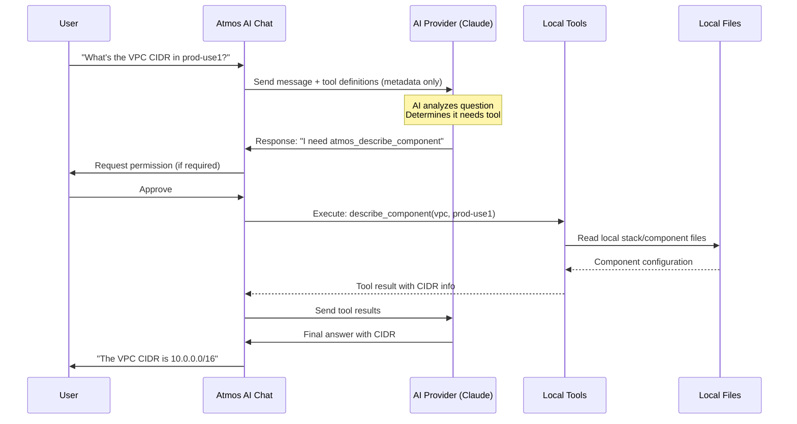

import File from '@site/src/components/File'
import Intro from '@site/src/components/Intro'
import Experimental from '@site/src/components/Experimental'

<Intro>
The `ai.tools` section controls which Atmos commands the AI assistant can execute and whether user
confirmation is required.
</Intro>

<Experimental />

## How Tool Calling Works

When you ask a question that requires infrastructure data, the AI decides which tool to call, requests permission (if configured), executes the tool locally, and uses the result to answer your question.



### What Gets Sent to the AI Provider

Only **metadata** is sent initially — tool definitions (names, parameters, descriptions) and your question. No actual infrastructure data leaves your machine until the AI specifically requests it by calling a tool.

When the AI calls a tool, it runs **locally** and only the tool's output is sent back. You control this through the [permission system](#permission-modes).

## Configuration

<File title="atmos.yaml">
```yaml
ai:
  tools:
    enabled: true
    require_confirmation: true
    allowed_tools:
      - atmos_describe_component
      - atmos_list_stacks
      - atmos_validate_stacks
      - atmos_describe_*            # Wildcard patterns supported
    restricted_tools:
      - write_component_file
      - write_stack_file
      - edit_file
    blocked_tools:
      - execute_bash_command
    yolo_mode: false                # Skip all confirmations (DANGEROUS!)
```
</File>

## Tool Settings

<dl>
  <dt>`tools.enabled`</dt>
  <dd>Enable or disable AI tool execution (default: `false`). When disabled, the AI can only answer from its training data and conversation context.</dd>

  <dt>`tools.require_confirmation`</dt>
  <dd>Prompt the user before executing any tool (default: `true`). Set to `false` to allow all tools except `restricted_tools` to execute automatically.</dd>

  <dt>`tools.allowed_tools`</dt>
  <dd>List of tools that execute without confirmation, even when `require_confirmation: true`. Supports wildcard patterns like `atmos_describe_*` (default: `[]`).</dd>

  <dt>`tools.restricted_tools`</dt>
  <dd>List of tools that always require user confirmation, even when `require_confirmation: false` (default: `[]`). Use this to protect write and execute operations.</dd>

  <dt>`tools.blocked_tools`</dt>
  <dd>List of tools completely blocked from execution (default: `[]`). The AI cannot invoke these tools under any circumstances.</dd>

  <dt>`tools.yolo_mode`</dt>
  <dd>Skip all permission checks and execute tools immediately (default: `false`). Only use in trusted, isolated CI/CD environments. **Never use in production or shared environments.**</dd>
</dl>

## Available Tools

### Atmos Commands

<dl>
  <dt>`atmos_describe_component`</dt>
  <dd>Describe a component's configuration in a stack. Read-only.</dd>

  <dt>`atmos_list_stacks`</dt>
  <dd>List all available stacks. Read-only.</dd>

  <dt>`atmos_validate_stacks`</dt>
  <dd>Validate stack configurations against schemas and policies. Read-only.</dd>

  <dt>`describe_affected`</dt>
  <dd>Show components affected by git changes. Read-only.</dd>

  <dt>`get_template_context`</dt>
  <dd>Debug Go template variable context. Read-only.</dd>

  <dt>`execute_atmos_command`</dt>
  <dd>Execute any Atmos CLI command. Permissions vary by command.</dd>
</dl>

### File Operations

<dl>
  <dt>`read_file`</dt>
  <dd>Read any file from the repository. Read-only.</dd>

  <dt>`read_component_file`</dt>
  <dd>Read a file from the components directory. Read-only.</dd>

  <dt>`read_stack_file`</dt>
  <dd>Read a file from the stacks directory. Read-only.</dd>

  <dt>`list_component_files`</dt>
  <dd>List files in a component directory. Read-only.</dd>

  <dt>`search_files`</dt>
  <dd>Search for patterns across files. Read-only.</dd>

  <dt>`edit_file`</dt>
  <dd>Edit an existing file with targeted changes. Requires confirmation by default.</dd>

  <dt>`write_component_file`</dt>
  <dd>Write or modify a component file. Requires confirmation by default.</dd>

  <dt>`write_stack_file`</dt>
  <dd>Write or modify a stack file. Requires confirmation by default.</dd>
</dl>

### Execution

<dl>
  <dt>`execute_bash_command`</dt>
  <dd>Execute shell commands. Requires confirmation by default.</dd>
</dl>

### Validation and Web

<dl>
  <dt>`validate_file_lsp`</dt>
  <dd>Validate files using LSP diagnostics ([requires LSP](/lsp/lsp-client)). Read-only.</dd>

  <dt>`web_search`</dt>
  <dd>Search the web via DuckDuckGo or Google. Requires confirmation by default.</dd>
</dl>

All file operations include **path traversal protection** -- files can only be accessed within configured directories.

### Web Search Configuration

<File title="atmos.yaml">
```yaml
ai:
  web_search:
    enabled: true
    max_results: 10
    # Google Custom Search (optional)
    # google_api_key: !env "GOOGLE_API_KEY"
    # google_cse_id: !env "GOOGLE_CSE_ID"
```
</File>

See [Web Search](/cli/configuration/ai#web-search) in the AI configuration reference for all settings.

## Permission Modes

<dl>
  <dt>**Prompt** (default)</dt>
  <dd>Set `require_confirmation: true`. Ask before each tool execution. The most secure mode.</dd>

  <dt>**Allow**</dt>
  <dd>Set `require_confirmation: false`. Auto-execute all tools except those in `restricted_tools`.</dd>

  <dt>**YOLO**</dt>
  <dd>Set `yolo_mode: true`. Skip all permission checks. Only use in isolated CI/CD environments.</dd>
</dl>

### Permission Flow

```
1. YOLO Mode?     → Yes → Execute immediately
2. Blocked?       → Yes → Deny
3. Allowed list?  → Yes → Execute without prompt
4. Restricted?    → Yes → Always prompt
5. Default        → Prompt if require_confirmation is true
```

### Permission Prompts

When a tool requires confirmation:

```
Tool Execution Request
━━━━━━━━━━━━━━━━━━━━━━━━━━━━━━━━━━━━━━━━
Tool: atmos_describe_component
Description: Describe an Atmos component configuration in a specific stack

Parameters:
  component: vpc
  stack: prod-use1

Options:
  [a] Always allow (save to .atmos/ai.settings.local.json)
  [y] Allow once
  [n] Deny once
  [d] Always deny (save to .atmos/ai.settings.local.json)

Choice (a/y/n/d):
```

## Wildcard Patterns

Tool lists support glob-style wildcard patterns:

```yaml
allowed_tools:
  - atmos_describe_*      # Match all describe commands
  - atmos_list_*          # Match all list commands
  - *_validate            # Match anything ending in _validate
```

## Persistent Permission Cache

"Always allow" and "always deny" choices from interactive prompts are saved to `.atmos/ai.settings.local.json`. This file is user-specific and gitignored by default.

**Priority order:** Blocked tools (config) > Cached denials > Allowed tools (config) > Cached allowances > Restricted tools > Default behavior.

## Skill-Specific Tool Access

Each [AI skill](/cli/configuration/ai/skills) defines which tools it can use, creating a safety layer where specialized skills only perform actions relevant to their purpose.

<dl>
  <dt>**General**</dt>
  <dd>Can read all, write all, execute all. Full access (respects global config).</dd>

  <dt>**atmos-stacks**</dt>
  <dd>Can read stacks, components, files. No write or execute. Analysis only.</dd>

  <dt>**atmos-components**</dt>
  <dd>Can read components, files. Can write and execute (with confirmation). Code-focused.</dd>

  <dt>**atmos-terraform**</dt>
  <dd>Can read stacks, components, files. No write. Can execute (with confirmation). Plan/review only.</dd>

  <dt>**atmos-validation**</dt>
  <dd>Can read stacks, files, LSP. No write or execute. Validation only.</dd>
</dl>

**Workflow tip:** Use different skills for different phases — analyze with `atmos-stacks`, refactor with `atmos-components`, validate with `atmos-validation`. Switch skills with **Ctrl+A** in the chat TUI.

## Security Best Practices

**Start conservative.** The default (prompt for everything) is the most secure. Relax permissions over time as you build trust:

<File title="atmos.yaml">
```yaml
# Production: very restrictive
ai:
  tools:
    enabled: true
    allowed_tools: []              # Prompt for everything
    blocked_tools:
      - execute_*                  # Block all execution tools
      - write_*                    # Block all write operations

# Development: more permissive
ai:
  tools:
    enabled: true
    allowed_tools:
      - atmos_describe_*           # Auto-approve read-only
      - atmos_list_*
      - atmos_validate_*
    blocked_tools:
      - execute_bash_command       # Block shell execution
```
</File>

:::warning YOLO Mode
Never use `yolo_mode` in production, shared environments, or workstations with production access. Reserve it for isolated CI/CD runners and sandboxed testing.
:::

## Troubleshooting

**Tools not executing:** Check `tools.enabled: true` in your config and verify the tool isn't in `blocked_tools`.

**No permission prompts:** The tool may be in `allowed_tools` or you may have previously chosen "always allow" in `.atmos/ai.settings.local.json`. Delete the cache file to reset.

**Timeouts:** Tools have a 30-second timeout. Long-running operations are automatically cancelled. Run them manually if needed.

## Related Documentation

- [AI Configuration](/cli/configuration/ai) - Configure AI providers and settings
- [AI Skills](/cli/configuration/ai/skills) - Skill system and custom skill creation
- [AI Sessions](/cli/configuration/ai/sessions) - Persistent conversation sessions
