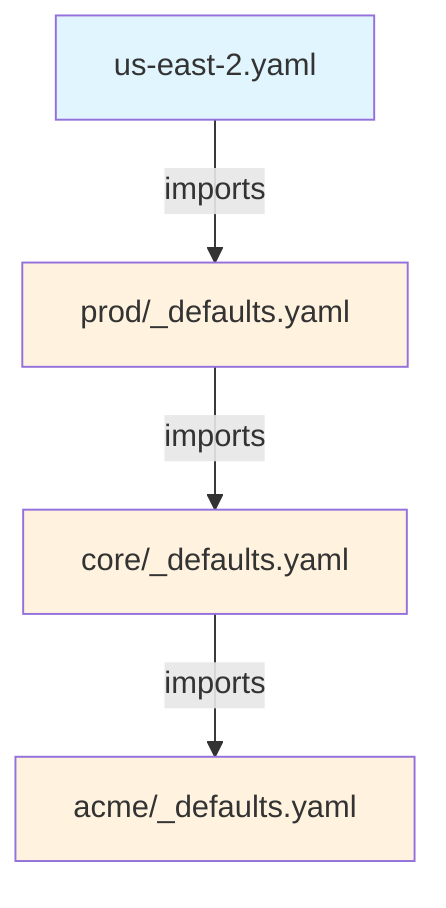

import Intro from '@site/src/components/Intro'
import PillBox from '@site/src/components/PillBox'

<PillBox>Atmos Design Pattern</PillBox>

<Intro>
The `_defaults.yaml` pattern is a **naming convention** (not an Atmos feature) for organizing hierarchical configuration defaults. Atmos has no special knowledge of these files—they are treated like any other YAML file that can be imported.
</Intro>

## What

The `_defaults.yaml` pattern is a naming convention used throughout Atmos configurations to organize default settings at different levels of your infrastructure hierarchy. This is purely a convention adopted by teams for better organization—Atmos itself has no built-in knowledge or special handling of files named `_defaults.yaml`.

## Why We Use This Convention

### 1. Lexicographic Sorting
The underscore prefix (`_`) ensures these files appear at the top of directory listings, making them immediately visible when browsing the filesystem. This saves time when navigating complex stack structures.

### 2. Visual Distinction
The naming pattern immediately signals to developers: "this file contains defaults, not a stack definition." This clear visual cue helps prevent confusion between actual stack configurations and their default settings.

### 3. Automatic Exclusion from Stack Discovery
By convention, we configure Atmos to exclude `**/_defaults.yaml` from stack discovery in `atmos.yaml`:

```yaml
stacks:
  excluded_paths:
    - "**/_defaults.yaml"
```

This prevents these files from being mistakenly processed as stacks when Atmos discovers stack configurations.

### 4. Explicit Import Control
Since they're excluded from discovery, these files must be explicitly imported, giving developers precise control over inheritance chains. This explicitness helps prevent unexpected configuration inheritance and makes the configuration flow easier to trace.

## How It Works

### Important: Not Automatic!

:::warning
Unlike some configuration systems, Atmos does **NOT** automatically import `_defaults.yaml` files. Each must be explicitly imported where needed. This is intentional—it provides explicit control over configuration inheritance.
:::

### Import Path Resolution

Atmos supports two types of import paths:

**Base-Relative Paths** (most common):
- Resolved relative to `stacks.base_path` configured in `atmos.yaml`
- Examples: `orgs/acme/_defaults`, `catalog/vpc/defaults`

**File-Relative Paths**:
- Start with `./` or `../`
- Resolved relative to the importing file's directory
- Examples: `./_defaults`, `../_defaults`

### Typical Usage Pattern

```console
stacks/
├── orgs/
│   └── acme/
│       ├── _defaults.yaml          # Organization defaults (NOT auto-imported)
│       ├── core/
│       │   ├── _defaults.yaml      # OU defaults - must import org defaults
│       │   └── prod/
│       │       ├── _defaults.yaml  # Stage defaults - must import OU defaults
│       │       └── us-east-2.yaml  # Stack - must import stage defaults
```

## The Convention in Practice

### Step 1: Create defaults at each level

```yaml title="stacks/orgs/acme/_defaults.yaml"
# Organization-wide defaults
vars:
  namespace: acme
  terraform_version: "1.5.0"

terraform:
  vars:
    tags:
      Organization: acme
      ManagedBy: Atmos
```

### Step 2: Import parent defaults in child defaults

```yaml title="stacks/orgs/acme/core/_defaults.yaml"
import:
  - orgs/acme/_defaults    # Must explicitly import parent defaults

# OU-specific defaults
vars:
  tenant: core

terraform:
  vars:
    tags:
      OrganizationalUnit: core
```

### Step 3: Import in actual stacks

```yaml title="stacks/orgs/acme/core/prod/us-east-2.yaml"
import:
  - orgs/acme/core/prod/_defaults  # Must explicitly import defaults
  - mixins/region/us-east-2

# Stack-specific configuration
terraform:
  vars:
    environment: prod
    region: us-east-2

components:
  terraform:
    vpc:
      vars:
        cidr_block: "10.0.0.0/16"
```

## Import Chain Example

Here's how a typical import chain works with the `_defaults.yaml` convention:



Each level explicitly imports its parent's defaults, creating a clear inheritance chain.

## Why Not Just Call Them "defaults.yaml"?

Without the underscore prefix:
- Files would be sorted alphabetically mixed with other files
- Harder to distinguish defaults from other configurations at a glance
- Still need to be excluded from stack discovery (just with a different pattern)

The underscore is a small detail that provides significant organizational benefits.

## Alternative Naming Conventions

Teams can choose different conventions if preferred:
- `defaults.yaml` (without underscore)
- `.defaults.yaml` (hidden file on Unix systems)
- `base.yaml`
- `common.yaml`

Just remember to:
1. Update `excluded_paths` in `atmos.yaml` to match your pattern
2. Be consistent across your project
3. Document your choice for your team

## Common Misunderstandings

Here are some clarifications about how `_defaults.yaml` files work in Atmos:

| What You Might Think | How It Actually Works |
|---------------------|----------------------|
| Atmos automatically processes `_defaults.yaml` files | Atmos has no special knowledge of this naming pattern. These files must be explicitly imported like any other YAML file. |
| The underscore has special meaning to Atmos | The underscore is purely for lexicographic sorting and visual distinction. Atmos treats `_defaults.yaml` the same as `defaults.yaml` or any other name. |
| `_defaults.yaml` files are always inherited | Nothing is inherited unless explicitly imported. You have complete control over what gets imported and when. |
| Files must be named `_defaults.yaml` for inheritance to work | You can import any YAML file. The `_defaults.yaml` name is just a helpful convention. |

## Best Practices

### Do's
- **Be Explicit**: Always explicitly import parent defaults
- **Document Import Chains**: Comment your imports to show the inheritance hierarchy
- **Keep It Simple**: Don't create too many levels of defaults (typically 3-4 levels maximum)
- **Stay Consistent**: Use the same naming convention throughout your project
- **Order Imports Logically**: Import parent defaults before child defaults or mixins

### Don'ts
- **Don't Assume Auto-Import**: Never assume `_defaults.yaml` files are automatically imported
- **Don't Create Circular Imports**: Avoid import cycles which will cause errors
- **Don't Override Everything**: Override only what needs to change at each level
- **Don't Mix Conventions**: Pick one naming convention and stick with it

## Example: Multi-Tenant, Multi-Region Setup

Here's a real-world example showing how the convention organizes a complex infrastructure:

```yaml title="stacks/orgs/acme/_defaults.yaml"
# Organization defaults
vars:
  namespace: acme

terraform:
  backend:
    s3:
      bucket: "acme-terraform-state"
      dynamodb_table: "acme-terraform-state-lock"
```

```yaml title="stacks/orgs/acme/plat/_defaults.yaml"
import:
  - orgs/acme/_defaults

vars:
  tenant: platform

terraform:
  vars:
    tags:
      Tenant: platform
      CostCenter: engineering
```

```yaml title="stacks/orgs/acme/plat/dev/_defaults.yaml"
import:
  - orgs/acme/plat/_defaults
  - mixins/stage/dev    # Can also import mixins

vars:
  stage: dev

terraform:
  vars:
    instance_type: t3.small  # Smaller instances for dev
```

```yaml title="stacks/orgs/acme/plat/dev/us-west-2.yaml"
import:
  - orgs/acme/plat/dev/_defaults
  - mixins/region/us-west-2

# This is the actual stack configuration
components:
  terraform:
    vpc:
      vars:
        availability_zones: ["us-west-2a", "us-west-2b"]
```

## Troubleshooting

### My defaults aren't being applied

**Check these common issues:**
1. **Missing Import**: Ensure you've explicitly imported the `_defaults.yaml` file
2. **Wrong Path Style**: Verify you're using the correct path style (base-relative vs file-relative)
3. **Path Typo**: Check for typos in the import path
4. **File Location**: Confirm the `_defaults.yaml` file exists where expected

**Debug with:**
```bash
# Show the final configuration with all imports processed
atmos describe component <component> -s <stack>
```

### I see `_defaults.yaml` in my stack list

This means the exclusion pattern isn't working. Check:

```yaml title="atmos.yaml"
stacks:
  excluded_paths:
    - "**/_defaults.yaml"  # Ensure this pattern is present
```

### Import path not found

If you get an import error, verify:
1. The path is relative to `stacks.base_path` (unless it starts with `./` or `../`)
2. The file extension (`.yaml` is added automatically if omitted)
3. The file actually exists at that location

## Summary

The `_defaults.yaml` pattern is a simple but effective naming convention that helps organize Atmos configurations. Remember:

- It's a **convention**, not an Atmos feature
- Files must be **explicitly imported**
- The underscore provides **lexicographic sorting**
- It creates **visual distinction** in file listings
- You have **complete control** over inheritance

This convention has emerged from real-world usage as a best practice for organizing hierarchical configurations in a clear, maintainable way.
