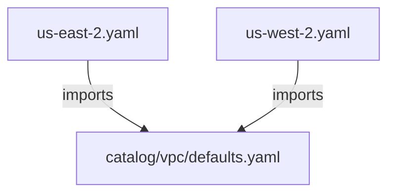

import File from '@site/src/components/File'
import PillBox from '@site/src/components/PillBox'
import Intro from '@site/src/components/Intro'

<PillBox>Atmos Design Pattern</PillBox>

<Intro>
The **Multi-Region Configuration** pattern describes how to deploy the same infrastructure across multiple AWS regions. This pattern is the foundation for understanding how Atmos handles variation across different dimensions.
</Intro>

## Use-cases

Use the **Multi-Region Configuration** pattern when:

- You need to deploy infrastructure to multiple AWS regions for disaster recovery (DR)

- You want to reduce latency by deploying closer to your users

- You have compliance requirements that mandate data residency in specific regions

- You need to provision region-specific resources while sharing common configuration

## Benefits

The **Multi-Region Configuration** pattern provides the following benefits:

- Region-specific configuration is defined once and reused across all stacks in that region

- Adding a new region requires minimal changes—just create a new stack file

- Common component configuration is shared, keeping your infrastructure [DRY](https://en.wikipedia.org/wiki/Don%27t_repeat_yourself)

- Each region can have unique settings (CIDR blocks, availability zones, etc.) while inheriting shared defaults

## How It Works

Each region has its own top-level stack file that imports shared component defaults and specifies region-specific settings.



## Example

The following example shows how to deploy `vpc` and `vpc-flow-logs-bucket` components across two regions: `us-east-2` and `us-west-2`.

### Directory Structure

```console
   │   # Centralized stacks configuration
   ├── stacks
   │   ├── catalog  # component-specific defaults
   │   │   ├── vpc-flow-logs-bucket
   │   │   │   └── defaults.yaml
   │   │   └── vpc
   │   │       └── defaults.yaml
   │   └── deploy  # top-level stacks
   │       └── dev
   │           ├── us-east-2.yaml
   │           └── us-west-2.yaml
   │
   │   # Centralized components configuration
   └── components
       └── terraform
           ├── vpc
           └── vpc-flow-logs-bucket
```

### Configure atmos.yaml

Add the following configuration to `atmos.yaml`:

<File title="atmos.yaml">
```yaml
components:
  terraform:
    base_path: "components/terraform"

stacks:
  base_path: "stacks"
  included_paths:
    # Tell Atmos to search for top-level stack manifests in the `deploy` folder
    - "deploy/**/*"
  name_template: "{{.vars.environment}}-{{.vars.stage}}"
```
</File>

### Configure Component Catalog

Define default configuration for each component in the catalog:

<File title="stacks/catalog/vpc-flow-logs-bucket/defaults.yaml">
```yaml
components:
  terraform:
    vpc-flow-logs-bucket:
      metadata:
        component: vpc-flow-logs-bucket
      vars:
        enabled: true
        name: "vpc-flow-logs"
        traffic_type: "ALL"
        force_destroy: true
```
</File>

<File title="stacks/catalog/vpc/defaults.yaml">
```yaml
components:
  terraform:
    vpc:
      metadata:
        component: vpc
      vars:
        enabled: true
        name: "common"
        max_subnet_count: 3
        map_public_ip_on_launch: true
        nat_gateway_enabled: true
        vpc_flow_logs_enabled: true
```
</File>

### Configure Top-Level Stack Manifests

Each region's stack file imports the shared defaults and specifies region-specific configuration:

<File title="stacks/deploy/dev/us-east-2.yaml">
```yaml
import:
  - catalog/vpc-flow-logs-bucket/defaults
  - catalog/vpc/defaults

vars:
  region: us-east-2
  environment: ue2
  stage: dev

components:
  terraform:
    vpc:
      vars:
        ipv4_primary_cidr_block: "10.10.0.0/16"
        availability_zones:
          - us-east-2a
          - us-east-2b
          - us-east-2c
```
</File>

<File title="stacks/deploy/dev/us-west-2.yaml">
```yaml
import:
  - catalog/vpc-flow-logs-bucket/defaults
  - catalog/vpc/defaults

vars:
  region: us-west-2
  environment: uw2
  stage: dev

components:
  terraform:
    vpc:
      vars:
        ipv4_primary_cidr_block: "10.20.0.0/16"
        availability_zones:
          - us-west-2a
          - us-west-2b
          - us-west-2c
```
</File>

:::tip Environment Abbreviations

The `environment` variable is typically set to an abbreviation of the region (e.g., `ue2` for `us-east-2`, `uw2` for `us-west-2`). This makes stack names shorter and more readable: `ue2-dev` instead of `us-east-2-dev`.

:::

### Provision the Components

Deploy to both regions:

```shell
# Deploy to us-east-2
atmos terraform apply vpc-flow-logs-bucket -s ue2-dev
atmos terraform apply vpc -s ue2-dev

# Deploy to us-west-2
atmos terraform apply vpc-flow-logs-bucket -s uw2-dev
atmos terraform apply vpc -s uw2-dev
```

## Adding a New Region

To add a new region (e.g., `eu-west-1`):

<File title="stacks/deploy/dev/eu-west-1.yaml">
```yaml
import:
  - catalog/vpc-flow-logs-bucket/defaults
  - catalog/vpc/defaults

vars:
  region: eu-west-1
  environment: ew1
  stage: dev

components:
  terraform:
    vpc:
      vars:
        ipv4_primary_cidr_block: "10.30.0.0/16"
        availability_zones:
          - eu-west-1a
          - eu-west-1b
          - eu-west-1c
```
</File>

Then deploy:

```shell
atmos terraform apply vpc-flow-logs-bucket -s ew1-dev
atmos terraform apply vpc -s ew1-dev
```

## Reducing Duplication with Mixins

As your multi-region deployment grows, you may notice duplication across region stack files (e.g., the same `region`, `environment`, and `availability_zones` repeated). You can extract this into [Mixins](/stacks/mixins) to keep your configuration DRY.

For example, create a region mixin:

<File title="stacks/mixins/region/us-east-2.yaml">
```yaml
vars:
  region: us-east-2
  environment: ue2

components:
  terraform:
    vpc:
      vars:
        availability_zones:
          - us-east-2a
          - us-east-2b
          - us-east-2c
```
</File>

Then your stack file becomes simpler:

<File title="stacks/deploy/dev/us-east-2.yaml">
```yaml
import:
  - catalog/vpc-flow-logs-bucket/defaults
  - catalog/vpc/defaults
  - mixins/region/us-east-2

vars:
  stage: dev

components:
  terraform:
    vpc:
      vars:
        ipv4_primary_cidr_block: "10.10.0.0/16"
```
</File>

See [Mixins](/stacks/mixins) for more details on this approach.

## Related Patterns

- [Organizational Hierarchy Configuration](/design-patterns/stack-organization/organizational-hierarchy-configuration) - Extend this pattern with multiple organizations, tenants, and accounts
- [Component Catalog](/design-patterns/component-catalog) - Organize reusable component defaults
- [Layered Stack Configuration](/design-patterns/stack-organization/layered-stack-configuration) - Group components into functional layers

## References

- [Catalogs](/stacks/catalogs)
- [Mixins](/stacks/mixins)
- [Stack Imports](/stacks/imports)
