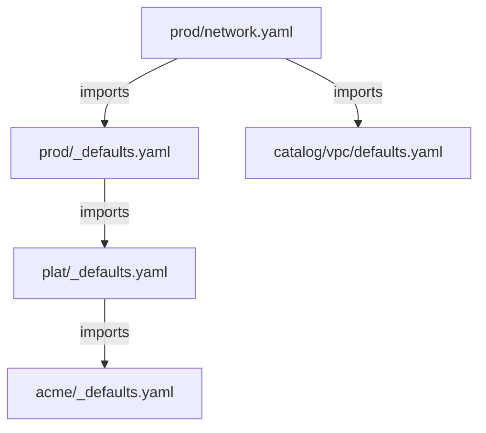

import File from '@site/src/components/File'
import PillBox from '@site/src/components/PillBox'
import Intro from '@site/src/components/Intro'

<PillBox>Atmos Design Pattern</PillBox>

<Intro>
The **Organizational Hierarchy Configuration** pattern describes how to structure stacks for enterprise environments with multiple organizations, organizational units (OUs), tenants, and accounts.
</Intro>

## Use-cases

Use the **Organizational Hierarchy Configuration** pattern when:

- You have one or more organizations with multiple organizational units/departments/tenants

- Each OU/department/tenant has multiple accounts (dev, staging, prod, etc.)

- You need to manage configuration at different levels (org, tenant, account)

## Benefits

The **Organizational Hierarchy Configuration** pattern provides the following benefits:

- Defaults for organizations, tenants/OUs, and accounts are defined in just one place, making the configuration extremely [DRY](https://en.wikipedia.org/wiki/Don%27t_repeat_yourself)

- New organizations can be added without affecting existing organization configurations

- New tenants/OUs can be added to an organization without affecting existing tenants

- New accounts can be added to a tenant without affecting existing accounts

- The hierarchical structure mirrors your actual organizational structure, making it intuitive to navigate

## Organizational Concepts

Atmos uses context variables to represent different levels of your organizational hierarchy:

<dl>
  <dt>`namespace`</dt>
  <dd>Represents the organization (e.g., `org1`, `org2`, `acme`). Used when managing multiple distinct organizations.</dd>

  <dt>`tenant`</dt>
  <dd>Represents an organizational unit, department, or team (e.g., `core`, `plat`, `engineering`). Groups related accounts together.</dd>

  <dt>`stage`</dt>
  <dd>Represents an account or deployment stage (e.g., `dev`, `staging`, `prod`, `audit`). Typically maps to an AWS account.</dd>
</dl>

## The Role of _defaults.yaml Files

The `_defaults.yaml` files at each level of the hierarchy contain baseline configurations that are inherited by child levels. These files:

- **Must be explicitly imported** — they are not automatically included
- **Create inheritance chains** by importing parent-level defaults
- **Are excluded from stack discovery** via the `excluded_paths` configuration

:::info
The `_defaults.yaml` naming is a convention, not an Atmos feature. The underscore prefix ensures these files sort to the top of directory listings and are visually distinct from stack configurations. See the [_defaults.yaml Design Pattern](/design-patterns/stack-organization/defaults-pattern) for details.
:::

## Example

The following example shows how to structure stacks for an organization (`acme`) with two OUs (`core` and `plat`) and multiple accounts. Each account (stage) is a folder containing layer files that group components by function.

### Directory Structure

```console
   ├── stacks
   │   ├── catalog  # component defaults
   │   │   ├── vpc
   │   │   │   └── defaults.yaml
   │   │   ├── rds
   │   │   │   └── defaults.yaml
   │   │   └── eks
   │   │       └── defaults.yaml
   │   └── orgs
   │       └── acme
   │           ├── _defaults.yaml
   │           ├── core  # 'core' OU
   │           │   ├── _defaults.yaml
   │           │   └── audit
   │           │       ├── _defaults.yaml
   │           │       └── network.yaml
   │           └── plat  # 'plat' OU
   │               ├── _defaults.yaml
   │               ├── dev
   │               │   ├── _defaults.yaml
   │               │   ├── network.yaml
   │               │   └── data.yaml
   │               ├── staging
   │               │   ├── _defaults.yaml
   │               │   ├── network.yaml
   │               │   └── data.yaml
   │               └── prod
   │                   ├── _defaults.yaml
   │                   ├── network.yaml
   │                   ├── data.yaml
   │                   └── compute.yaml
   │
   └── components
       └── terraform
           ├── vpc
           ├── rds
           └── eks
```

### Configure atmos.yaml

<File title="atmos.yaml">
```yaml
components:
  terraform:
    base_path: "components/terraform"

stacks:
  base_path: "stacks"
  included_paths:
    - "orgs/**/*"
  excluded_paths:
    - "**/_defaults.yaml"
  name_template: "{{.vars.tenant}}-{{.vars.stage}}-{{.vars.layer}}"
```
</File>

:::tip Simpler Stack Names

If you prefer simpler stack names without the layer, use:

```yaml
name_template: "{{.vars.tenant}}-{{.vars.stage}}"
```

This works when each layer file defines different components (no overlap).

:::

### Configure Organization Defaults

<File title="stacks/orgs/acme/_defaults.yaml">
```yaml
vars:
  namespace: acme

terraform:
  vars:
    tags:
      Organization: acme
```
</File>

### Configure Tenant Defaults

<File title="stacks/orgs/acme/plat/_defaults.yaml">
```yaml
import:
  - orgs/acme/_defaults

vars:
  tenant: plat
```
</File>

### Configure Stage Defaults

Each stage folder has a `_defaults.yaml` that sets the stage variable:

<File title="stacks/orgs/acme/plat/dev/_defaults.yaml">
```yaml
import:
  - orgs/acme/plat/_defaults

vars:
  stage: dev
```
</File>

<File title="stacks/orgs/acme/plat/prod/_defaults.yaml">
```yaml
import:
  - orgs/acme/plat/_defaults

vars:
  stage: prod
```
</File>

### Configure Layer Stacks

Each layer file imports its stage defaults and the relevant component catalogs:

<File title="stacks/orgs/acme/plat/dev/network.yaml">
```yaml
import:
  - orgs/acme/plat/dev/_defaults
  - catalog/vpc/defaults

vars:
  layer: network
```
</File>

<File title="stacks/orgs/acme/plat/dev/data.yaml">
```yaml
import:
  - orgs/acme/plat/dev/_defaults
  - catalog/rds/defaults

vars:
  layer: data

# Dev-specific overrides
components:
  terraform:
    rds:
      vars:
        instance_class: db.t3.small
```
</File>

<File title="stacks/orgs/acme/plat/prod/network.yaml">
```yaml
import:
  - orgs/acme/plat/prod/_defaults
  - catalog/vpc/defaults

vars:
  layer: network

# Prod-specific overrides
components:
  terraform:
    vpc:
      vars:
        map_public_ip_on_launch: false
```
</File>

<File title="stacks/orgs/acme/plat/prod/compute.yaml">
```yaml
import:
  - orgs/acme/plat/prod/_defaults
  - catalog/eks/defaults

vars:
  layer: compute
```
</File>

## Import Chain

The following diagram shows how configuration flows through the import chain:



## Provision the Components

Deploy the network layer in dev:

```shell
atmos terraform apply vpc -s plat-dev-network
```

Deploy the data layer in prod:

```shell
atmos terraform apply rds -s plat-prod-data
```

Deploy the compute layer in prod:

```shell
atmos terraform apply eks -s plat-prod-compute
```

## Adding New Elements

### Adding a New Account

Create a new stage folder with its defaults and layer files:

```console
stacks/orgs/acme/plat/qa/
├── _defaults.yaml
├── network.yaml
└── data.yaml
```

### Adding a New Layer

Add a new layer file to each stage that needs it:

```console
stacks/orgs/acme/plat/prod/observability.yaml
```

## Combining with Multi-Region

This pattern can be combined with the [Multi-Region Configuration](/design-patterns/stack-organization/multi-region-configuration) pattern. Add the `environment` variable to your name template and structure:

```yaml
name_template: "{{.vars.tenant}}-{{.vars.environment}}-{{.vars.stage}}-{{.vars.layer}}"
```

See the Multi-Region Configuration pattern for details.

## Related Patterns

- [Layered Stack Configuration](/design-patterns/stack-organization/layered-stack-configuration) - The layer concept used within each stage
- [Multi-Region Configuration](/design-patterns/stack-organization/multi-region-configuration) - Add multi-region support
- [_defaults.yaml Convention](/design-patterns/stack-organization/defaults-pattern) - The naming convention used throughout
- [Component Catalog](/design-patterns/component-catalog) - Organize reusable component defaults

## References

- [Catalogs](/howto/catalogs)
- [Stack Imports](/stacks/imports)
