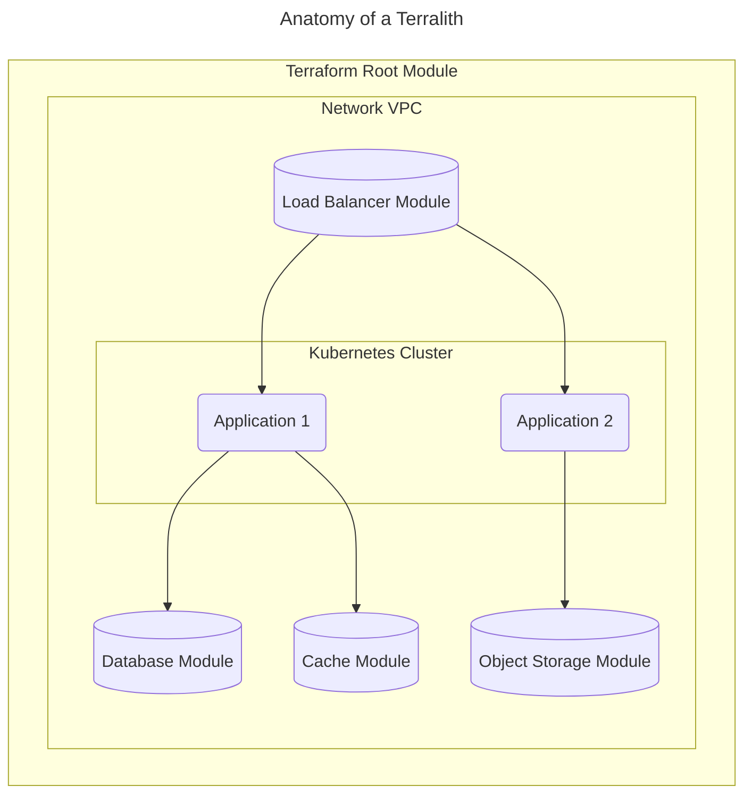

A monolithic Terraform "root module" is also known as a Terralith. It's characterized by an expansive, all-encompassing Terraform configuration that attempts to manage every aspect of the infrastructure within a single module.

In Atmos, this is considered an anti-pattern; instead, this should be broken down into [components](/components) and configured with [stacks](/learn/stacks).

To learn more, see [Stage 2](/intro/why-atmos/stage-2) of the typical Terraform maturity path.
