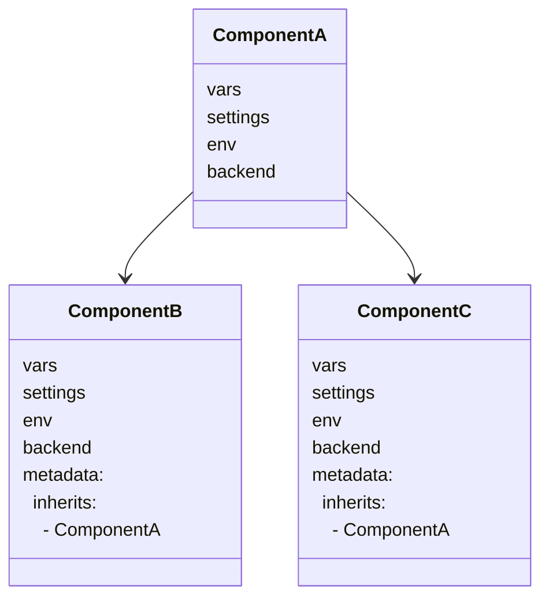
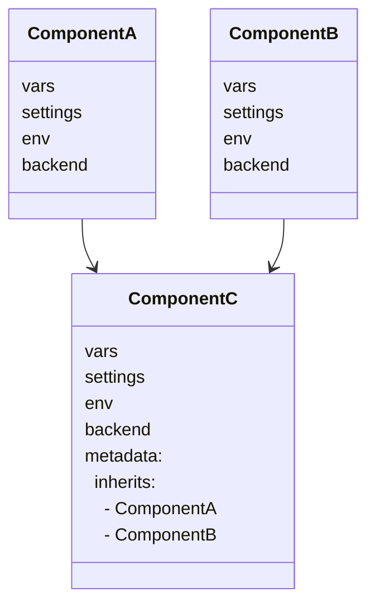
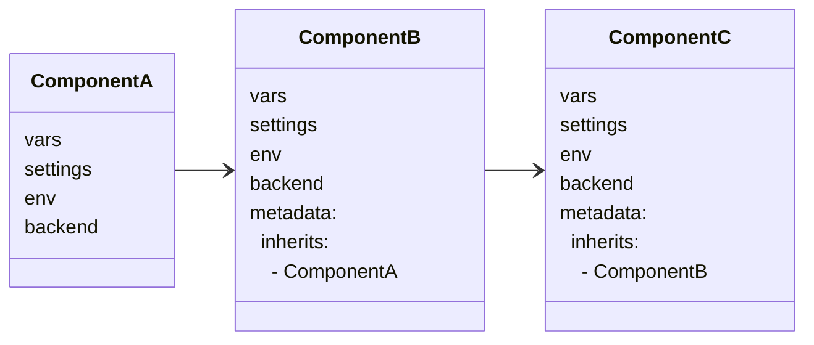
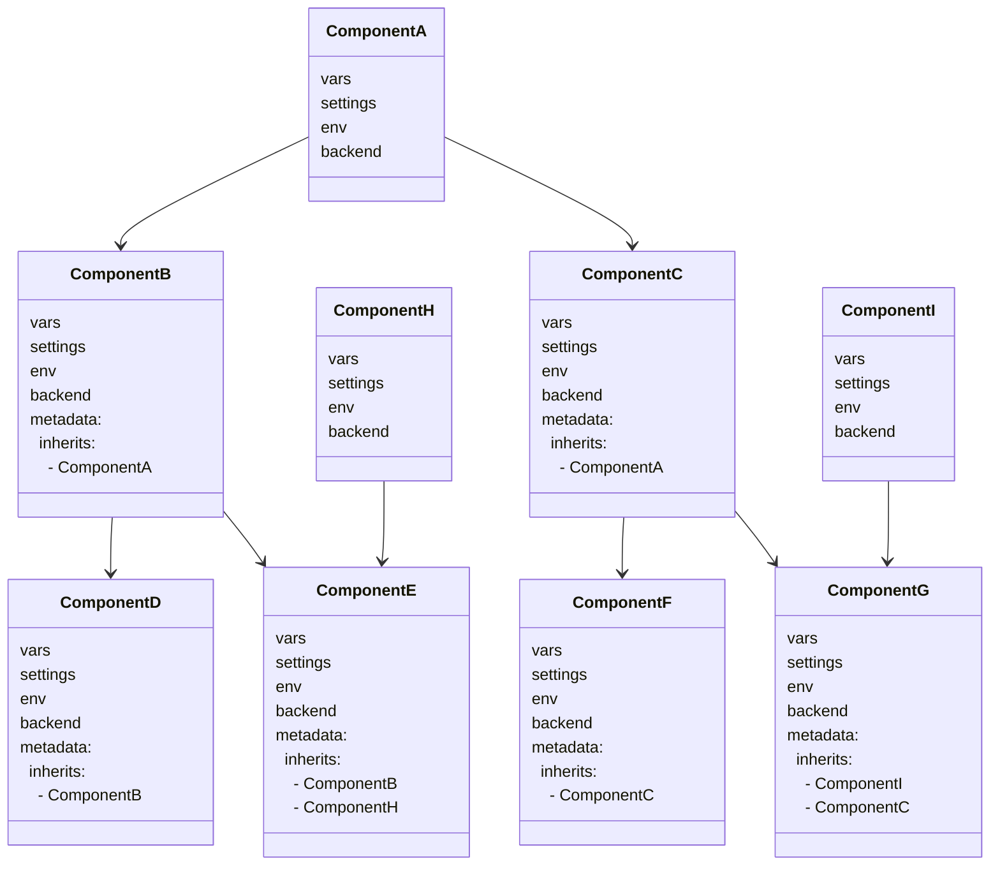
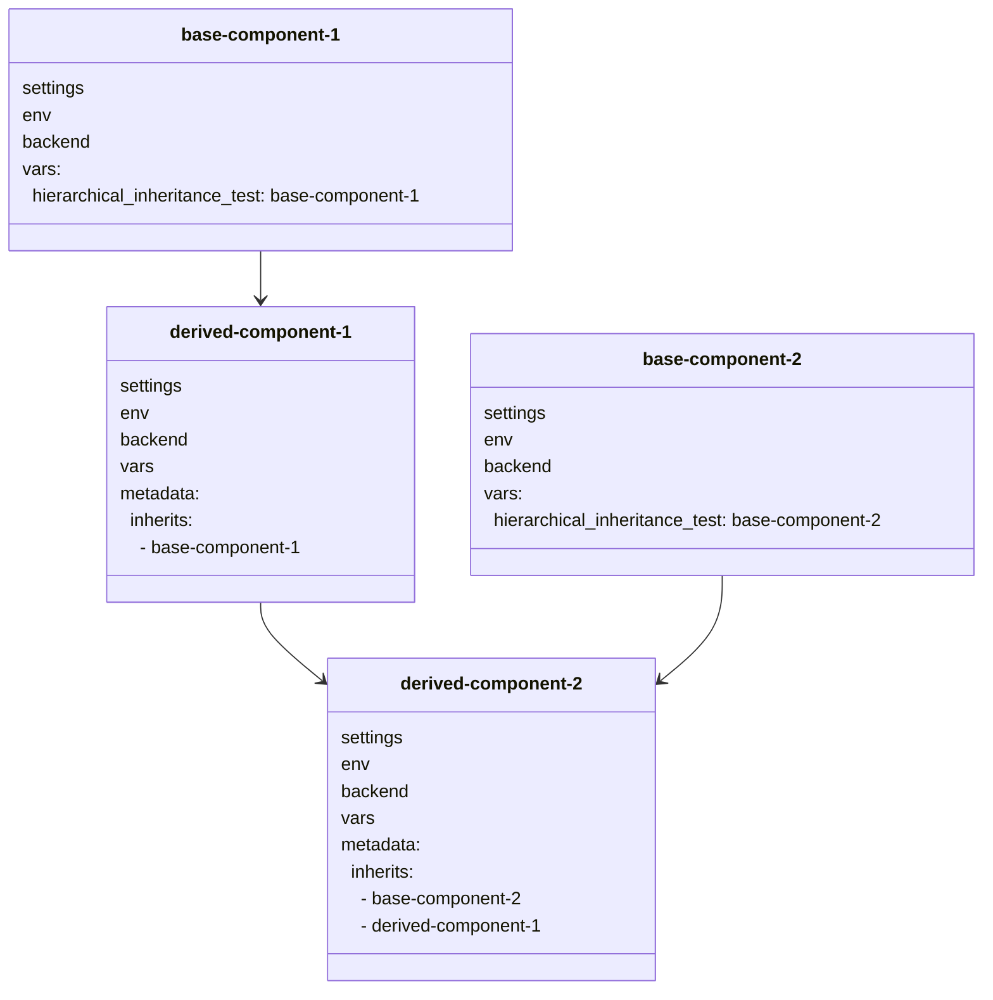

import File from '@site/src/components/File'
import Terminal from '@site/src/components/Terminal'
import PillBox from '@site/src/components/PillBox'
import Intro from '@site/src/components/Intro'

<Intro>
Inheritance lets components derive configuration from other components. A derived component inherits all settings from its base component and can override specific values.
</Intro>

Atmos supports the following concepts and principles of **Component-Oriented Programming (COP)**:

- [Single Inheritance](/howto/inheritance#single-inheritance) - when an Atmos component inherits the configuration properties from
  another Atmos component

- [Multiple Inheritance](/howto/inheritance#multiple-inheritance) - when an Atmos component inherits the configuration from more than one Atmos
  component

These concepts and principles are implemented and used in Atmos by combining two features: [`import`](/stacks/imports)
and [`metadata`](/stacks/components/component-metadata) component's configuration section.

:::info
The mechanics of mixins and inheritance apply only to the [Stack](/learn/stacks) configurations. Atmos knows nothing about the underlying
components (e.g. terraform), and does not magically implement inheritance for HCL. However, by designing highly reusable components that do one thing
well, we're able to achieve many of the same benefits.
:::

Component Inheritance is implemented and used in Atmos by combining two features: [`import`](/stacks/imports)
and `metadata` component's configuration section.

### Definitions

<dl>
<dt>Base Component</dt>
<dd>is an Atmos component from which other Atmos components inherit all the configuration properties</dd>
<dt>Derived Component</dt>
<dd>is an Atmos component that derives the configuration properties from other Atmos components</dd>
</dl>

# Understanding Inheritance

The concept of inheritance in Atmos is implemented through deep merging. Deep merging involves taking two maps or objects and combining them in a specific order, where the values in the latter map override those in the former. This approach allows us to achieve a template-free way of defining configurations in a logical, predictable, and consistent manner.

## Single Inheritance

<PillBox>Easy</PillBox>

Single Inheritance is used when an Atmos component inherits from another base Atmos component.

In the diagram below, `ComponentA` is the base component. `ComponentB` and `ComponentC` are derived components, they inherit all the
configurations (`vars`, `settings`, `env` and other sections) from `ComponentA`, and can override the default values from `ComponentA`.




### Single Inheritance Example

Let's say we want to provision two VPCs with different settings into the same AWS account.

In the `stacks/catalog/vpc.yaml` file, add the following config for the VPC component:

<File title="stacks/catalog/vpc.yaml">
```yaml
components:
  terraform:
    vpc-defaults:
      metadata:
        # Setting `metadata.type: abstract` makes the component `abstract`,
        # explicitly prohibiting the component from being deployed.
        # `atmos terraform apply` will fail with an error.
        # If `metadata.type` attribute is not specified, it defaults to `real`.
        # `real` components can be provisioned by `atmos` and CI/CD like Spacelift and Atlantis.
        type: abstract
      # Default variables, which will be inherited and can be overridden in the derived components
      vars:
        public_subnets_enabled: false
        nat_gateway_enabled: false
        nat_instance_enabled: false
        max_subnet_count: 3
        vpc_flow_logs_enabled: true
```
</File>

In the configuration above, the following **Component-Oriented Programming** concepts are implemented:

- **Abstract Components**: `atmos` component `vpc-defaults` is marked as abstract in `metadata.type`. This makes the component non-deployable, and it
  can be used only as a base for other components that inherit from it
- **Dynamic Polymorphism**: All the variables in the `vars` section become the default values for the derived components. This provides the ability to
  override and use the base component properties in the derived components to provision the same Terraform configuration many times but with different
  settings

<details>
<summary>Deep Dive</summary>

Component Inheritance is one of the principles of [Component-Oriented Programming (COP)](https://en.wikipedia.org/wiki/Component-based_software_engineering)
supported by Atmos.

The concept is borrowed from [Object-Oriented Programming](https://en.wikipedia.org/wiki/Inheritance_(object-oriented_programming))
to logically organize complex configurations in a way that makes conceptual sense. The side effect of this are extremely DRY and reusable
configurations.

[Component-Oriented Configuration](https://en.wikipedia.org/wiki/Component-based_software_engineering) is a reuse-based approach to defining,
implementing and composing loosely-coupled independent components into systems.

<dl>
  <dt>Dynamic Polymorphism</dt>
  <dd>Ability to use and override base component(s) properties</dd>

  <dt>Encapsulation</dt>
  <dd>Enclose a set of related configuration properties into reusable loosely-coupled modules. Encapsulation is implemented by <a href="/components">Atmos Components</a> which are opinionated building blocks of Infrastructure-as-Code (IAC) that solve one specific problem or use-case</dd>

  <dt>Abstraction</dt>
  <dd>
    <ul>
      <li>Principle of Abstraction: In a given stack, "hide" all but the relevant information about a component configuration in order to reduce complexity and increase efficiency</li>
      <li>Abstract Components: If a component is marked as <code>abstract</code>, it can be used only as a base for other components and can't be provisioned using <code>atmos</code></li>
    </ul>
  </dd>
</dl>
</details>


In the `stacks/ue2-dev.yaml` stack config file, add the following config for the derived VPC components in the `ue2-dev` stack:

<File title="stacks/ue2-dev.yaml">
```yaml
# Import the base component configuration from the `catalog`.
# `import` supports POSIX-style Globs for file names/paths (double-star `**` is supported).
# File extensions are optional (if not specified, `.yaml` is used by default).
import:
  - catalog/vpc

components:
  terraform:

    vpc/1:
      metadata:
        component: infra/vpc # Point to the Terraform component in `components/terraform` folder
        inherits:
          - vpc-defaults # Inherit all settings and variables from the `vpc-defaults` base component
      vars:
        # Define variables that are specific for this component
        # and are not set in the base component
        name: vpc-1
        # Override the default variables from the base component
        public_subnets_enabled: true
        nat_gateway_enabled: true
        vpc_flow_logs_enabled: false

    vpc/2:
      metadata:
        component: infra/vpc # Point to the same Terraform component in `components/terraform` folder
        inherits:
          - vpc-defaults # Inherit all settings and variables from the `vpc-defaults` base component
      vars:
        # Define variables that are specific for this component
        # and are not set in the base component
        name: vpc-2
        # Override the default variables from the base component
        max_subnet_count: 2
        vpc_flow_logs_enabled: false
```
</File>

In the configuration above, the following **Component-Oriented Programming** concepts are implemented:

- **Component Inheritance**: In the `ue2-dev` stack (`stacks/ue2-dev.yaml` stack config file), the Atmos components `vpc/1` and `vpc/2` inherit from
  the base component `vpc-defaults`. This makes `vpc/1` and `vpc/2` derived components
- **Principle of Abstraction**: In the `ue2-dev` stack, only the relevant information about the derived components in the stack is shown. All the base
  component settings are "hidden" (in the imported `catalog`), which reduces the configuration size and complexity
- **Dynamic Polymorphism**: The derived `vpc/1` and `vpc/2` components override and use the base component properties to be able to provision the same
  Terraform configuration many times but with different settings

Having the components in the stack configured as shown above, we can now provision the `vpc/1` and `vpc/2` components into the `ue2-dev` stack by
executing the following `atmos` commands:

```shell
atmos terraform apply vpc/1 -s ue2-dev
atmos terraform apply vpc/2 -s ue2-dev
```

As we can see, using the principles of **Component-Oriented Programming (COP)**, we are able to define two (or more) components with
different settings, and provision them into the same (or different) environment (account/region) using the same Terraform code (which is
environment-agnostic). And the configurations are extremely DRY and reusable.

## Multiple Inheritance

<PillBox>Advanced</PillBox>

Multiple Inheritance is used when an Atmos component inherits from more than one Atmos component.


In the diagram below, `ComponentA` and `ComponentB` are the base components. `ComponentC` is a derived components, it inherits all the
configurations (`vars`, `settings`, `env` and other sections) from `ComponentA` and `ComponentB`, and can override the default values
from `ComponentA` and `ComponentB`.



Multiple Inheritance allows a component to inherit from many base components or mixins, each base component having its own inheritance chain,
effectively making it an inheritance matrix. It uses a method similar to Method Resolution Order (MRO) using
the [C3 linearization](https://en.wikipedia.org/wiki/C3_linearization) algorithm, which is how Python supports multiple inheritance.

:::info

In **Object-Oriented Programming (OOP)**, a mixin is a class that contains methods for use by other classes without having to be the parent class of
those other classes.

In **Component-Oriented Programming (COP)** implemented in Atmos, a [mixin](/howto/mixins) is an abstract base component that is never
meant to be provisioned and does not have any physical implementation - it just contains default settings/variables/properties for use by other Atmos
components.

:::

Multiple Inheritance, similarly to Single Inheritance, is defined by the `metadata.inherits` section in the component
configuration. `metadata.inherits` is a list of component or mixins names from which the current component inherits.
In the case of multiple base components, it is processed in the order by which it was declared.

For example, in the following configuration:

```yaml
metadata:
  inherits:
    - componentA
    - componentB
```

Atmos will recursively deep-merge all the base components of `componentA` (each component overriding its base),
then all the base components of `componentB` (each component overriding its base), then the two results are deep-merged together with `componentB`
inheritance chain overriding the values from `componentA` inheritance chain.

:::caution
All the base components/mixins referenced by `metadata.inherits` must be already defined in the Stack configuration, either by using an `import`
statement or by explicitly defining them in the Stack configuration. The `metadata.inherits` statement does not imply that we are importing anything.
:::

### Multiple Inheritance Example

Here is a concrete example:

<File title="stack.yaml">
```yaml
# Import all the base components and mixins we want to inherit from.
# `import` supports POSIX-style Globs for file names/paths (double-star `**` is supported).
import:
  - catalog/terraform/test/test-component-override
  - catalog/terraform/test/test-component-override-2
  - catalog/terraform/mixins/test-*.*

components:
  terraform:
    test/test-component-override-3:
      vars: {}
      metadata:
        # `real` is implicit, you don't need to specify it.
        # `abstract` makes the component protected from being deployed.
        type: real
        # Terraform component. Must exist in `components/terraform` folder.
        # If not specified, it's assumed that this component `test/test-component-override-3`
        # is also a Terraform component in
        # `components/terraform/test/test-component-override-3` folder.
        component: "test/test-component"
        # Multiple inheritance.
        # It's a down-top/left-right matrix similar to Method Resolution Order (MRO) in Python.
        inherits:
          - "test/test-component-override"
          - "test/test-component-override-2"
          - "mixin/test-1"
          - "mixin/test-2"
```
</File>

In the configuration above, all the base components and mixins are processed and deep-merged in the order they are specified in the `inherits` list:

- `test/test-component-override-2` overrides `test/test-component-override` and its base components (all the way up its inheritance chain)

- `mixin/test-1` overrides `test/test-component-override-2` and its base components (all the way up its inheritance chain)

- `mixin/test-2` overrides `mixin/test-1` and its base components (all the way up its inheritance chain)

- The current component `test/test-component-override-3` overrides `mixin/test-2` and its base components (all the way up its inheritance chain)

When we run the following command to provision the `test/test-component-override-3` Atmos component into the stack `tenant1-ue2-dev`:

```shell
atmos terraform apply test/test-component-override-3 -s tenant1-ue2-dev
```

Atmos will process all configurations for the current component and all the base components/mixins and will show the following console output:

```text
Command info:
Atmos component: test/test-component-override-3
Terraform component: test/test-component
Terraform command: apply
Stack: tenant1-ue2-dev
Inheritance: test/test-component-override-3 -> mixin/test-2 -> mixin/test-1 ->
             test/test-component-override-2 -> test/test-component-override -> test/test-component
```

The `Inheritance` output shows the multiple inheritance steps that Atmos performed and deep-merged into the final configuration, including
the variables which are sent to the Terraform component `test/test-component` that is being provisioned.

### Multilevel Inheritance

<PillBox>Advanced</PillBox>

Multilevel Inheritance is used when an Atmos component inherits from a base Atmos component, which in turn inherits from another base Atmos component.

In the diagram below, `ComponentC` directly inherits from `ComponentB`.
`ComponentB` directly inherits from `ComponentA`.

After this Multilevel Inheritance chain gets processed by Atmos, `ComponentC` will inherit all the configurations (`vars`, `settings`, `env` and other
sections) from both `ComponentB` and `ComponentA`.

Note that `ComponentB` overrides the values from `ComponentA`.
`ComponentC` overrides the values from both `ComponentB` and `ComponentA`.



### Hierarchical Inheritance

<PillBox>Advanced</PillBox>

Hierarchical Inheritance is a combination of Multiple Inheritance and Multilevel Inheritance.

In Hierarchical Inheritance, every component can act as a base component for one or more child (derived) components, and each derived component can
inherit from one of more base components.



In the diagram above:

- `ComponentA` is the base component of the whole hierarchy

- `ComponentB` and `ComponentC` inherit from `ComponentA`

- `ComponentD` inherits from `ComponentB` directly, and from `ComponentA` via Multilevel Inheritance

- `ComponentE` is an example of using both Multiple Inheritance and Multilevel Inheritance.
  It inherits from `ComponentB` and `ComponentH` directly, and from `ComponentA` via Multilevel Inheritance

For `ComponentE`, the inherited components are processed and deep-merged in the order they are specified in the `inherits` list:

- `ComponentB` overrides the configuration from `ComponentA`

- `ComponentH` overrides the configuration from `ComponentB` and `ComponentA` (since it's defined after `ComponentB` in the `inherits` section)

- And finally, `ComponentE` overrides `ComponentH`, `ComponentB` and `ComponentA`

For `ComponentG`:

- `ComponentI` is processed first (since it's the first item in the `inherits` list)

- Then `ComponentA` is processed (since it's the base component for `ComponentC` which is the second item in the `inherits` list)

- Then `ComponentC` is processed, and it overrides the configuration from `ComponentA` and `ComponentI`

- And finally, `ComponentG` is processed, and it overrides `ComponentC`, `ComponentA` and `ComponentI`

#### Hierarchical Inheritance Example

Let's consider the following configuration for Atmos components `base-component-1`, `base-component-2`, `derived-component-1`
and `derived-component-2`:

<File title="stack.yaml">
```yaml
components:
  terraform:

    base-component-1:
      metadata:
        type: abstract
      vars:
        hierarchical_inheritance_test: "base-component-1"

    base-component-2:
      metadata:
        type: abstract
      vars:
        hierarchical_inheritance_test: "base-component-2"

    derived-component-1:
      metadata:
        component: "test/test-component"
        inherits:
          - base-component-1
      vars: {}

    derived-component-2:
      metadata:
        component: "test/test-component"
        inherits:
          - base-component-2
          - derived-component-1
      vars: {}
```
</File>

This configuration can be represented by the following diagram:



In the configuration above, `derived-component-1` inherits from `base-component-1`.

`derived-component-2` inherits from `base-component-2` and `derived-component-1` via Multiple Inheritance, and from `base-component-1` via Multilevel
Inheritance.

The `derived-component-2` component is processed in the following order:

- `base-component-2` is processed first (since it's the first item in the `inherits` list)

- Then `base-component-1` is processed (since it's the base component for `derived-component-1` which is the second item in the `inherits` list), and
  it overrides the configuration from `base-component-2`

- Then `derived-component-1` is processed, and it overrides the configuration from `base-component-2` and `base-component-1`

- And finally, `derived-component-2` is processed, and it overrides `derived-component-1`, `base-component-1` and `base-component-2`

When we run the following command to provision the `derived-component-2` component, Atmos will show the following console output:

<Terminal title="atmos terraform plan derived-component-2 -s tenant1-ue2-test-1">
```console
Variables for the component 'derived-component-2' in the stack 'tenant1-ue2-test-1':
environment: ue2
hierarchical_inheritance_test: base-component-1
namespace: cp
region: us-east-2
stage: test-1
tenant: tenant1

Command info:
Terraform binary: terraform
Terraform command: plan
Component: derived-component-2
Terraform component: test/test-component
Inheritance: derived-component-2 -> derived-component-1 -> base-component-1 -> base-component-2
```
</Terminal>

Note that the `hierarchical_inheritance_test` variable was inherited from `base-component-1` because it overrode the configuration
from `base-component-2`.

If we change the order of the components in the `inherits` list for `derived-component-2`:

<File title="stack.yaml">
```yaml
components:
  terraform:

    derived-component-2:
      metadata:
        component: "test/test-component"
        inherits:
          - derived-component-1
          - base-component-2
      vars: {}
```
</File>

`base-component-2` will be processed after `base-component-1` and `derived-component-1`, and the `hierarchical_inheritance_test` variable
will be inherited from `base-component-2`:

```console
Variables for the component 'derived-component-2' in the stack 'tenant1-ue2-test-1':
environment: ue2
hierarchical_inheritance_test: base-component-2
namespace: cp
region: us-east-2
stage: test-1
tenant: tenant1

Command info:
Terraform binary: terraform
Terraform command: plan
Component: derived-component-2
Terraform component: test/test-component
Inheritance: derived-component-2 -> base-component-2 -> derived-component-1 -> base-component-1
```

## References

- [Abstract Component Atmos Design Pattern](/design-patterns/inheritance-patterns/abstract-component)
- [Component Inheritance Atmos Design Pattern](/design-patterns/inheritance-patterns/component-inheritance)
