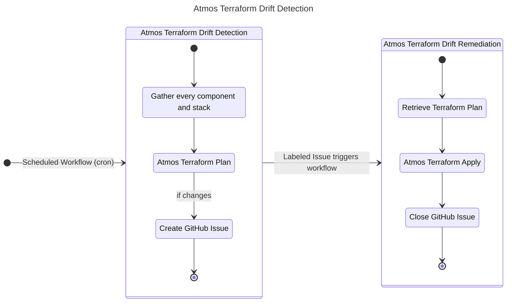
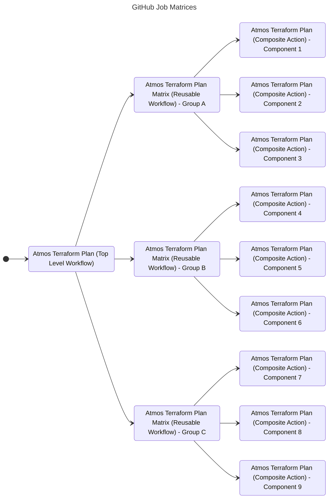

The Cloud Posse GitHub Action for "Atmos Terraform Drift Detection" and "Atmos Terraform Drift Remediation" define a scalable pattern for detecting and remediating Terraform drift from within GitHub using workflows and Issues. "Atmos Terraform Drift Detection" will determine drifted Terraform state by running [Atmos Terraform Plan](/integrations/github-actions/atmos-terraform-plan) and creating GitHub Issues for any drifted component and stack. Furthermore, "Atmos Terraform Drift Remediation" will run [Atmos Terraform Apply](/integrations/github-actions/atmos-terraform-apply) for any open Issue if called and close the given Issue. With these two actions, we can fully support drift detection for Terraform directly within the GitHub UI.

This action is intended to be used together with [Atmos Terraform Plan](/integrations/github-actions/atmos-terraform-plan) and [Atmos Terraform Apply](/integrations/github-actions/atmos-terraform-apply).

## Features

This GitHub Action incorporates superior GitOps support for Terraform by utilizing the capabilities of Atmos, enabling efficient management of large enterprise-scale environments.

* **Implements Native GitOps** with Atmos and Terraform.
* **No hardcoded credentials.** Use GitHub OIDC to assume roles.
* **Compatible with GitHub Cloud & Self-hosted Runners** for maximum flexibility. 
* **Beautiful Job Summaries** don't clutter up pull requests with noisy GitHub comments.
* **Automated Drift Detection** Regularly check and track all resources for drift.
* **Free Tier GitHub** Use GitHub Issues to track drifted resources.
* **100% Open Source with Permissive APACHE2 License** means you have no expensive subscriptions or long-term commitments.

## Usage



Drift Detection with Atmos requires two separate workflows. 

### Atmos Terraform Drift Detection

First, we trigger the "Atmos Terraform Drift Detection" workflow on a schedule. This workflow will gather every single component and stack in the repository. Then using that list of components and stacks, run `atmos terraform plan <component> --stack <stack>` for the given component and stack. If there are any changes, the workflow will create a GitHub Issue.

For example in this screenshot, the workflow has gathered two components. Only one has drift, and therefore one new Issue has been created.


Now we can see the new Issue, including a Terraform Plan summary and metadata for applying.


:::tip Limiting the number of Issues

Without a limit, the number of Issues for drifted components can quickly get out-of-hand. In order to create a more manageable developer experience, set a limit for the maximum number of Isuses created by the "Atmos Terraform Drift Detection" action with `max-opened-issues`. 

The default value is `10`.

See [cloudposse/github-action-atmos-terraform-drift-detection](https://github.com/cloudposse/github-action-atmos-terraform-drift-detection/#inputs) for details.

:::

We can quickly see a complete list of all drift components in the "Issues" tab in the GitHub UI.


#### Example Usage

```yaml
  name: 👽 Atmos Terraform Drift Detection

  on:
    schedule:
      - cron: "0 * * * *"

  permissions:
    id-token: write
    contents: write
    issues: write

  jobs:
    select-components:
      runs-on: ubuntu-latest
      name: Select Components
      outputs:
        matrix: ${{ steps.components.outputs.matrix }}
      steps:
        - name: Selected Components
          id: components
          uses: cloudposse/github-action-atmos-terraform-select-components@v0
          with:
            jq-query: 'to_entries[] | .key as $parent | .value.components.terraform | to_entries[] | select(.value.settings.github.actions_enabled // false) | [$parent, .key] | join(",")'
            debug: ${{ env.DEBUG_ENABLED }}

    plan-atmos-components:
      needs:
        - select-components
      runs-on: ubuntu-latest
      if: ${{ needs.select-components.outputs.matrix != '{"include":[]}' }}
      strategy:
        fail-fast: false # Don't fail fast to avoid locking TF State
        matrix: ${{ fromJson(needs.select-components.outputs.matrix) }}
      name: ${{ matrix.stack_slug }}
      env:
        GITHUB_TOKEN: "${{ github.token }}"
      steps:
        - name: Plan Atmos Component
          id: atmos-plan
          uses: cloudposse/github-action-atmos-terraform-plan@v0
          with:
            component: ${{ matrix.component }}
            stack: ${{ matrix.stack }}
            component-path: ${{ matrix.component_path }}
            drift-detection-mode-enabled: "true"
            terraform-plan-role: "arn:aws:iam::111111111111:role/acme-core-gbl-identity-gitops"
            terraform-state-bucket: "acme-core-ue2-auto-gitops"
            terraform-state-role: "arn:aws:iam::999999999999:role/acme-core-ue2-auto-gitops-gha"
            terraform-state-table: "acme-core-ue2-auto-gitops"
            aws-region: "us-east-2"

    drift-detection:
      needs:
        - plan-atmos-components
      runs-on: ubuntu-latest
      steps:
        - name: Drift Detection
          uses: cloudposse/github-action-atmos-terraform-drift-detection@v0
          with:
            max-opened-issues: '3'
```

#### 256 Matrix Limitation

:::warning 

GitHub Actions support 256 matrix jobs in a single workflow at most, [ref](https://docs.github.com/en/actions/using-jobs/using-a-matrix-for-your-jobs#using-a-matrix-strategy). 

:::

When planning all stacks in an Atmos environment, we frequently plan more than 256 component in the stacks at a time. In order to work around this limitation by GitHub, we can add an additional layer of abstraction using reusable workflows. 

For example, the "Atmos Terraform Plan" workflow can call "Atmos Terraform Plan Matrix" workflow which then calls the "Atmos Terraform Plan" Composite Action.




### Atmos Terraform Drift Remediation

Once we have an open Issue for a drifted component, we can trigger another workflow to remediate the drifted Terraform resources. When an Issue is labeled with `apply`, the "Atmos Terraform Drift Remediation" workflow will take the component and stack in the given Issue and run `atmos terraform apply <component> --stack <stack>` using the latest Terraform Planfile. If the apply is successful, the workflow will close the given Issue as resolved.

#### Example Usage

```yaml
name: 👽 Atmos Terraform Drift Remediation
run-name: 👽 Atmos Terraform Drift Remediation

on:
  issues:
    types:
      - labeled
      - closed

permissions:
  id-token: write
  contents: read

jobs:
  remediate-drift:
    runs-on: ubuntu-latest
    name: Remediate Drift
    if: |
      github.event.action == 'labeled' &&
      contains(join(github.event.issue.labels.*.name, ','), 'apply')
    steps:
      - name: Remediate Drift
        uses: cloudposse/github-action-atmos-terraform-drift-remediation@v1
        with:
          issue-number: ${{ github.event.issue.number }}
          action: remediate
          atmos-gitops-config-path: ./.github/config/atmos-gitops.yaml

  discard-drift:
    runs-on: ubuntu-latest
    name: Discard Drift
    if: |
      github.event.action == 'closed' &&
      !contains(join(github.event.issue.labels.*.name, ','), 'remediated')
    steps:
      - name: Discard Drift
        uses: cloudposse/github-action-atmos-terraform-drift-remediation@v1
        with:
          issue-number: ${{ github.event.issue.number }}
          action: discard
          atmos-gitops-config-path: ./.github/config/atmos-gitops.yaml
```

## Requirements

This action has the same requirements as [Atmos Terraform Plan](/integrations/github-actions/atmos-terraform-plan). Use the same S3 Bucket, DynamoDB table, and IAM Roles created with the requirements described there.
