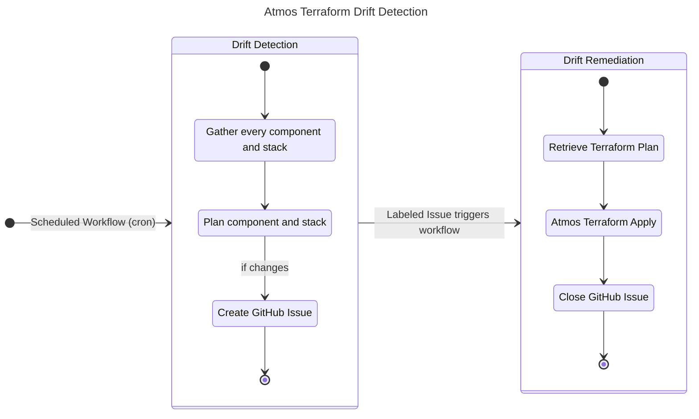
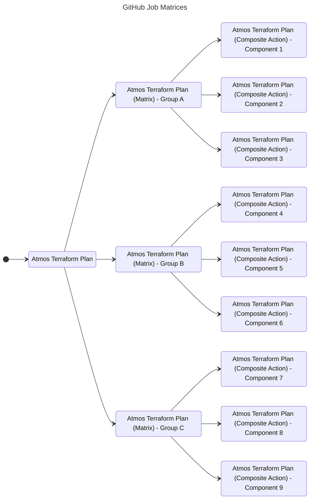

The Cloud Posse GitHub Action for "Atmos Terraform Drift Detection" and "Atmos Terraform Drift Remediation" define a scalable pattern for detecting and remediating Terraform drift from within GitHub using workflows and Issues. "Atmos Terraform Drift Detection" will determine drifted Terraform state by running [Atmos Terraform Plan](/integrations/github-actions/atmos-terraform-apply) and creating GitHub Issues for any drifted component and stack. Furthermore, "Atmos Terraform Drift Remediation" will run [Atmos Terraform Apply](/integrations/github-actions/atmos-terraform-apply) for any open Issue if called and close the given Issue. With these two actions, we can fully support drift detection for Terraform directly within the GitHub UI.

This action is intended to be used together with [Atmos Terraform Plan](/integrations/github-actions/atmos-terraform-plan) and [Atmos Terraform Apply](/integrations/github-actions/atmos-terraform-apply).

## Features

This GitHub Action incorporates superior GitOps support for Terraform by utilizing the capabilities of Atmos, enabling efficient management of large enterprise-scale environments.

* **Implements Native GitOps** with Atmos and Terraform
* **No hardcoded credentials.** Use GitHub OIDC to assume roles.
* **Compatible with GitHub Cloud & Self-hosted Runners** for maximum flexibility. 
* **Beautiful Job Summaries** don't clutter up pull requests with noisy GitHub comments
* **100% Open Source with Permissive APACHE2 License** means you have no expensive subscriptions or long-term commitments.

## Usage

### 256 Matrix Limitation

:::warning 

GitHub Actions support 256 matrix jobs in a single workflow at most, [ref](https://docs.github.com/en/actions/using-jobs/using-a-matrix-for-your-jobs#using-a-matrix-strategy). 

:::

When planning all stacks in an Atmos environment, we frequently plan more than 256 component and stacks at a time. In order to work around this limitation by GitHub, we can add an additional layer abstraction using reusuable workflows. 

For example, the "Atmos Terraform Plan" workflow can call "Atmos Terraform Plan Matrix" workflow which then calls the Atmos Terraform Plan Composite Action.

