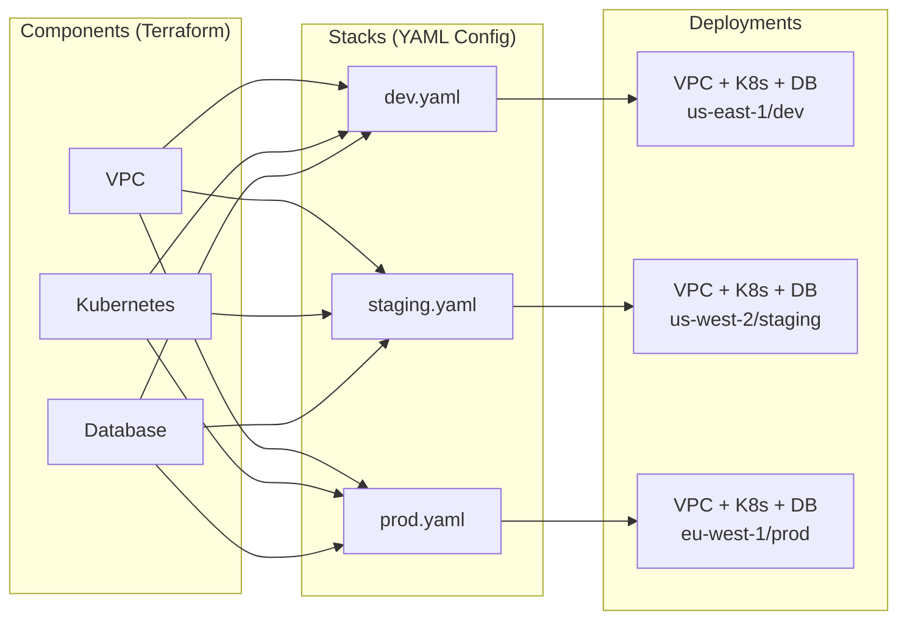

import Link from '@docusaurus/Link'
import Intro from '@site/src/components/Intro'
import ActionCard from '@site/src/components/ActionCard'
import PrimaryCTA from '@site/src/components/PrimaryCTA'
import JourneyCard from '@site/src/components/JourneyCard'
import StepNumber from '@site/src/components/StepNumber'

# Get Started

<Intro>
If you've been using Terraform for a while, you've probably noticed something: what started as a few simple configurations has grown into something much harder to manage. Environments multiply. Copy-paste becomes the norm. Changes feel risky. This is the natural evolution of infrastructure as code—and Atmos is designed to help.
</Intro>

You're not alone. Every team using Terraform goes through this progression. It's normal, expected, and part of the learning process.

The good news? **You don't have to figure it out on your own.** Atmos gives you proven patterns from day one, so you can skip the painful parts and get straight to managing infrastructure with confidence.

<Link
    to="/quick-start/simple"
    className="button button--lg button--primary">
    Try Quick Start
</Link>

<Link
    to="/intro/why-atmos"
    className="button button--lg button--outline button--primary ml20">
    Why Atmos?
</Link>

## What is Atmos?

Atmos is a framework for Terraform that separates your configuration from your code. You write your Terraform once, then configure it for any environment using simple YAML files.

**Components** are your Terraform root modules—reusable building blocks that you write once.

**Stacks** are YAML configuration files that tell Atmos how to deploy those components for each environment.

**Deployments** are the result: your infrastructure running in dev, staging, prod, or anywhere else you need it.

This separation means you can manage dozens of environments without duplicating code. Add a new region? Create a new stack file. Need different settings for production? Override just what's different.

## Core Concepts

Atmos is built around a few key ideas that make scaling Terraform manageable:

### <StepNumber step="1">Write Your Terraform Once</StepNumber>

Instead of copying Terraform code for each environment, you create reusable **components**. A component is just a Terraform root module designed to be configured through variables.

### <StepNumber step="2">Configure Without Code</StepNumber>

**Stacks** let you configure your components using YAML instead of HCL. No code generation, no templates—just clean configuration files that are easy to read, review, and version control.

### <StepNumber step="3">Inherit and Override</StepNumber>

Stacks support **imports and inheritance**, so you can define common settings once and override only what's different. Your production stack might inherit 90% of its configuration from a base, with just a few environment-specific values changed.

### <StepNumber step="4">Keep State Separate</StepNumber>

Each component maintains its own Terraform state. This means smaller blast radius, faster plans, and the ability for different teams to own different parts of your infrastructure.

## What Atmos is Not

You might be wondering what Atmos replaces—or doesn't. Here's the short version:

**Atmos is not a Terraform replacement.** It's a companion. Under the hood, Atmos still runs `terraform plan` and `terraform apply`. You're writing real Terraform, and you keep all of Terraform's power and ecosystem.

**Atmos is not a wrapper that hides Terraform.** You'll see exactly what Terraform commands are being run. There's no magic—just better organization.

**Atmos is not opinionated about your cloud architecture.** Bring your own patterns, or use our [design patterns](/design-patterns/). Atmos helps you manage configuration, not dictate how your infrastructure should look.

**Atmos is not a CI/CD replacement.** It complements your existing pipelines. We provide [GitHub Actions](/integrations/github-actions) and support for other [CI/CD integrations](/integrations/).

## Where Are You on Your Terraform Journey?

Recognizing your current stage helps you understand how Atmos can help. Where do you fit?

  <JourneyCard title="Just Getting Started" to="/intro/why-atmos/stage-1">
    New to Terraform, or managing a single environment? Start with best practices from day one.
  </JourneyCard>
  <JourneyCard title="Growing Pains" to="/intro/why-atmos/stage-3">
    Copy-paste getting out of hand? Multiple environments causing drift? You're ready for a framework.
  </JourneyCard>
  <JourneyCard title="Enterprise Scale" to="/intro/why-atmos/stage-5">
    Multi-account, multi-region, multiple teams? Atmos was built for exactly this complexity.
  </JourneyCard>

Not sure where you are? [Take the full Terraform Maturity Journey →](/intro/why-atmos)

## Get Started

Ready to try Atmos? Our Quick Start tutorial will have you up and running in about 30 minutes.

<ActionCard>
  Start with a working example project. You'll learn the basics of components, stacks, and deployments hands-on.
  <PrimaryCTA to="/quick-start/simple">Try Quick Start</PrimaryCTA>
</ActionCard>

**Or explore at your own pace:**

- [**Atmos Mindset**](/learn/mindset) — Understand how to think about infrastructure the Atmos way
- [**Why Atmos?**](/intro/why-atmos) — See the natural evolution of Terraform complexity and how Atmos helps
- [**Core Concepts**](/learn/concepts-overview) — Dive deeper into the syntax and concepts

:::tip Open Source with Commercial Support

**Atmos is 100% open source** (Apache 2.0) with an [active community](https://slack.cloudposse.com) and thousands of GitHub stars.

Built and maintained by [Cloud Posse](https://cloudposse.com), Atmos comes from real-world experience helping funded startups and Fortune 100 enterprises manage their AWS infrastructure. If your team needs help adopting Atmos or building your cloud architecture, [commercial support is available](https://cloudposse.com/services/).

[GitHub](https://github.com/cloudposse/atmos) · [Community Slack](https://slack.cloudposse.com) · [Commercial Support](https://cloudposse.com/services/)

:::
