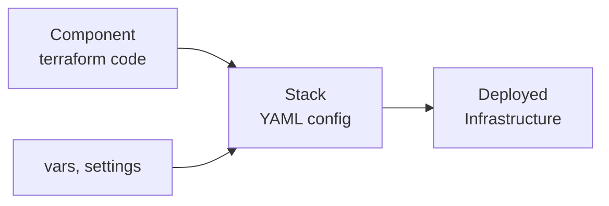

import Intro from '@site/src/components/Intro'

<Intro>
Atmos is built around three core concepts: Components (your infrastructure code), Stacks (your environment configuration), and the separation between them. Understanding these fundamentals is key to using Atmos effectively.
</Intro>

## Components: Reusable Infrastructure Code

**Components** are the building blocks of your infrastructure—typically Terraform "root modules" that provision specific pieces of infrastructure.

Think of components like services in a service-oriented architecture: they're self-contained, independently deployable, and solve a specific problem. Each component does one thing well:

- A VPC component manages virtual networks
- An EKS component provisions Kubernetes clusters
- An RDS component sets up databases

### Why Separate Components?

Components typically have their own software development lifecycle (SDLC). The key question is: **what changes together?**

- **Things that change frequently together** should be in the same component
- **Things that change at different rates** should be separate components
- **Different team ownership** often means different components
- **Different permission boundaries** suggest separate components

For example, a VPC rarely changes after initial setup, but the applications running in it change constantly. Keeping them as separate components means you can update applications without risking network infrastructure—and different teams can own each piece.

### Key Principles

- **Generic**: Components work anywhere without environment-specific hardcoded values
- **Reusable**: The same VPC component deploys to dev, staging, and prod
- **Focused**: Each component has a single responsibility
- **Independent**: Components can be deployed, updated, and rolled back independently

Components live in `components/terraform/` and are standard Terraform code—no special syntax or modifications needed.

## Stacks: Environment Configuration

**Stacks** are YAML files that configure your components for specific environments. They're where you define which components to deploy and with what settings.

Think of stacks like configuration files: they bring together components with environment-specific values:

```yaml
components:
  terraform:
    vpc:
      vars:
        cidr_block: "10.0.0.0/16"
        name: "dev-vpc"
```

**Key Principles**:
- **Configuration as Data**: Stacks are YAML, not code
- **Deep Merging**: Import and layer configurations to stay DRY
- **Composable**: Combine multiple components in one stack

Stacks live in `stacks/` and define the complete configuration for an environment.

## Configuration as Data

The power of Atmos comes from **separating configuration from code**:

| What | Where | Purpose |
|------|-------|---------|
| **Components** | `components/terraform/` | Generic, reusable infrastructure code |
| **Stacks** | `stacks/` | Environment-specific configuration |

This separation means:
- **Components are portable**: Use the same VPC code in every environment
- **Configuration is centralized**: All settings in one place, not scattered across `.tfvars` files
- **Changes are safer**: Update configuration without touching code

## From Components to Deployed Infrastructure

Here's how it all comes together:



1. **Write** generic Terraform components
2. **Configure** them with stacks (YAML)
3. **Deploy** with `atmos terraform apply`

The same component + different stack configuration = different environments.

## Example: VPC Across Environments

**One Component** (`components/terraform/vpc/`):
```hcl
variable "cidr_block" {}
variable "name" {}

resource "aws_vpc" "this" {
  cidr_block = var.cidr_block
  tags = {
    Name = var.name
  }
}
```

**Multiple Stacks**:

```yaml
# stacks/dev.yaml
components:
  terraform:
    vpc:
      vars:
        cidr_block: "10.0.0.0/16"
        name: "dev-vpc"
```

```yaml
# stacks/prod.yaml
components:
  terraform:
    vpc:
      vars:
        cidr_block: "10.1.0.0/16"
        name: "prod-vpc"
```

Same component, different configuration—deployed with:
```shell
atmos terraform apply vpc -s dev
atmos terraform apply vpc -s prod
```

## What's Next

Now that you understand the core concepts, let's put them into practice:

- [Your First Stack](/learn/first-stack) - Start with a simple, working example
- [Understanding YAML in Atmos](/learn/yaml) - Learn how configuration works
