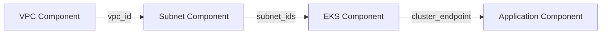
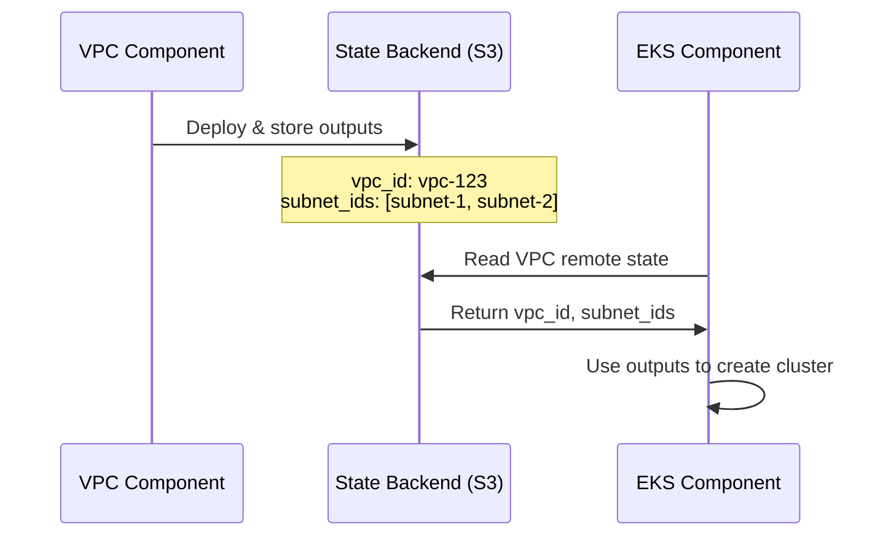

import File from '@site/src/components/File'
import Intro from '@site/src/components/Intro'

<Intro>
Components rarely work in isolation. Your application needs the VPC ID. Your database needs the subnet IDs. Your load balancer needs security group references. Atmos makes it easy to connect components and share data between them.
</Intro>

The key is **remote state**—components store their outputs in a backend (like S3), and other components read those outputs when needed.

## Why Components Need to Connect

Imagine building a typical web application infrastructure:

1. **VPC** creates the network (`vpc_id`)
2. **Subnets** need the `vpc_id` to create subnets
3. **EKS cluster** needs subnet IDs to launch in the right network
4. **Application** needs the EKS cluster endpoint to deploy

Each component depends on outputs from previous components. This is called a **loosely coupled architecture**—components are independent but can reference each other's outputs.



## Your First Component Connection

Let's connect a VPC component to an EKS cluster component.

**Step 1: VPC component outputs its ID**

<File title="components/terraform/vpc/outputs.tf">
```hcl
output "vpc_id" {
  value       = aws_vpc.this.id
  description = "VPC ID"
}

output "private_subnet_ids" {
  value       = aws_subnet.private[*].id
  description = "Private subnet IDs"
}
```
</File>

**Step 2: EKS component reads the VPC outputs**

<File title="components/terraform/eks/remote_state.tf">
```hcl
# Read the VPC component's remote state
module "vpc" {
  source  = "cloudposse/stack-config/yaml//modules/remote-state"
  version = "1.5.0"

  component = "vpc"

  context = module.this.context
}

# Now you can use the VPC outputs
resource "aws_eks_cluster" "this" {
  name = var.cluster_name

  vpc_config {
    subnet_ids = module.vpc.outputs.private_subnet_ids
  }
}
```
</File>

The `remote-state` module handles all the complexity of reading Terraform state from the backend.

## How Remote State Works

When you deploy a component with `atmos terraform apply`, Terraform:

1. **Runs your configuration** (plan → apply)
2. **Stores outputs in the state file**
3. **Saves state to the backend** (S3, Terraform Cloud, etc.)

Later, when another component needs those outputs:

1. **Remote-state module queries the backend**
2. **Reads the state file**
3. **Extracts the outputs**
4. **Makes them available as `module.vpc.outputs.vpc_id`**



## Remote State Configuration

Atmos configures your Terraform backend automatically. You just need to define backend settings in your stack:

<File title="stacks/dev.yaml">
```yaml
terraform:
  backend_type: s3
  backend:
    s3:
      bucket: my-terraform-state
      key: terraform.tfstate
      region: us-east-1
      dynamodb_table: terraform-lock

components:
  terraform:
    vpc:
      backend:
        s3:
          workspace_key_prefix: vpc
      vars:
        cidr_block: "10.0.0.0/16"
```
</File>

When you run `atmos terraform apply vpc -s dev`, Atmos generates a backend configuration automatically.

## Reading Remote State in Stack Configuration

You can also read remote state directly in your stack YAML using template functions:

<File title="stacks/dev.yaml">
```yaml
components:
  terraform:
    vpc:
      vars:
        cidr_block: "10.0.0.0/16"

    eks:
      vars:
        # Read VPC component output
        vpc_id: '{{ (atmos.Component "vpc" .stack).outputs.vpc_id }}'
        subnet_ids: '{{ (atmos.Component "vpc" .stack).outputs.private_subnet_ids }}'
```
</File>

This resolves at runtime, so the EKS component automatically gets the latest VPC outputs.

:::tip
Use `atmos.Component` for configuration-time resolution. Use the `remote-state` module for Terraform-time resolution.
:::

## Connecting Across Stacks

Components can read outputs from other stacks, not just the current stack:

<File title="stacks/prod.yaml">
```yaml
components:
  terraform:
    app:
      vars:
        # Read VPC from prod stack
        vpc_id: '{{ (atmos.Component "vpc" "prod").outputs.vpc_id }}'

        # Read database from shared-services stack
        db_endpoint: '{{ (atmos.Component "rds" "shared-services").outputs.endpoint }}'
```
</File>

This enables patterns like:

- **Shared services account** with centralized databases
- **Hub-and-spoke networks** with VPC peering
- **Cross-environment references** (staging uses prod DNS zone)

## Common Connection Patterns

### 1. Network Dependencies

<File title="VPC → Subnets → EKS → App">
```yaml
components:
  terraform:
    vpc:
      vars:
        cidr_block: "10.0.0.0/16"

    subnets:
      vars:
        vpc_id: '{{ (atmos.Component "vpc" .stack).outputs.vpc_id }}'

    eks:
      vars:
        subnet_ids: '{{ (atmos.Component "subnets" .stack).outputs.private_subnet_ids }}'

    app:
      vars:
        cluster_endpoint: '{{ (atmos.Component "eks" .stack).outputs.cluster_endpoint }}'
```
</File>

### 2. Shared Services

<File title="Prod App reads Shared RDS">
```yaml
# stacks/shared-services.yaml
components:
  terraform:
    rds:
      vars:
        instance_class: db.r5.xlarge

# stacks/prod.yaml
components:
  terraform:
    app:
      vars:
        db_endpoint: '{{ (atmos.Component "rds" "shared-services").outputs.endpoint }}'
        db_name: '{{ (atmos.Component "rds" "shared-services").outputs.database_name }}'
```
</File>

### 3. Cross-Region References

<File title="App in us-west-2 reads Route53 from us-east-1">
```yaml
# stacks/global.yaml
components:
  terraform:
    route53:
      vars:
        domain: example.com

# stacks/prod-us-west-2.yaml
components:
  terraform:
    app:
      vars:
        hosted_zone_id: '{{ (atmos.Component "route53" "global").outputs.zone_id }}'
```
</File>

## Avoiding Circular Dependencies

Be careful not to create circular references:

```yaml
# ❌ BAD - Circular dependency
components:
  terraform:
    component-a:
      vars:
        value_from_b: '{{ (atmos.Component "component-b" .stack).outputs.some_value }}'

    component-b:
      vars:
        value_from_a: '{{ (atmos.Component "component-a" .stack).outputs.other_value }}'
```

This creates a deadlock—neither component can deploy until the other exists.

**Solution:** Break the cycle by using explicit values or adding an intermediate component:

```yaml
# ✅ GOOD - No circular dependency
components:
  terraform:
    shared-config:
      vars:
        shared_value: "initial-value"

    component-a:
      vars:
        value_from_shared: '{{ (atmos.Component "shared-config" .stack).outputs.value }}'

    component-b:
      vars:
        value_from_shared: '{{ (atmos.Component "shared-config" .stack).outputs.value }}'
```

## Deployment Order

When components depend on each other, deploy them in dependency order:

```bash
# 1. Deploy VPC first
atmos terraform apply vpc -s dev

# 2. Deploy subnets (needs VPC)
atmos terraform apply subnets -s dev

# 3. Deploy EKS (needs subnets)
atmos terraform apply eks -s dev

# 4. Deploy app (needs EKS)
atmos terraform apply app -s dev
```

Atmos doesn't automatically determine order—you control deployment sequence.

:::tip
Use [workflows](/workflows/) to automate multi-component deployments in the correct order.
:::

## Key Takeaways

✅ **Components share data via remote state** - Outputs stored in backend
✅ **Use `remote-state` module** in Terraform for runtime resolution
✅ **Use `atmos.Component`** in stack YAML for configuration-time resolution
✅ **Read across stacks** - Not limited to current stack
✅ **Avoid circular dependencies** - Deploy in correct order
✅ **Loosely coupled architecture** - Components independent but connected

## What's Next

You've learned the fundamentals of Atmos! Now you can:

- **[Explore Next Steps](/learn/next-steps)** - Advanced topics and resources
- **[Read the Stack Reference](/stacks/)** - Deep dive into advanced stack features
- **[Learn about Workflows](/workflows/)** - Automate multi-component deployments
- **[Explore Template Functions](/functions/)** - Advanced YAML and Go template functions
