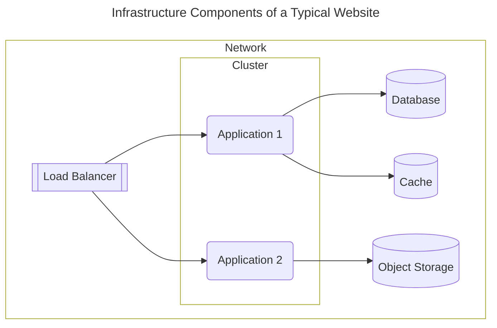

import Link from '@docusaurus/Link'
import KeyPoints from '@site/src/components/KeyPoints'
import Screengrab from '@site/src/components/Screengrab';
import Step from '@site/src/components/Step'
import StepNumber from '@site/src/components/StepNumber'
import Intro from '@site/src/components/Intro'
import ActionCard from '@site/src/components/ActionCard'
import PrimaryCTA from '@site/src/components/PrimaryCTA'

<Intro>
    Atmos can change how you think about the Terraform code you write to build your infrastructure.

    When you design cloud architectures with Atmos, you will first break them apart into pieces called components. Then, you will implement Terraform "root modules" for each of those components. Finally, compose your components in any way you like using stacks, without the need to write any code or messy templates for code generation.
</Intro>

In this tutorial, we'll guide you through the thought process of building Terraform "root modules" that are suitable for use as components. To ensure your components are highly reusable, parameterize them with variables.
Design them to serve a single purpose, making them the smallest possible unit of infrastructure in a typical
software development lifecycle (SDLC). Group pieces that usually change together, and separate those that change independently.


You're about to discover a new way to think about terraform...

<Link
    to="/quick-start/simple"
    className="button button--lg button--primary">
    Try our Simple Tutorial
</Link>

<Link
    to="/learn/concepts-overview"
    className="button button--lg button--outline button--primary ml20">
    Core Concepts
</Link>


<h1> Your Architecture is Made up of Components</h1>

Start by thinking about your architecture in terms of its logical components.

For example, let's consider the architecture of a typical modern website. Its components might include a network, a cluster, some applications running on it, a database to store data, a cache, and maybe some object storage.



Each of these logical pieces is a component and typically changes independently.

They are loosely related and this relationship forms a stack. A stack logically combines components without tightly coupling them,
ensuring each component's state is separate. This approach minimizes the blast radius of changes, keeps the state separate, and
allows teams to own components. Plus, it encourages reuse since there is a finite number of ways to express infrastructure.

Then, to implement this architecture with Atmos, you will usually follow these same five steps every time.

<details>
<summary>Why don't we just put everything into a single "Root module"?</summary>

The goal should be to build a loosely coupled [service-oriented architecture (SOA)](https://en.wikipedia.org/wiki/Service-oriented_architecture). Like with modern app design, we should avoid monolithic infrastructure code. Decoupling our infrastructure into [components](/components) ensures resilience and maintainability.

When we place all the infrastructure into a single "root module," we end up with a [Terralith](/terms/terralith), which is roughly [Stage-2 of the Terraform maturity path](/intro/why-atmos/stage-2). All your eggs are in one basket.

- Massive blast radius for every change
- Brittle and prolonged plan/apply cycles
- All your state is in one place

Large root modules are less reusable across teams due to varying requirements, resulting in many specialized root modules without significant benefits. As these root modules grow, they become increasingly time-consuming to plan and apply. This can even lead to hitting cloud provider rate limits, rendering your infrastructure code undeployable.
</details>

## The Five Steps of Atmos

<Step>
    ### <StepNumber/> Start Your Project

    Create a solid foundation with a well-structured folder layout, embracing best practices and conventions for a consistently organized project. By convention, we recommend keeping all configurations separate from your components, which helps ensure your components' reusability across teams.

    <details>
    <summary>See Example</summary>
    <Screengrab title="Start your Project" command="# here's an example of what your folder structure will like..." slug="demo-stacks/start-your-project" />
    </details>

    <ActionCard>
        Projects are organized into a well-structured folder layout, embracing best practices and conventions for a consistently organized project.
        <PrimaryCTA to="/learn/stacks">Learn About Projects</PrimaryCTA>
    </ActionCard>

</Step>

<Step>
    ### <StepNumber/> Write Your Components (e.g. Terraform Root Modules)

    For each component in your architecture, write a Terraform root module.

    Use your existing Terraform root modules or create new ones. As your component library grows, you'll need to write fewer new components, enabling faster development cycles by reusing infrastructure components across projects.

    Try to reuse 80% of your components across projects, and only write new ones when necessary.


    ```mermaid
    ---
    title: Example of Typical Root Modules
    ---
    flowchart TB
        subgraph Network ["Network"]
            style Network fill:none
            VPC[VPC Network Root Module]
            LB[Load Balancer Root Module]
        end

        subgraph Platform ["App Platform"]
            style Platform fill:none
            Cluster[Cluster Root Module]
            App["Application Root Module(s)"]
        end

        subgraph Services ["Backing Services"]
            style Services fill:none
            DB[Database Root Module]
            Cache[Cache Root Module]
            ObjectStorage[Object Storage Root Module]
        end

    ```
    <i>Each component stands alone as its own "root module." Think of them as layers if it helps.</i>

    What you should end up with are "root modules" for each of these pieces. Something like this...
    <details>
    <summary>See Example</summary>
    <Screengrab title="Write your Components" command="# Then write your terraform root modules..." slug="demo-stacks/write-your-components" />
    </details>

    <ActionCard>
        Components form the essential building blocks of your architecture. They are the smallest unit of infrastructure in a typical software development lifecycle (SDLC).
        <PrimaryCTA to="/components">Learn Atmos Components</PrimaryCTA>
    </ActionCard>
</Step>

<Step>
    ### <StepNumber/> Pass Values Between Components

    Use Terraform's native ability to read the remote state or configuration of any other component, for a "loosely coupled" architecture. Atmos provides [methods that make this easy](/stacks/share-data).

    ```mermaid
    classDiagram
        class Network["VPC (root module)"] {
            outputs: vpc_id
        }

        class TerraformStateBackend["Terraform State Backend (e.g S3)"] {
            vpc_id: 12345
        }

        class Cluster["Kubernetes Cluster (root module)"] {
            needs: vpc_id
        }

        Network --> TerraformStateBackend : Stores Output
        Cluster --> TerraformStateBackend : Reads Remote State
        Cluster ..> Network : Loosely Depends on

    ```

    <ActionCard>
        Passing state between components is how you build a loosely coupled architecture.
        <PrimaryCTA to="/stacks/share-data">Learn How</PrimaryCTA>
    </ActionCard>
</Step>

<Step>
    ### <StepNumber/> Configure Your Components with Stacks

    Configure your environments such as development, staging, and production—each tailored to different stages of the lifecycle, ensuring smooth transitions and robust deployment strategies. Use a combination imports and inheritance for a template-free way to keep your configurations DRY and enforce consistency across your stacks.

    <details>
    <summary>See Example</summary>
    <Screengrab title="Define your Stacks" command="# Configure your stacks using YAML... easily import and inherit settings" slug="demo-stacks/define-your-stacks" />
    </details>
    <ActionCard>
        Components are configured with Stacks, which are defined om YAML. Stacks are separate from Components (terraform root modules) to ensure root modules remain highly reusable across teams and promote testing.
        <PrimaryCTA to="/learn/stacks">Learn Configuration</PrimaryCTA>
    </ActionCard>
</Step>

<Step>
    ### <StepNumber/> Deploy Stacks with Atmos 🚀

    Execute deployments with precision using Terraform's `plan` and `apply` commands, fully integrated with [native GitOps workflows](/integrations/github-actions) through [GitHub Actions](/integrations/github-actions) for seamless deployment automation. Leverage [workflows](/workflows) to orchestrate more complicated deployments that involve multiple steps.

    ```mermaid
    graph LR
        Dev[Development]
        Stage[Staging]
        Prod[Production]

        Dev --> Stage
        Stage --> Prod
    ```

    <details>
    <summary>See Example</summary>
    <Screengrab title="Atmos Stacks" command="# Deploy your stacks with the console UI or using GitHub Actions" slug="demo-stacks/deploy" />
    </details>
    <ActionCard>
        Deploy Components with Atmos, fully integrated with GitOps workflows through GitHub Actions for seamless deployment automation.
        <PrimaryCTA to="/deploy">Deploying with Atmos</PrimaryCTA>
    </ActionCard>
</Step>

## Where to Go From Here

This brief introduction covered the essentials of designing cloud architectures that can be used with Atmos.

Now you can start with your first Atmos project! Try out our [Simple](/quick-start/simple)/[Advanced](/quick-start/advanced) Quick Start,
or delve deeper into the [syntax and concepts](/learn/concepts-overview) used in this tutorial.

<Link
    to="/quick-start/simple"
    className="button button--lg button--primary">
    Try our Simple Tutorial
</Link>

<Link
    to="/learn/concepts-overview"
    className="button button--lg button--outline button--primary ml20">
    Core Concepts
</Link>
