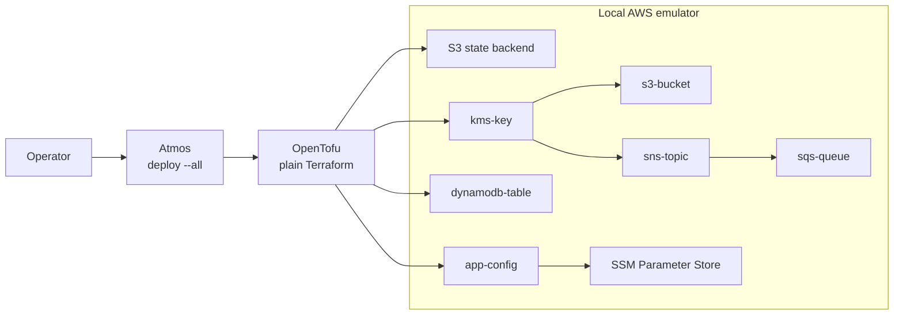

import PillBox from '@site/src/components/PillBox'
import Intro from '@site/src/components/Intro'

<PillBox>Advanced</PillBox>

# Advanced Tutorial

<Intro>
In about **30 minutes**, you'll deploy a real **event-driven application backend** — a KMS key, an encrypted S3 bucket, a DynamoDB table, an SNS topic, an SQS queue, and an SSM Parameter Store config — and you'll do it **entirely on your laptop, with no AWS account and no credentials**. Along the way you'll learn the Atmos patterns you'll reach for every day.
</Intro>

New to Atmos? Start with the [Simple Quick Start](/quick-start/simple) first — this tutorial assumes you've seen the basics.

## What you'll build

A small but realistic backend, provisioned with **plain Terraform** and orchestrated by Atmos:

- **`kms-key`** — encryption key the other resources use
- **`s3-bucket`** — versioned, KMS-encrypted bucket
- **`dynamodb-table`** — a simple table
- **`sns-topic`** + **`sqs-queue`** — the queue subscribes to the topic
- **`app-config`** — publishes the stack's resolved coordinates and two secrets to SSM Parameter Store



The components depend on each other, so Atmos deploys them **in dependency order**. Everything runs against a **local sandbox** (a containerized cloud-API *emulator*) that Atmos starts for you — including the S3 state backend, which Atmos provisions inside the sandbox automatically.

## You will learn

- How Atmos **installs the exact tools** your stacks need (OpenTofu, security scanners) so everyone runs the same versions
- How to start a **local sandbox** and bind your components to it with an identity — no `providers.tf`, no endpoints
- How to compose configuration with **catalogs, mixins, and a stack hierarchy** instead of copy-paste
- How components **share data** with stack templates, dependency metadata, output-publishing hooks, and [stores](/cli/configuration/stores)
- How to run **hooks** — security scans, cost estimates, output publishing — automatically on plan and apply
- How to manage **secrets** so they're delivered to Terraform in memory and **never written to disk**
- How to **validate** stacks and then **deploy everything** in dependency order with one command

:::tip It's just plain Terraform — bring your own
Every component here is **vanilla Terraform**: raw `aws_*` resources on the official `hashicorp/aws` provider, with **no Cloud Posse modules and no wrappers**. The components carry **no `providers.tf` and no backend block** — Atmos generates the provider and backend configuration at apply time and points them at the sandbox. You write the resources; Atmos wires the plumbing. Switch the stack and the *same components* deploy to real AWS.
:::

## Prerequisites

The **only thing you need installed is a container runtime** — [Docker](https://www.docker.com/) or [Podman](https://podman.io/). Atmos installs OpenTofu and everything else through its [toolchain](/quick-start/advanced/install-toolchain). You do **not** need an AWS account, AWS credentials, or any cloud access.

You can follow along in your own repo, or clone the finished example to read ahead:

```bash
git clone https://github.com/cloudposse/atmos.git
cd atmos/examples/quick-start-advanced
```

## The steps

1. [**Configure the Project**](/quick-start/advanced/configure-project) — lay out the repo and a single `atmos.yaml`
2. [**Install the Toolchain**](/quick-start/advanced/install-toolchain) — pin OpenTofu and let Atmos install it for you
3. [**Start the Local Sandbox**](/quick-start/advanced/start-sandbox) — spin up the emulator your stacks deploy against
4. [**Create Stacks**](/quick-start/advanced/create-atmos-stacks) — compose components with catalogs, mixins, and a hierarchy
5. [**Configure Hooks**](/quick-start/advanced/configure-hooks) — scan on every plan and publish outputs on every apply
6. [**Manage Secrets**](/quick-start/advanced/configure-secrets) — keep secrets off disk with stores and `!secret`
7. [**Validate Configurations**](/quick-start/advanced/configure-validation) — lint stacks and enforce policy
8. [**Deploy Everything**](/quick-start/advanced/provision) — bring the whole backend up in dependency order

Then, when you're ready for more, three optional chapters — [automating workflows](/quick-start/advanced/create-workflows), [adding custom commands](/quick-start/advanced/add-custom-commands), and [vendoring components](/quick-start/advanced/vendor-components) — plus a [Terraform state backend](/quick-start/advanced/configure-terraform-backend) deep-dive.

Ready? **[Configure the Project →](/quick-start/advanced/configure-project)**

import DocCardList from '@theme/DocCardList'

<DocCardList/>
