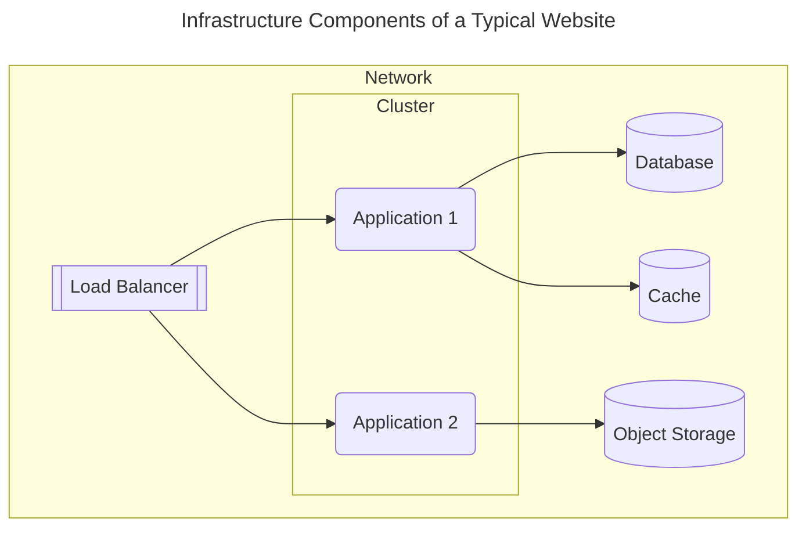

import Link from '@docusaurus/Link'
import KeyPoints from '@site/src/components/KeyPoints';
import Screengrab from '@site/src/components/Screengrab';
import Step from '@site/src/components/Step'
import StepNumber from '@site/src/components/StepNumber';

Atmos can change how you think about the Terraform code you write to build your infrastructure. 

When you design cloud architectures with Atmos, you will first break them apart into pieces called components. 

Then, you will implement Terraform "root modules" for each of those components. 

To ensure your components are highly reusable, parameterize them with variables. 
Design them to serve a single purpose, making them the smallest possible unit of infrastructure in a typical 
software development lifecycle (SDLC). Group pieces that usually change together and separate those that change independently.

Finally, you connect your components together using stacks, so that everything comes together. 

In this tutorial, we’ll guide you through the thought process of building Terraform "root modules" that are suitable for use as components.

You're about discover a new way to think about terraform... 

<Link
    to="/quick-start/simple"
    className="button button--lg button--primary">
    Try our Simple Tutorial
</Link>

<Link
    to="/core-concepts"
    className="button button--lg button--outline button--primary ml20">
    Learn Atmos
</Link>

<h1> Your Architecture is Made up of Components</h1>

Start by thinking about your architecture in terms its logical components.

For example, let’s take a typical architecture of a modern website. 

<i>Its components might include a network, a cluster, some applications running on it, a database to store data, a cache, maybe some object storage.</i>
 

Each of these logical pieces is a component and typically changes independently.

They are loosely related and this relationship forms a stack. A stack logically combines components without tightly coupling them,
ensuring each component’s state is separate. This approach minimizes the blast radius of changes, keeps the state separate, and 
allows teams to own components. Plus, it encourages reuse since there is a finite number ways to express infrastructure.

Then, to implement this architecture with Atmos, you will usually follow these same five steps everytime.

<Step>
## <StepNumber/> Start Your Project

Create a solid foundation with a well-structured folder layout, embracing best practices and conventions for a consistently organized project.

<Screengrab title="Start your Project" command="# here's an example of what your folder structure will like..." slug="demo-stacks/start-your-project" />

</Step>

<Step>
## <StepNumber/> Write Your Components (e.g. Terraform Root Modules)

Use your existing Terraform root modules or create new ones. Component libraries make sharing easy. 
Use vendoring to pull down remote dependencies.
<Screengrab title="Write your Components" command="# Then write your terraform root modules..." slug="demo-stacks/write-your-components" />

</Step>

<Step>
## <StepNumber/> Pass Values Between Components
</Step>

<Step>
## <StepNumber/> Define their Baseline Configuration

Configure your environments—development, staging, production—each tailored to different stages of the lifecycle, ensuring smooth transitions and robust deployment strategies.

<Screengrab title="Define your Stacks" command="# Configure your stacks using YAML... easily import and inherit settings" slug="demo-stacks/define-your-stacks" />

                
</Step>

<Step>
## <StepNumber/> Import Configurations into a Stack

 Inherit from a common baseline to keep it DRY.
</Step>

<Step>
## <StepNumber/> Deploy Stacks with Atmos 🚀

Execute deployments with precision using Terraform's plan and apply commands, fully integrated with native GitOps workflows through GitHub Actions for seamless automation.

<Screengrab title="Atmos Stacks" command="# Deploy your stacks with the console UI or using GitHub Actions" slug="demo-stacks/deploy" />

</Step>

## Where to Go From Here

This brief introduction covered the essentials designing cloud architectures that can be used with Atmos.

Now you can start with your first an Atmos project! Try out our [Simple](/quick-start/simple)/[Advanced](/quick-start/advanced) Quick Start, 
or delve deeper into the [syntax and concepts](/core-concepts) used in this tutorial.

<Link
    to="/quick-start/simple"
    className="button button--lg button--primary">
    Try our Simple Tutorial
</Link>

<Link
    to="/core-concepts"
    className="button button--lg button--outline button--primary ml20">
    Learn Atmos
</Link>
