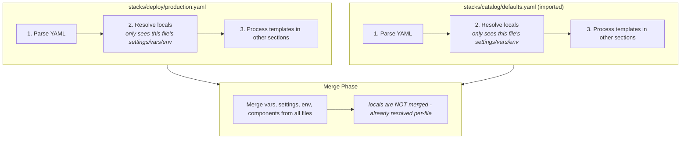

import File from '@site/src/components/File'
import Intro from '@site/src/components/Intro'
import Experimental from '@site/src/components/Experimental'
import EmbedExample from '@site/src/components/EmbedExample'

<Intro>
The `locals` section defines file-scoped temporary variables for use within templates. Unlike `vars`, `settings`, and `env`, locals do **not** inherit across file boundaries—they are resolved within a single file and can reference each other with automatic dependency resolution.
</Intro>

<Experimental />

## Use Cases

- **Reduce Repetition:** Define common values once and reference them throughout the file.
- **Build Complex Values:** Construct naming conventions, tags, or resource identifiers from simpler components.
- **Improve Readability:** Give meaningful names to computed values instead of repeating expressions.
- **Template Composition:** Build values incrementally by referencing other locals.

## How Locals Work

Locals are similar to [Terraform locals](https://developer.hashicorp.com/terraform/language/values/locals) and [Terragrunt locals](https://terragrunt.gruntwork.io/docs/reference/config-blocks-and-attributes/#locals):

1. **File-Scoped:** Locals are only available within the file where they are defined. They do not inherit across imports.
2. **Dependency Resolution:** Locals can reference other locals using `{{ .locals.name }}` syntax. Atmos automatically determines the correct resolution order.
3. **Cycle Detection:** Circular references are detected and reported with clear error messages.
4. **Template Support:** Locals support Go templates with [Sprig functions](http://masterminds.github.io/sprig/).

## Configuration Scopes

The `locals` section can be defined at multiple levels within a single file. Each scope inherits from its parent scope within that file.

### Global Level

Locals defined at the root level are available to all sections in the file:

```yaml
# stacks/orgs/acme/plat/prod/us-east-1.yaml
locals:
  namespace: acme
  environment: prod
  stage: us-east-1
  name_prefix: "{{ .locals.namespace }}-{{ .locals.environment }}"

vars:
  cluster_name: "{{ .locals.name_prefix }}-eks"
```

### Component-Type Level

Locals defined under `terraform`, `helmfile`, or `packer` inherit from global locals and are available to all components of that type:

```yaml
# stacks/orgs/acme/plat/prod/us-east-1.yaml
locals:
  namespace: acme
  environment: prod

terraform:
  locals:
    # Inherits namespace and environment from global
    backend_bucket: "{{ .locals.namespace }}-{{ .locals.environment }}-tfstate"
    backend_key_prefix: "{{ .locals.environment }}"

  backend_type: s3
  backend:
    s3:
      bucket: "{{ .locals.backend_bucket }}"
      key: "{{ .locals.backend_key_prefix }}/terraform.tfstate"
```

### Using Locals in Components

Components can reference merged locals (global + component-type) in their `vars`. When the same key is defined at multiple scopes, later scopes take precedence: component-type locals override global locals, and component-level locals override both.

```yaml
# stacks/orgs/acme/plat/prod/us-east-1.yaml
locals:
  namespace: acme
  environment: prod
  name_prefix: "{{ .locals.namespace }}-{{ .locals.environment }}"

terraform:
  locals:
    backend_bucket: "{{ .locals.namespace }}-{{ .locals.environment }}-tfstate"

components:
  terraform:
    vpc:
      vars:
        # Uses merged locals (global + terraform section)
        vpc_name: "{{ .locals.name_prefix }}-vpc"
        bucket: "{{ .locals.backend_bucket }}"

    eks:
      vars:
        # Same merged locals available to all terraform components
        cluster_name: "{{ .locals.name_prefix }}-eks"
        bucket: "{{ .locals.backend_bucket }}"
```

:::tip Component-Level Locals
Components can also define their own `locals:` section. Component-level locals inherit from global and section-level locals, and also support inheritance from base components via `metadata.inherits`. See [Component-Level Locals](#component-level-locals) for details and the [describe locals command](/cli/commands/describe/locals) for inspecting them.
:::

## Scope Inheritance (Within a File)

Within a single file, locals follow this inheritance chain:

```
Global locals
    ↓
Component-type locals (terraform/helmfile/packer)
    ↓
Component-level locals (inside component definitions)
```

Each level can:
- Access locals from parent scopes
- Define new locals
- Override parent locals with new values

Component-level locals also inherit from base components via `metadata.inherits` or `component` attribute.

:::note Precedence
When the same key exists at multiple levels, the most specific scope wins. For terraform components, the full precedence chain is:

**Global → Terraform Section → Base Component → Component**

This means component-level locals override section-level, which override global locals.
:::

### Example

```yaml
locals:
  env: prod              # Global

terraform:
  locals:
    env: production      # Overrides global for terraform components
    tf_version: "1.5"

components:
  terraform:
    vpc:
      vars:
        # Uses merged locals: env = "production", tf_version = "1.5"
        name: "{{ .locals.env }}-vpc"
        terraform_version: "{{ .locals.tf_version }}"
```

## File-Scoped Isolation

**Important:** Unlike `vars`, `settings`, and `env`, locals do **not** inherit across file imports. Each file has its own isolated locals scope.

<File title="stacks/catalog/defaults.yaml">
```yaml
# These locals are ONLY available in this file
locals:
  default_region: us-east-1
  default_tags:
    ManagedBy: Atmos
```
</File>

<File title="stacks/orgs/acme/plat/prod/us-east-1.yaml">
```yaml
import:
  - catalog/defaults

# The locals from catalog/defaults are NOT available here
# You must define your own locals in this file
locals:
  namespace: acme
  environment: prod
```
</File>

This design is intentional:
- **Predictability:** Locals in a file only come from that file
- **No Hidden Dependencies:** You can understand a file without tracing imports
- **Flexibility:** Each file can define locals that make sense for its context

### Processing Order

To understand why locals are file-scoped, it helps to know how Atmos processes stack files:

1. **Per-File Processing:** Each file (including imported files) is processed independently
2. **Locals Resolution:** Within each file, locals are resolved first using only that file's context
3. **Import Merging:** After all files are processed, their sections (`vars`, `settings`, `env`, `components`) are merged according to import precedence
4. **Final Template Processing:** Templates in `vars`, `settings`, and other sections are processed with the fully merged context

Since locals are resolved in step 2 (before imports are merged), they only have access to data from their own file. By the time imports are merged in step 3, locals resolution is already complete.



This architecture ensures that locals resolution is fast, predictable, and free of cross-file dependencies.

## Dependency Resolution

Locals can reference other locals, and Atmos automatically resolves them in the correct order using topological sorting:

```yaml
locals:
  # These can be defined in any order
  full_name: "{{ .locals.name_prefix }}-{{ .locals.component }}"
  name_prefix: "{{ .locals.namespace }}-{{ .locals.environment }}"
  namespace: acme
  environment: prod
  component: vpc
```

Atmos resolves these in dependency order:
1. `namespace` and `environment` (no dependencies)
2. `component` (no dependencies)
3. `name_prefix` (depends on `namespace`, `environment`)
4. `full_name` (depends on `name_prefix`, `component`)

## Circular Dependency Detection

Atmos detects circular references and provides clear error messages:

```yaml
locals:
  a: "{{ .locals.b }}"
  b: "{{ .locals.c }}"
  c: "{{ .locals.a }}"  # Creates a cycle!
```

Error output:
```
circular dependency in locals at stacks/example.yaml

Dependency cycle detected:
  a → b → c → a
```

## Accessing Other Sections

Locals can access other sections defined in the **same file**. This is useful for building computed values based on your configuration.

### Available Template Context

Within a file, locals have access to:

| Section | Syntax | Description |
|---------|--------|-------------|
| `locals` | `{{ .locals.name }}` | Other locals in the same file |
| `settings` | `{{ .settings.key }}` | Settings defined in the same file |
| `vars` | `{{ .vars.key }}` | Variables defined in the same file |
| `env` | `{{ .env.KEY }}` | Environment variables defined in the same file |

### Example: Accessing Settings

```yaml
settings:
  version: v1
  validation:
    enabled: true
    strict_mode: false

locals:
  # Access settings from the same file
  api_version: "{{ .settings.version }}"
  validation_level: '{{ if .settings.validation.strict_mode }}strict{{ else }}standard{{ end }}'

vars:
  version: "{{ .locals.api_version }}"
```

### Example: Accessing Vars

```yaml
vars:
  base_name: myapp
  environment: production

locals:
  # Access vars from the same file
  full_name: "{{ .vars.base_name }}-{{ .vars.environment }}"
  log_path: "/var/log/{{ .vars.base_name }}"
```

:::warning Same-File Access Only
Locals can only access `settings`, `vars`, and `env` defined in the **same file**. Values from imported files are not available during locals resolution because imports are processed separately.

If you need to share values across files, use `vars` or `settings` instead of `locals`. These sections properly inherit across imports.

```yaml
# ❌ This won't work - settings from imported file not available
import:
  - catalog/defaults  # Has settings.region = us-east-1

locals:
  region: "{{ .settings.region }}"  # Error: settings.region not found

# ✅ Instead, use vars which inherit across imports
import:
  - catalog/defaults  # Has vars.region = us-east-1

vars:
  computed_name: "{{ .vars.region }}-cluster"  # Works!
```
:::

## Using Templates in Locals

Locals support full Go template syntax with [Sprig functions](http://masterminds.github.io/sprig/):

```yaml
locals:
  name: myapp
  environment: production

  # String manipulation
  upper_name: "{{ .locals.name | upper }}"
  quoted_env: '{{ .locals.environment | quote }}'

  # Conditionals
  log_level: '{{ if eq .locals.environment "production" }}warn{{ else }}debug{{ end }}'

  # Complex expressions
  resource_name: "{{ .locals.name }}-{{ .locals.environment | lower | trunc 4 }}"
```

## Complex Values

Locals can contain maps and lists, not just strings:

```yaml
locals:
  namespace: acme
  environment: prod

  # Map value
  default_tags:
    Namespace: "{{ .locals.namespace }}"
    Environment: "{{ .locals.environment }}"
    ManagedBy: Atmos

  # List value
  availability_zones:
    - us-east-1a
    - us-east-1b
    - us-east-1c

  # Nested structure
  backend_config:
    bucket: "{{ .locals.namespace }}-tfstate"
    region: us-east-1
    encrypt: true

vars:
  tags: "{{ .locals.default_tags }}"
  azs: "{{ .locals.availability_zones }}"
```

## Complete Example

<File title="stacks/orgs/acme/plat/prod/us-east-1.yaml">
```yaml
# Global locals - available throughout this file
locals:
  # Base identifiers
  namespace: acme
  tenant: platform
  environment: prod
  stage: us-east-1

  # Computed values
  name_prefix: "{{ .locals.namespace }}-{{ .locals.tenant }}-{{ .locals.environment }}"
  full_name: "{{ .locals.name_prefix }}-{{ .locals.stage }}"

  # Shared tags
  default_tags:
    Namespace: "{{ .locals.namespace }}"
    Tenant: "{{ .locals.tenant }}"
    Environment: "{{ .locals.environment }}"
    Stage: "{{ .locals.stage }}"
    ManagedBy: Atmos

# Use locals in global vars
vars:
  region: "{{ .locals.stage }}"
  tags: "{{ .locals.default_tags }}"

terraform:
  # Terraform-specific locals (inherit from global)
  locals:
    backend_bucket: "{{ .locals.namespace }}-{{ .locals.environment }}-tfstate"
    vpc_name: "{{ .locals.full_name }}-vpc"
    cluster_name: "{{ .locals.full_name }}-eks"

  backend_type: s3
  backend:
    s3:
      bucket: "{{ .locals.backend_bucket }}"
      region: "{{ .locals.stage }}"
      key: terraform.tfstate

# Components use merged locals (global + terraform section)
components:
  terraform:
    vpc:
      vars:
        name: "{{ .locals.vpc_name }}"
        cidr_block: "10.0.0.0/16"
        tags:
          Name: "{{ .locals.vpc_name }}"

    eks:
      vars:
        cluster_name: "{{ .locals.cluster_name }}"
        tags:
          Name: "{{ .locals.cluster_name }}"
```
</File>

## Component-Level Locals

Components can define their own `locals:` section that inherits from global and section-level locals. Component-level locals also support inheritance from base components.

### Basic Component Locals

```yaml
locals:
  namespace: acme

terraform:
  locals:
    backend_bucket: "{{ .locals.namespace }}-tfstate"

components:
  terraform:
    vpc:
      locals:
        # Component-specific locals
        vpc_type: production
        cidr_prefix: "10.0"
      vars:
        name: "{{ .locals.namespace }}-{{ .locals.vpc_type }}-vpc"
        cidr: "{{ .locals.cidr_prefix }}.0.0/16"
```

### Inheritance from Base Components

Component-level locals support inheritance from base components via `metadata.inherits` or the `component` attribute. This follows the same inheritance pattern as `vars`:

```yaml
components:
  terraform:
    # Base component (abstract)
    vpc/base:
      metadata:
        type: abstract
      locals:
        vpc_type: standard
        cidr_prefix: "10.0"
        enable_nat: false

    # Derived component - inherits and overrides locals
    vpc/production:
      metadata:
        inherits:
          - vpc/base
      locals:
        vpc_type: production       # Overrides base
        enable_nat: true           # Overrides base
        # cidr_prefix inherited from base
      vars:
        name: "{{ .locals.vpc_type }}-vpc"
        cidr: "{{ .locals.cidr_prefix }}.0.0/16"
        nat_gateway_enabled: "{{ .locals.enable_nat }}"
```

### Full Locals Resolution Order

For a component, locals are resolved in this order (later values override earlier):

```
1. Global locals (root level)
2. Section locals (terraform/helmfile/packer)
3. Base component locals (from metadata.inherits chain)
4. Component locals (in the component definition)
```

:::note
Component-level locals appear in the final component output and can be inspected with `atmos describe locals <component> -s <stack>`. They support the same template syntax as file-level locals.
:::

## Scope Merging for Settings and Vars

When locals access `settings` or `vars`, the values come from the **same file** with section-level values merged on top of global values.

### How Merging Works

```yaml
# Global settings
settings:
  region: us-east-1
  team: platform

# Global vars
vars:
  stage: dev
  instance_type: t3.medium

terraform:
  # Section-level settings (merged with global)
  settings:
    team: terraform-team  # Overrides global

  # Section-level vars (merged with global)
  vars:
    instance_type: t3.large  # Overrides global

  locals:
    # Locals in terraform section see MERGED values:
    # - .settings.region = "us-east-1" (from global)
    # - .settings.team = "terraform-team" (section overrides global)
    # - .vars.stage = "dev" (from global)
    # - .vars.instance_type = "t3.large" (section overrides global)
    resource_name: "{{ .settings.team }}-{{ .vars.stage }}"
```

This merging only happens within the same file. Values from imported files are not available.

## Debugging Locals

Use the `atmos describe locals` command to inspect resolved locals values.

### View Stack Locals

```shell
# Show all locals for a stack
atmos describe locals -s dev

# Output as JSON
atmos describe locals -s dev --format json

# Write to file
atmos describe locals -s dev --file locals.yaml
```

### View Component Locals

```shell
# Show locals available to a specific component
atmos describe locals vpc -s dev
```

This shows the merged locals (global + section + base component + component) that are available during template resolution for that component.

### Example Output

```shell
$ atmos describe locals -s dev
```

```yaml
locals:
  namespace: acme
  environment: dev
  name_prefix: acme-dev
terraform:
  locals:
    backend_bucket: acme-dev-tfstate
helmfile:
  locals:
    release_prefix: acme-helm
```

### Debugging Template Errors

If a local fails to resolve, check:

1. **Is the referenced value defined in the same file?**
   ```shell
   # Look at the raw stack file
   cat stacks/deploy/dev.yaml | grep -A5 "settings:"
   ```

2. **Is the syntax correct?**
   - Use `{{ .settings.key }}` not `{{ settings.key }}`
   - Use `{{ .locals.name }}` not `{{ locals.name }}`

3. **Are you trying to access imported values?**
   - Locals cannot access settings/vars from imported files
   - Use `vars` in the template instead, which inherits across imports

4. **Is there a circular dependency?**
   - Run with `--logs-level Debug` to see dependency resolution
   - Error messages show the dependency cycle if detected

## Locals vs Vars

| Aspect | `locals` | `vars` |
|--------|----------|--------|
| **Scope** | File-scoped only | Inherits across imports |
| **Purpose** | Temporary values for DRY | Input variables for components |
| **Output** | Not passed to components | Passed to Terraform/Helmfile/Packer |
| **Dependencies** | Can reference other locals, settings, vars, env from same file | Can reference locals after they're resolved |
| **Visibility** | Internal to stack config | Visible in component execution |
| **Cross-File Access** | Cannot access imported values | Can access merged values from all imports |

Use `locals` for intermediate computations within a single file, and `vars` for values that need to be passed to your components or shared across files.

### When to Use Each

**Use `locals` when:**
- You need temporary values to reduce repetition within a single file
- You're building computed values from other data in the same file
- The values are only relevant to template processing, not component execution

**Use `vars` when:**
- Values need to be passed to Terraform/Helmfile/Packer components
- Values need to be shared across multiple files via imports
- You need to reference values from imported catalog files

## Template Processing Behavior

When a file defines locals, template processing is automatically enabled for that file. This means any `{{ ... }}` syntax in the file will be processed as Go templates.

:::warning Conflicting Template Syntax
If your YAML files contain non-Atmos template syntax (such as Helm's `{{ ... }}`), adding locals will cause those templates to be processed incorrectly. To prevent this, you can disable template processing for specific imports:

```yaml
import:
  - path: catalog/helm-values
    skip_templates_processing: true  # Preserves {{ ... }} syntax as literal text
```

This is useful when importing files that contain:
- Helm chart values with Go template syntax
- Other templating systems that use `{{ }}`
- Literal strings that happen to contain template-like patterns
:::

## Error Handling

When a template reference cannot be resolved, Atmos produces a clear error message rather than silently returning an empty string or passing through the literal template syntax.

### Unresolved Template References

If you reference a key that doesn't exist in the current scope, you'll get an error:

```yaml
# This file has NO settings section defined
locals:
  domain: "{{ .settings.region }}.example.com"  # Error!
```

**Error output:**
```
Error: failed to resolve local "domain" in stacks/deploy/example.yaml:
  template: domain:1:12: executing "domain" at <.settings.region>:
  map has no entry for key "settings"

Available locals at this scope: (none)
Available context:
  • .vars
```

The error message tells you:
- Which local failed to resolve
- Which key was missing
- What context is actually available

### Common Error Scenarios

| Scenario | Error Message |
|----------|---------------|
| Accessing `.settings` when no settings defined | `map has no entry for key "settings"` |
| Accessing `.settings.foo` when `foo` doesn't exist | `map has no entry for key "foo"` |
| Accessing `.vars` when no vars defined | `map has no entry for key "vars"` |
| Referencing `.locals.undefined` | `map has no entry for key "undefined"` |

### Handling Optional Values

If you need to handle cases where a value might not exist, use Go template conditionals:

```yaml
settings:
  # region might or might not be defined
  region: us-east-1

locals:
  # Using 'with' for conditional access
  safe_region: '{{ with .settings }}{{ .region }}{{ else }}us-west-2{{ end }}'

  # Using index with default (requires the parent key to exist)
  domain: '{{ index .settings "region" | default "us-west-2" }}.example.com'

  # Checking if a key exists before using it
  log_path: '{{ if .settings }}{{ .settings.region }}{{ else }}default{{ end }}'
```

### Cross-File Access Errors

A common mistake is attempting to access `settings`, `vars`, or `env` from an imported file:

```yaml
import:
  - catalog/defaults  # This file has settings.region = us-east-1

locals:
  # ❌ This will fail with "map has no entry for key 'settings'"
  # because the imported settings aren't available during locals resolution
  region: "{{ .settings.region }}"
```

**Why this happens:** Locals are resolved *before* imports are merged. At the time locals are processed, only the current file's `settings`, `vars`, and `env` are available.

**Solution:** Define the values you need in the same file, or use `vars` which properly inherit across imports:

```yaml
import:
  - catalog/defaults  # Has vars.region = us-east-1

# Option 1: Define settings in this file
settings:
  region: us-east-1

locals:
  domain: "{{ .settings.region }}.example.com"  # ✅ Works

# Option 2: Use vars in templates (not locals)
vars:
  # vars can access imported values after merge
  domain: "{{ .vars.region }}.example.com"  # ✅ Works
```

## Limitations

Locals have intentional limitations that stem from their file-scoped design and the order in which Atmos processes stack files.

### Cannot Access Inherited Settings, Vars, or Env

Locals can only access `settings`, `vars`, and `env` from the **same file**. Values from imported files are not available during locals resolution:

```yaml
import:
  - catalog/defaults  # Has settings.region = us-east-1

locals:
  # ❌ This fails with "map has no entry for key 'settings'"
  region: "{{ .settings.region }}"
```

**Why this happens:** Locals are resolved in step 2 of file processing, before imports are merged in step 3. At the time locals are processed, the inherited values don't exist yet.

**Workarounds:**

1. **Define values in the same file:**
   ```yaml
   settings:
     region: us-east-1  # Define here instead of importing

   locals:
     domain: "{{ .settings.region }}.example.com"  # ✅ Works
   ```

2. **Use vars for cross-file values (not locals):**
   ```yaml
   import:
     - catalog/defaults  # Has vars.region = us-east-1

   vars:
     # vars can access inherited values after merge
     domain: "{{ .vars.region }}.example.com"  # ✅ Works
   ```

### Cannot Be Shared Across Files

Locals defined in one file are not accessible from other files. Each file has its own isolated locals scope:

```yaml
# catalog/base.yaml
locals:
  namespace: acme  # Only available in THIS file
  prefix: "{{ .locals.namespace }}-platform"

# deploy/prod.yaml
import:
  - catalog/base

locals:
  # ❌ Cannot access namespace or prefix from catalog/base.yaml
  name: "{{ .locals.prefix }}-prod"
```

**Workaround:** Use `vars` or `settings` for values that need to be shared:

```yaml
# catalog/base.yaml
vars:
  namespace: acme
  prefix: acme-platform  # Pre-computed, shared via vars

# deploy/prod.yaml
import:
  - catalog/base

vars:
  # ✅ Can access inherited vars
  name: "{{ .vars.prefix }}-prod"
```

### No Lazy Evaluation

All locals are resolved eagerly during file processing. There's no way to defer resolution to access values that become available later in the processing pipeline.

This means:
- Locals cannot reference values from component inheritance chains
- Locals cannot access the final merged state of vars/settings
- Locals cannot use values computed during component processing

### No Cross-File Dependency Resolution

Circular dependency detection only works within a single file. If you have implicit dependencies across files (via vars that reference locals), those won't be detected:

```yaml
# file-a.yaml
vars:
  foo: some-value

# file-b.yaml (imports file-a.yaml)
locals:
  bar: "{{ .vars.foo }}"  # This works if vars.foo is defined in THIS file
                           # but NOT if it only comes from file-a.yaml
```

### Why These Limitations Exist

These limitations are intentional design decisions that provide:

1. **Predictability:** You can understand a file's locals by looking only at that file
2. **Performance:** Each file is processed independently without waiting for others
3. **Simplicity:** No complex cross-file dependency graphs to debug
4. **Encapsulation:** Files are self-contained units with clear boundaries

If you need values shared across files or access to inherited configuration, use `vars` and `settings` which are designed for cross-file inheritance.

## Best Practices

1. **Use for Repetition:** If you find yourself repeating the same value or expression, extract it to a local.

2. **Build Incrementally:** Start with simple locals and compose them into more complex values:
   ```yaml
   locals:
     namespace: acme
     env: prod
     prefix: "{{ .locals.namespace }}-{{ .locals.env }}"  # Build on simpler locals
     bucket: "{{ .locals.prefix }}-assets"                # Build on prefix
   ```

3. **Keep Locals Close:** Define locals near where they're used. If a local is only used in one component, define it at the component level.

4. **Use Descriptive Names:** Choose names that describe what the value represents, not how it's computed.

5. **Avoid Deep Nesting:** If you have many levels of local dependencies, consider simplifying or restructuring.

6. **Remember File Scope:** Don't expect locals from imported files—define what you need in each file.

7. **Use Vars for Cross-File Sharing:** If you need values available across multiple files, put them in `vars` or `settings` instead of `locals`. These sections properly merge across imports:
   ```yaml
   # stacks/catalog/defaults.yaml
   vars:
     shared_region: us-east-1  # Available to all files that import this

   # stacks/deploy/production.yaml
   import:
     - catalog/defaults

   vars:
     # Can reference vars from imported files
     bucket_name: "assets-{{ .vars.shared_region }}"
   ```

## Try It

Explore a working example that demonstrates locals in action.

<EmbedExample example="locals" />

## Related

- [Variables (vars)](/stacks/vars)
- [Environment Variables (env)](/stacks/env)
- [Settings](/stacks/settings)
- [Imports](/stacks/imports)
- [YAML Functions](/functions/yaml)
