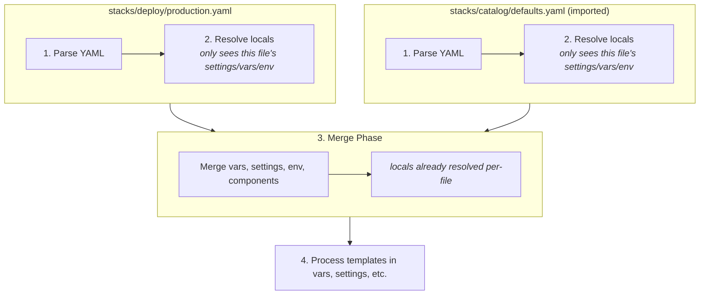

import File from '@site/src/components/File'
import Intro from '@site/src/components/Intro'
import Experimental from '@site/src/components/Experimental'
import EmbedExample from '@site/src/components/EmbedExample'

<Intro>
The `locals` section defines file-scoped temporary variables for use within templates. Unlike `vars`, `settings`, and `env`, locals do **not** inherit across file boundaries—they are resolved within a single file and can reference each other with automatic dependency resolution.
</Intro>

<Experimental />

## Use Cases

- **Reduce Repetition:** Define common values once and reference them throughout the file.
- **Build Complex Values:** Construct naming conventions, tags, or resource identifiers from simpler components.
- **Improve Readability:** Give meaningful names to computed values instead of repeating expressions.
- **Template Composition:** Build values incrementally by referencing other locals.

## How Locals Work

Locals are similar to [Terraform locals](https://developer.hashicorp.com/terraform/language/values/locals) and [Terragrunt locals](https://terragrunt.gruntwork.io/docs/reference/config-blocks-and-attributes/#locals):

1. **File-Scoped:** Locals are only available within the file where they are defined. They do not inherit across imports.
2. **Dependency Resolution:** Locals can reference other locals using `{{ .locals.name }}` syntax. Atmos automatically determines the correct resolution order.
3. **Cycle Detection:** Circular references are detected and reported with clear error messages.
4. **Template Support:** Locals support Go templates with [Sprig functions](http://masterminds.github.io/sprig/).

## Configuration Scopes

Locals can be defined at three levels within a file, each inheriting from its parent:

```
Global locals → Component-type locals (terraform/helmfile/packer) → Component-level locals
```

When the same key exists at multiple levels, the most specific scope wins.

```yaml
locals:
  namespace: acme
  environment: prod
  name_prefix: "{{ .locals.namespace }}-{{ .locals.environment }}"

terraform:
  locals:
    # Inherits from global, adds terraform-specific locals
    backend_bucket: "{{ .locals.namespace }}-{{ .locals.environment }}-tfstate"

components:
  terraform:
    vpc:
      locals:
        # Component-specific locals (inherits from global + terraform)
        vpc_type: production
      vars:
        name: "{{ .locals.name_prefix }}-{{ .locals.vpc_type }}-vpc"
        bucket: "{{ .locals.backend_bucket }}"
```

## File-Scoped Isolation

Unlike `vars`, `settings`, and `env`, locals do **not** inherit across file imports. Each file has its own isolated locals scope.

<File title="stacks/catalog/defaults.yaml">
```yaml
# These locals are ONLY available in this file
locals:
  default_region: us-east-1
```
</File>

<File title="stacks/deploy/production.yaml">
```yaml
import:
  - catalog/defaults

# The locals from catalog/defaults are NOT available here
locals:
  namespace: acme  # Define your own locals
```
</File>

This design ensures predictability—you can understand a file without tracing imports.

<details>
<summary>How does processing work?</summary>

Locals are resolved before imports are merged:

1. **Per-File Processing:** Each file is processed independently
2. **Locals Resolution:** Locals are resolved using only that file's context
3. **Import Merging:** Sections (`vars`, `settings`, `env`, `components`) are merged
4. **Final Template Processing:** Templates in other sections use the merged context



</details>

## Dependency Resolution

Locals can reference other locals in any order—Atmos resolves them automatically:

```yaml
locals:
  full_name: "{{ .locals.name_prefix }}-{{ .locals.component }}"  # Resolved last
  name_prefix: "{{ .locals.namespace }}-{{ .locals.environment }}" # Resolved second
  namespace: acme      # Resolved first
  environment: prod    # Resolved first
  component: vpc       # Resolved first
```

Circular references are detected and reported with clear error messages showing the dependency cycle.

## Accessing Other Sections

Locals can access `settings`, `vars`, and `env` defined in the **same file**:

| Section | Syntax | Description |
|---------|--------|-------------|
| `locals` | `{{ .locals.name }}` | Other locals in the same file |
| `settings` | `{{ .settings.key }}` | Settings defined in the same file |
| `vars` | `{{ .vars.key }}` | Variables defined in the same file |
| `env` | `{{ .env.KEY }}` | Environment variables defined in the same file |

```yaml
settings:
  version: v1

vars:
  stage: dev

locals:
  namespace: acme
  label: "{{ .locals.namespace }}-{{ .vars.stage }}-{{ .settings.version }}"
```

:::warning Same-File Access Only
Locals cannot access `settings`, `vars`, or `env` from imported files. If you need values from imports, use `vars` instead—they inherit across files.
:::

```yaml
# ❌ Won't work - imported settings not available to locals
import:
  - catalog/defaults  # Has settings.region = us-east-1
locals:
  region: "{{ .settings.region }}"  # Error!

# ✅ Use vars instead - they inherit across imports
vars:
  computed_name: "{{ .vars.region }}-cluster"
```

## Using Templates

Locals support full Go template syntax with [Sprig functions](http://masterminds.github.io/sprig/):

```yaml
locals:
  name: myapp
  environment: production
  upper_name: "{{ .locals.name | upper }}"
  log_level: '{{ if eq .locals.environment "production" }}warn{{ else }}debug{{ end }}'
```

## YAML Functions in Locals

Locals support all Atmos [YAML functions](/functions/yaml), enabling dynamic value resolution from external sources:

| Function | Description | Example |
|----------|-------------|---------|
| `!env` | Environment variables | `!env API_ENDPOINT` |
| `!exec` | Command execution | `!exec echo hello` |
| `!store` | Store lookups | `!store secrets/db .password` |
| `!terraform.state` | Terraform state queries | `!terraform.state vpc .vpc_id` |
| `!terraform.output` | Terraform outputs | `!terraform.output vpc .vpc_id` |

### Example: Environment Variables

Use `!env` to inject environment-specific values into locals:

```yaml
locals:
  # Fetch from environment variables
  api_endpoint: !env API_ENDPOINT
  db_host: !env DATABASE_HOST

  # Combine with Go templates
  api_url: "https://{{ .locals.api_endpoint }}/api/v1"
  connection_string: "postgresql://app@{{ .locals.db_host }}:5432/mydb"

components:
  terraform:
    backend:
      vars:
        api_url: "{{ .locals.api_url }}"
        database_url: "{{ .locals.connection_string }}"
```

### Example: Cross-Component References

Use `!terraform.state` or `!terraform.output` to reference outputs from other components:

```yaml
locals:
  # Fetch VPC outputs from another component's state
  vpc_id: !terraform.state vpc .vpc_id
  private_subnets: !terraform.state vpc .private_subnet_ids

  # Build derived values
  cluster_name: "eks-{{ .locals.vpc_id }}"

components:
  terraform:
    eks:
      vars:
        vpc_id: "{{ .locals.vpc_id }}"
        subnet_ids: "{{ .locals.private_subnets }}"
        name: "{{ .locals.cluster_name }}"
```

### Example: Secret Management

Use `!store` to fetch secrets from your configured store:

```yaml
locals:
  # Fetch secrets from store
  db_password: !store secrets/database .password
  api_key: !store secrets/api .key

  # Build connection strings
  database_url: "postgresql://app:{{ .locals.db_password }}@db.example.com/mydb"

components:
  terraform:
    app:
      vars:
        database_url: "{{ .locals.database_url }}"
        api_key: "{{ .locals.api_key }}"
```

### Example: Dynamic Values with Exec

Use `!exec` to run commands and capture output:

```yaml
locals:
  # Get current git commit
  git_commit: !exec git rev-parse --short HEAD

  # Get current timestamp
  build_time: !exec date -u +%Y%m%d%H%M%S

  # Build version string
  version: "{{ .locals.git_commit }}-{{ .locals.build_time }}"

components:
  terraform:
    app:
      vars:
        image_tag: "{{ .locals.version }}"
```

### Combining YAML Functions with Templates

YAML functions are resolved first, then Go templates are processed. This allows you to build complex values:

```yaml
locals:
  # Step 1: YAML function fetches the base value
  endpoint: !env GRAFANA_ENDPOINT

  # Step 2: Go template uses the resolved value
  dashboard_url: "https://{{ .locals.endpoint }}/d/ray-workers"
  metrics_url: "https://{{ .locals.endpoint }}/api/v1/query"

vars:
  monitoring:
    dashboard: "{{ .locals.dashboard_url }}"
    metrics: "{{ .locals.metrics_url }}"
```

:::tip YAML Function Processing Order
YAML functions in locals are processed during stack configuration loading. The resolved values become available to other locals and component vars through Go templates.
:::

## Complex Values

Locals can contain maps and lists:

```yaml
locals:
  namespace: acme
  environment: prod

  default_tags:
    Namespace: "{{ .locals.namespace }}"
    Environment: "{{ .locals.environment }}"
    ManagedBy: Atmos

  availability_zones:
    - us-east-1a
    - us-east-1b

vars:
  tags: "{{ .locals.default_tags }}"
```

## Component-Level Locals

Components can define their own locals that inherit from global and section-level locals. They also support inheritance from base components via `metadata.inherits`:

```yaml
components:
  terraform:
    vpc/base:
      metadata:
        type: abstract
      locals:
        vpc_type: standard
        enable_nat: false

    vpc/production:
      metadata:
        inherits:
          - vpc/base
      locals:
        vpc_type: production  # Overrides base
        enable_nat: true      # Overrides base
      vars:
        name: "{{ .locals.vpc_type }}-vpc"
        nat_enabled: "{{ .locals.enable_nat }}"
```

Resolution order (later overrides earlier): **Global → Section → Base Component → Component**

## Debugging

Use `atmos describe locals` to inspect resolved values:

```shell
atmos describe locals -s dev              # All locals for a stack
atmos describe locals vpc -s dev          # Locals for a specific component
atmos describe locals -s dev --format json # Output as JSON
```

<details>
<summary>Example output</summary>

```yaml
locals:
  namespace: acme
  environment: dev
  name_prefix: acme-dev
terraform:
  locals:
    backend_bucket: acme-dev-tfstate
```

</details>

## Locals vs Vars

| Aspect | `locals` | `vars` |
|--------|----------|--------|
| **Scope** | File-scoped only | Inherits across imports |
| **Purpose** | Temporary values for DRY | Input variables for components |
| **Output** | Not passed to components | Passed to Terraform/Helmfile/Packer |
| **Cross-File Access** | Cannot access imported values | Can access merged values from all imports |

Use `locals` for intermediate computations within a single file, and `vars` for values that need to be passed to components or shared across files.

## Template Processing

When a file defines locals, template processing is automatically enabled. Any `{{ ... }}` syntax will be processed.

:::warning Conflicting Template Syntax
If your YAML files contain Helm templates or other `{{ }}` syntax, use `skip_templates_processing`:

```yaml
import:
  - path: catalog/helm-values
    skip_templates_processing: true
```
:::

## Error Handling

Unresolved template references produce clear error messages:

```yaml
locals:
  domain: "{{ .settings.region }}.example.com"  # Error if no settings defined
```

```
Error: map has no entry for key "settings"
```

For optional values, use Go template conditionals:

```yaml
locals:
  safe_region: '{{ with .settings }}{{ .region }}{{ else }}us-west-2{{ end }}'
```

## Best Practices

1. **Extract repetition** to locals instead of duplicating values.
2. **Build incrementally**—compose complex values from simpler locals.
3. **Keep locals close** to where they're used (component-level when possible).
4. **Use vars for cross-file sharing**—locals are file-scoped by design.

## Try It

<EmbedExample example="locals" />

## Related

- [Variables (vars)](/stacks/vars)
- [Environment Variables (env)](/stacks/env)
- [Settings](/stacks/settings)
- [Imports](/stacks/imports)
