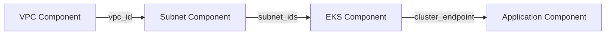
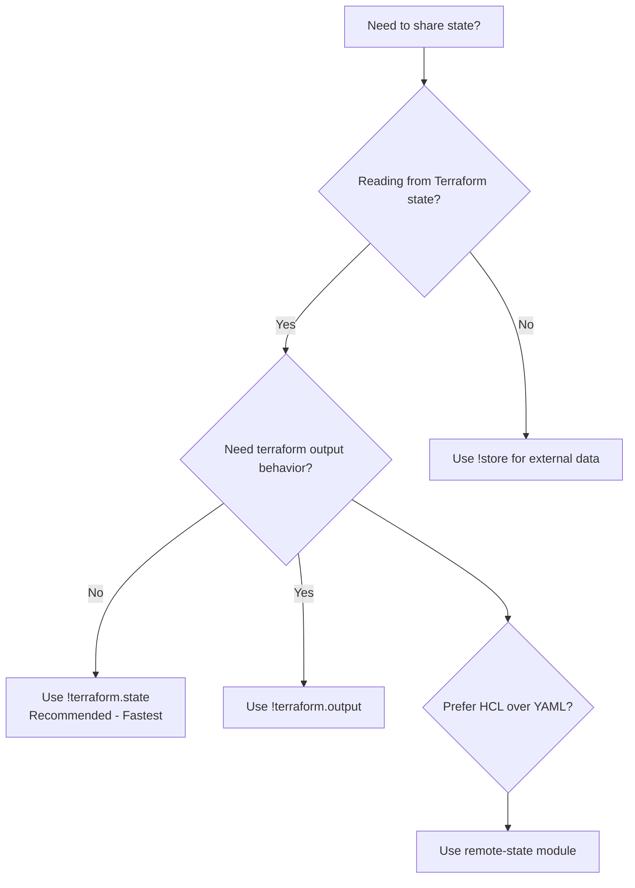

import Intro from '@site/src/components/Intro'
import ActionCard from '@site/src/components/ActionCard'
import PrimaryCTA from '@site/src/components/PrimaryCTA'
import KeyPoints from '@site/src/components/KeyPoints'
import File from '@site/src/components/File'

<Intro>
Breaking up your infrastructure into loosely-coupled components is a great way to manage complexity and
reuse code. However, these smaller components often need to share data with each other.
Atmos provides several ways to easily share outputs, configurations, and settings between components.
</Intro>

<KeyPoints>
- Use `!terraform.state` as the recommended, fastest method to read outputs from other components
- Alternative methods include `!terraform.output`, the `remote-state` module, and external stores
- Share data within the same stack or across different stacks
</KeyPoints>

## Why Components Need to Share State

Imagine building a typical web application infrastructure:

1. **VPC** creates the network and outputs `vpc_id`
2. **Subnets** need the `vpc_id` to create subnets
3. **EKS cluster** needs subnet IDs to launch in the right network
4. **Application** needs the EKS cluster endpoint to deploy

Each component depends on outputs from previous components. This is called a **loosely coupled architecture**---components are independent but can reference each other's outputs.



## Recommended: `!terraform.state`

The **fastest and recommended** way to share state between components is the [`!terraform.state`](/stacks/sharing-state/terraform-state) YAML function. It reads outputs directly from your Terraform backend without initializing Terraform, downloading providers, or generating configuration files.

<File title="stacks/dev.yaml">
```yaml
components:
  terraform:
    vpc:
      vars:
        cidr_block: "10.0.0.0/16"

    eks:
      vars:
        # Read VPC outputs directly from the state backend
        vpc_id: !terraform.state vpc vpc_id
        subnet_ids: !terraform.state vpc private_subnet_ids
```
</File>

**Why `!terraform.state` is recommended:**
- **10-100x faster** than alternatives that require Terraform initialization
- **No provider downloads** - reads state files directly from backends (S3, GCS, Azure, local)
- **Same syntax** as `!terraform.output` - easy migration
- **Automatic caching** - repeated calls are served from memory

<ActionCard title="Learn More About !terraform.state">
The recommended method for sharing state between components.
<PrimaryCTA to="/stacks/sharing-state/terraform-state">Get Started</PrimaryCTA>
</ActionCard>

## Alternative Methods

While `!terraform.state` is recommended for most use cases, Atmos provides other methods that may be useful in specific scenarios:

| Method | Use Case | Speed |
|--------|----------|-------|
| [`!terraform.state`](/stacks/sharing-state/terraform-state) | **Recommended** - Read outputs from Terraform backends | Fastest |
| [`!terraform.output`](/stacks/sharing-state/terraform-output) | When you need `terraform output` command behavior | Slow |
| [Remote State Module](/stacks/sharing-state/remote-state-module) | Native Terraform/HCL approach | Medium |
| [`!store`](/stacks/sharing-state/stores) | Read from external stores (SSM, Vault, etc.) | Varies |

### Quick Comparison

**`!terraform.state`** - Reads directly from state backends. Fastest option.
```yaml
vpc_id: !terraform.state vpc vpc_id
```

**`!terraform.output`** - Runs `terraform output` command. Slower but uses Terraform's output pipeline.
```yaml
vpc_id: !terraform.output vpc vpc_id
```

**Remote State Module** - Native Terraform approach using the `remote-state` module in HCL.
```hcl
module "vpc" {
  source    = "cloudposse/stack-config/yaml//modules/remote-state"
  component = "vpc"
  context   = module.this.context
}
```

**`!store`** - Read from external key-value stores.
```yaml
vpc_id: !store ssm/prod vpc vpc_id
```

## Cross-Stack References

All methods support reading outputs from components in different stacks:

<File title="stacks/prod.yaml">
```yaml
components:
  terraform:
    app:
      vars:
        # Read VPC from prod stack
        vpc_id: !terraform.state vpc prod vpc_id

        # Read database from shared-services stack
        db_endpoint: !terraform.state rds shared-services endpoint
```
</File>

This enables patterns like:
- **Shared services** with centralized databases or networking
- **Hub-and-spoke networks** with VPC peering
- **Cross-environment references** (e.g., staging uses prod DNS zone)

## Choosing the Right Method

Use this decision tree to choose the best method for your use case:



**General guidance:**
- Start with `!terraform.state` - it's the fastest and works for most cases
- Use `!terraform.output` only when you specifically need `terraform output` command behavior
- Use the `remote-state` module when you prefer to keep all logic in Terraform HCL
- Use `!store` when reading from external systems like SSM Parameter Store or HashiCorp Vault
